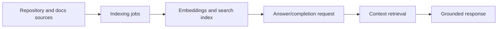
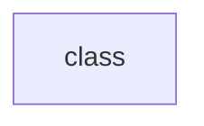

# Chapter 4: Answer Engine and Context Indexing

Welcome to **Chapter 4: Answer Engine and Context Indexing**. In this part of **Tabby Tutorial: Self-Hosted AI Coding Assistant Architecture and Operations**, you will build an intuitive mental model first, then move into concrete implementation details and practical production tradeoffs.


Tabby quality depends on context. This chapter covers how indexing and answer workflows convert repository state into grounded responses.

## Learning Goals

- understand repository and document context ingestion
- map answer engine behavior to indexed sources
- define reliability checks for context freshness

## Context Pipeline


```mermaid
flowchart LR
    A[Repository and docs sources] --> B[Indexing jobs]
    B --> C[Embeddings and search index]
    C --> D[Answer/completion request]
    D --> E[Context retrieval]
    E --> F[Grounded response]
```

## Operational Pattern

| Stage | Control Point |
|:------|:--------------|
| ingestion | decide which repos/docs are indexed |
| indexing cadence | set update frequency and shard behavior |
| retrieval | validate relevance in real tasks |
| answer output | verify citations and code references are coherent |

## Quality Guardrails

- maintain repository selection policy to avoid noisy context.
- run periodic smoke prompts against known code locations.
- monitor indexing failures before they accumulate stale context.

## Recent Capability Signals

The changelog documents ongoing work around context quality, including custom document APIs and indexing behavior improvements.

## Source References

- [Tabby Changelog](https://github.com/TabbyML/tabby/blob/main/CHANGELOG.md)
- [Administration: Context](https://tabby.tabbyml.com/docs/administration/context)
- [Administration: Index Custom Document](https://tabby.tabbyml.com/docs/administration/index-custom-document)

## Summary

You now have a practical model for operating Tabby as a context-grounded assistant instead of a bare autocomplete endpoint.

Next: [Chapter 5: Editor Agents and Client Integrations](05-editor-agents-and-client-integrations.md)

## Source Code Walkthrough

### `python/tabby/trainer.py`

The `class` class in [`python/tabby/trainer.py`](https://github.com/TabbyML/tabby/blob/HEAD/python/tabby/trainer.py) handles a key part of this chapter's functionality:

```py
import os
import glob
from dataclasses import dataclass, field
from typing import List

import peft
import torch
from transformers import (
    AutoModelForCausalLM,
    AutoTokenizer,
    HfArgumentParser,
    Trainer,
    TrainingArguments,
)
from datasets import Dataset, load_dataset


class ConstantLengthDataset:
    """
    Iterable dataset that returns constant length chunks of tokens from stream of text files.
        Args:
            tokenizer (Tokenizer): The processor used for proccessing the data.
            dataset (dataset.Dataset): Dataset with text files.
            infinite (bool): If True the iterator is reset after dataset reaches end else stops.
            seq_length (int): Length of token sequences to return.
            num_of_sequences (int): Number of token sequences to keep in buffer.
            chars_per_token (int): Number of characters per token used to estimate number of tokens in text buffer.
    """

    def __init__(
        self,
        tokenizer,
```

This class is important because it defines how Tabby Tutorial: Self-Hosted AI Coding Assistant Architecture and Operations implements the patterns covered in this chapter.


## How These Components Connect


```mermaid
flowchart TD
    A[class]
```
