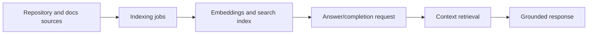
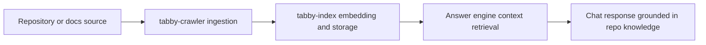

# Chapter 4: Answer Engine and Context Indexing

Welcome to **Chapter 4: Answer Engine and Context Indexing**. In this part of **Tabby Tutorial: Self-Hosted AI Coding Assistant Architecture and Operations**, you will build an intuitive mental model first, then move into concrete implementation details and practical production tradeoffs.

Tabby quality depends on context. This chapter covers how indexing and answer workflows convert repository state into grounded responses.

## Learning Goals

- understand repository and document context ingestion
- map answer engine behavior to indexed sources
- define reliability checks for context freshness

## Context Pipeline

```mermaid
flowchart LR
    A[Repository and docs sources] --> B[Indexing jobs]
    B --> C[Embeddings and search index]
    C --> D[Answer/completion request]
    D --> E[Context retrieval]
    E --> F[Grounded response]
```

## Operational Pattern

| Stage | Control Point |
|:------|:--------------|
| ingestion | decide which repos/docs are indexed |
| indexing cadence | set update frequency and shard behavior |
| retrieval | validate relevance in real tasks |
| answer output | verify citations and code references are coherent |

## Quality Guardrails

- maintain repository selection policy to avoid noisy context.
- run periodic smoke prompts against known code locations.
- monitor indexing failures before they accumulate stale context.

## Recent Capability Signals

The changelog documents ongoing work around context quality, including custom document APIs and indexing behavior improvements.

## Source References

- [Tabby Changelog](https://github.com/TabbyML/tabby/blob/main/CHANGELOG.md)
- [Administration: Context](https://tabby.tabbyml.com/docs/administration/context)
- [Administration: Index Custom Document](https://tabby.tabbyml.com/docs/administration/index-custom-document)

## Summary

You now have a practical model for operating Tabby as a context-grounded assistant instead of a bare autocomplete endpoint.

Next: [Chapter 5: Editor Agents and Client Integrations](05-editor-agents-and-client-integrations.md)

## Source Code Walkthrough

Use the following upstream sources to verify answer engine and context indexing details while reading this chapter:

- [`crates/tabby-index/src/lib.rs`](https://github.com/TabbyML/tabby/blob/HEAD/crates/tabby-index/src/lib.rs) — the repository and documentation indexing crate that builds the vector store used by the answer engine to retrieve relevant code context.
- [`crates/tabby-crawler/src/lib.rs`](https://github.com/TabbyML/tabby/blob/HEAD/crates/tabby-crawler/src/lib.rs) — the document crawler that fetches and preprocesses external documentation sources before they are passed to the indexer.

Suggested trace strategy:
- trace the indexing pipeline in `tabby-index` from document ingestion through embedding to vector store write
- review the `tabby-crawler` to understand which source types (git, web, docs) are supported and how content is extracted
- check `crates/tabby/src/routes/chat.rs` to see how the answer engine retrieves context from the index before generating chat responses

## How These Components Connect

```mermaid
flowchart LR
    A[Repository or docs source] --> B[tabby-crawler ingestion]
    B --> C[tabby-index embedding and storage]
    C --> D[Answer engine context retrieval]
    D --> E[Chat response grounded in repo knowledge]
```