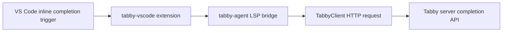

# Chapter 5: Editor Agents and Client Integrations

Welcome to **Chapter 5: Editor Agents and Client Integrations**. In this part of **Tabby Tutorial: Self-Hosted AI Coding Assistant Architecture and Operations**, you will build an intuitive mental model first, then move into concrete implementation details and practical production tradeoffs.


This chapter focuses on the client side: extension behavior, `tabby-agent`, and custom editor wiring.

## Learning Goals

- understand why Tabby ships a dedicated LSP agent
- configure editor clients with endpoint and token flow
- integrate non-default editors safely

## Integration Surfaces

| Surface | Typical Usage |
|:--------|:--------------|
| official VS Code extension | fastest path for most teams |
| JetBrains extension | IDE-native integration in JVM shops |
| Vim/Neovim extension | lightweight workflows |
| `tabby-agent` standalone | custom editor or advanced LSP setups |

## Manual `tabby-agent` Launch

```bash
npx tabby-agent --stdio
```

Example editor LSP wiring (Helix pattern):

```toml
[language-server.tabby]
command = "npx"
args = ["tabby-agent", "--stdio"]
```

## Client Reliability Checklist

1. endpoint and token are configured per environment (dev/stage/prod)
2. extension and server versions are tested together
3. fallback behavior is defined when Tabby is unavailable
4. editor telemetry/error signals are captured for support

## Source References

- [Connect IDE Extensions](https://tabby.tabbyml.com/docs/quick-start/setup-ide)
- [Extensions Configuration](https://tabby.tabbyml.com/docs/extensions/configurations)
- [tabby-agent README](https://github.com/TabbyML/tabby/blob/main/clients/tabby-agent/README.md)

## Summary

You now know how to integrate Tabby clients beyond default setup paths and keep editor behavior predictable.

Next: [Chapter 6: Configuration, Security, and Enterprise Controls](06-configuration-security-and-enterprise-controls.md)

## Source Code Walkthrough

Use the following upstream sources to verify editor agent and client integration details while reading this chapter:

- [`clients/tabby-agent/src/index.ts`](https://github.com/TabbyML/tabby/blob/HEAD/clients/tabby-agent/src/index.ts) — the TypeScript LSP bridge that editor extensions communicate with; it handles completion requests, inline completion debounce, and connection management to the Tabby server.
- [`clients/tabby-agent/src/TabbyClient.ts`](https://github.com/TabbyML/tabby/blob/HEAD/clients/tabby-agent/src/TabbyClient.ts) — the HTTP client layer inside `tabby-agent` that sends requests to the Tabby server API and handles authentication headers and retry logic.

Suggested trace strategy:
- trace how the VS Code extension calls `tabby-agent` for inline completions and how the agent proxies to the server
- review `TabbyClient.ts` to understand the request/response lifecycle including token auth and error recovery
- check `clients/tabby-vscode/` for the VS Code extension source to see the full editor integration surface

## How These Components Connect

