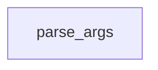

# Chapter 5: Editor Agents and Client Integrations

Welcome to **Chapter 5: Editor Agents and Client Integrations**. In this part of **Tabby Tutorial: Self-Hosted AI Coding Assistant Architecture and Operations**, you will build an intuitive mental model first, then move into concrete implementation details and practical production tradeoffs.


This chapter focuses on the client side: extension behavior, `tabby-agent`, and custom editor wiring.

## Learning Goals

- understand why Tabby ships a dedicated LSP agent
- configure editor clients with endpoint and token flow
- integrate non-default editors safely

## Integration Surfaces

| Surface | Typical Usage |
|:--------|:--------------|
| official VS Code extension | fastest path for most teams |
| JetBrains extension | IDE-native integration in JVM shops |
| Vim/Neovim extension | lightweight workflows |
| `tabby-agent` standalone | custom editor or advanced LSP setups |

## Manual `tabby-agent` Launch

```bash
npx tabby-agent --stdio
```

Example editor LSP wiring (Helix pattern):

```toml
[language-server.tabby]
command = "npx"
args = ["tabby-agent", "--stdio"]
```

## Client Reliability Checklist

1. endpoint and token are configured per environment (dev/stage/prod)
2. extension and server versions are tested together
3. fallback behavior is defined when Tabby is unavailable
4. editor telemetry/error signals are captured for support

## Source References

- [Connect IDE Extensions](https://tabby.tabbyml.com/docs/quick-start/setup-ide)
- [Extensions Configuration](https://tabby.tabbyml.com/docs/extensions/configurations)
- [tabby-agent README](https://github.com/TabbyML/tabby/blob/main/clients/tabby-agent/README.md)

## Summary

You now know how to integrate Tabby clients beyond default setup paths and keep editor behavior predictable.

Next: [Chapter 6: Configuration, Security, and Enterprise Controls](06-configuration-security-and-enterprise-controls.md)

## Source Code Walkthrough

### `python/tabby/trainer.py`

The `parse_args` function in [`python/tabby/trainer.py`](https://github.com/TabbyML/tabby/blob/HEAD/python/tabby/trainer.py) handles a key part of this chapter's functionality:

```py


def parse_args() -> TrainLoraArguments:
    parser = HfArgumentParser(TrainLoraArguments)
    return parser.parse_args()


def train(args: TrainLoraArguments):
    gradient_accumulation_steps = args.batch_size // args.micro_batch_size

    model = AutoModelForCausalLM.from_pretrained(
        args.base_model, torch_dtype=torch.float16 if args.half else torch.float32
    )

    tokenizer = AutoTokenizer.from_pretrained(args.base_model)

    config = peft.LoraConfig(
        r=args.lora_r,
        lora_alpha=args.lora_alpha,
        target_modules=args.lora_target_modules,
        lora_dropout=args.lora_dropout,
        bias="none",
        task_type=peft.TaskType.CAUSAL_LM,
    )
    model = peft.get_peft_model(model, config)

    data_files = glob.glob(os.path.join(args.data_path, "*.jsonl"))
    print("Collected data files...", data_files)
    dataset = load_dataset("json", data_files=data_files)["train"]
    data = Dataset.from_generator(ConstantLengthDataset(tokenizer, dataset))

    resume_from_checkpoint = args.resume_from_checkpoint
```

This function is important because it defines how Tabby Tutorial: Self-Hosted AI Coding Assistant Architecture and Operations implements the patterns covered in this chapter.


## How These Components Connect


