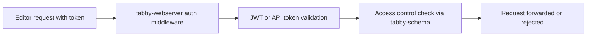

# Chapter 6: Configuration, Security, and Enterprise Controls

Welcome to **Chapter 6: Configuration, Security, and Enterprise Controls**. In this part of **Tabby Tutorial: Self-Hosted AI Coding Assistant Architecture and Operations**, you will build an intuitive mental model first, then move into concrete implementation details and practical production tradeoffs.


As Tabby moves from single-user setup to team deployment, security and policy controls become central.

## Learning Goals

- use `config.toml` as the primary behavior contract
- enforce authentication and network boundaries
- evaluate enterprise-only controls without vendor lock assumptions

## Configuration Priorities

| Priority | Why |
|:---------|:----|
| auth and token policy | protects API access boundaries |
| model endpoint policy | avoids accidental data egress |
| prompt/system behavior | enforces assistant behavior constraints |
| reverse proxy + TLS | secures external access |

## Example Prompt Policy

```toml
[answer]
system_prompt = """
You are Tabby for internal engineering support.
Prefer codebase-grounded answers and explicit uncertainty.
"""
```

## Access Controls to Plan

- SSO and enterprise identity integrations (where applicable)
- role and membership governance for multi-user instances
- explicit public/private network exposure policy

## Security Review Questions

1. which model providers receive source code content?
2. what audit trail exists for admin changes?
3. which roles can change indexing and model config?
4. how are secrets stored and rotated?

## Source References

- [Config TOML](https://tabby.tabbyml.com/docs/administration/config-toml)
- [Administration: Reverse Proxy](https://tabby.tabbyml.com/docs/administration/reverse-proxy)
- [Administration: SSO](https://tabby.tabbyml.com/docs/administration/sso)
- [Administration: User](https://tabby.tabbyml.com/docs/administration/user)

## Summary

You now have a concrete security checklist for moving Tabby into shared environments.

Next: [Chapter 7: Operations, Upgrades, and Observability](07-operations-upgrades-and-observability.md)

## Source Code Walkthrough

Use the following upstream sources to verify configuration, security, and enterprise controls while reading this chapter:

- [`ee/tabby-webserver/src/lib.rs`](https://github.com/TabbyML/tabby/blob/HEAD/ee/tabby-webserver/src/lib.rs) — the enterprise web server layer that adds JWT authentication, user management, team access controls, and the web UI on top of the core Tabby server.
- [`ee/tabby-schema/src/lib.rs`](https://github.com/TabbyML/tabby/blob/HEAD/ee/tabby-schema/src/lib.rs) — the GraphQL schema definition for the enterprise web server, covering user, team, repository, and integration management APIs.

Suggested trace strategy:
- trace authentication middleware in `tabby-webserver` to understand how API tokens and JWT are validated per request
- review the schema types in `tabby-schema` to understand which entities are access-controlled and at which granularity
- check `config.toml` documentation (https://tabby.tabbyml.com/docs/administration/config-toml) for all security-relevant settings

## How These Components Connect

