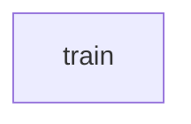

# Chapter 6: Configuration, Security, and Enterprise Controls

Welcome to **Chapter 6: Configuration, Security, and Enterprise Controls**. In this part of **Tabby Tutorial: Self-Hosted AI Coding Assistant Architecture and Operations**, you will build an intuitive mental model first, then move into concrete implementation details and practical production tradeoffs.


As Tabby moves from single-user setup to team deployment, security and policy controls become central.

## Learning Goals

- use `config.toml` as the primary behavior contract
- enforce authentication and network boundaries
- evaluate enterprise-only controls without vendor lock assumptions

## Configuration Priorities

| Priority | Why |
|:---------|:----|
| auth and token policy | protects API access boundaries |
| model endpoint policy | avoids accidental data egress |
| prompt/system behavior | enforces assistant behavior constraints |
| reverse proxy + TLS | secures external access |

## Example Prompt Policy

```toml
[answer]
system_prompt = """
You are Tabby for internal engineering support.
Prefer codebase-grounded answers and explicit uncertainty.
"""
```

## Access Controls to Plan

- SSO and enterprise identity integrations (where applicable)
- role and membership governance for multi-user instances
- explicit public/private network exposure policy

## Security Review Questions

1. which model providers receive source code content?
2. what audit trail exists for admin changes?
3. which roles can change indexing and model config?
4. how are secrets stored and rotated?

## Source References

- [Config TOML](https://tabby.tabbyml.com/docs/administration/config-toml)
- [Administration: Reverse Proxy](https://tabby.tabbyml.com/docs/administration/reverse-proxy)
- [Administration: SSO](https://tabby.tabbyml.com/docs/administration/sso)
- [Administration: User](https://tabby.tabbyml.com/docs/administration/user)

## Summary

You now have a concrete security checklist for moving Tabby into shared environments.

Next: [Chapter 7: Operations, Upgrades, and Observability](07-operations-upgrades-and-observability.md)

## Depth Expansion Playbook

## Source Code Walkthrough

### `python/tabby/trainer.py`

The `train` function in [`python/tabby/trainer.py`](https://github.com/TabbyML/tabby/blob/HEAD/python/tabby/trainer.py) handles a key part of this chapter's functionality:

```py
@dataclass
class TrainLoraArguments:
    data_path: str = field(metadata={"help": "Dataset dir for training / eval "})
    output_dir: str = field(metadata={"help": "Output dir for checkpoint"})
    base_model: str = field(
        default="TabbyML/J-350M", metadata={"help": "Base model for fine-tuning"}
    )

    batch_size: int = 128
    micro_batch_size: int = 4
    num_epochs: int = 3
    learning_rate: float = 3e-4
    cutoff_len: int = 256

    # Evaluations
    val_set_size: int = 2000
    eval_steps: int = 200

    # Lora Hyperparams
    lora_r: int = 8
    lora_alpha: int = 16
    lora_dropout: float = 0.05
    lora_target_modules: List[str] = (
        [
            "q_proj",
            "v_proj",
        ],
    )
    resume_from_checkpoint: str = None  # either training checkpoint or final adapter
    half: bool = True


```

This function is important because it defines how Tabby Tutorial: Self-Hosted AI Coding Assistant Architecture and Operations implements the patterns covered in this chapter.


## How These Components Connect


