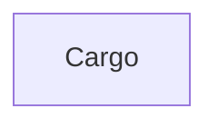

# Chapter 7: Operations, Upgrades, and Observability

Welcome to **Chapter 7: Operations, Upgrades, and Observability**. In this part of **Tabby Tutorial: Self-Hosted AI Coding Assistant Architecture and Operations**, you will build an intuitive mental model first, then move into concrete implementation details and practical production tradeoffs.


Long-term reliability comes from disciplined upgrades, backup paths, and visibility into failures.

## Learning Goals

- design an upgrade process with rollback safety in mind
- establish backup and restore routines for metadata and config
- define basic service-level observability for Tabby

## Upgrade Runbook

1. back up Tabby metadata before each upgrade
2. read release notes and changelog for breaking behavior
3. roll out to staging first with representative repositories
4. upgrade production and monitor completion/chat health

## Upgrade Paths

| Deployment Mode | Upgrade Action |
|:----------------|:---------------|
| Docker | pull new image tag and restart service |
| standalone binary | download from releases and replace binary |
| source-based | rebuild from target commit/release |

## Observability Baseline

- service health and uptime checks on API endpoints
- completion latency and error-rate tracking
- indexing job success/failure monitoring
- client connectivity alerts from extension support logs

## Source References

- [Upgrade Guide](https://tabby.tabbyml.com/docs/administration/upgrade)
- [Backup Guide](https://tabby.tabbyml.com/docs/administration/backup)
- [Tabby Releases](https://github.com/TabbyML/tabby/releases)
- [Tabby Changelog](https://github.com/TabbyML/tabby/blob/main/CHANGELOG.md)

## Summary

You now have a practical operations frame for safely evolving Tabby over time.

Next: [Chapter 8: Contribution, Roadmap, and Team Adoption](08-contribution-roadmap-and-team-adoption.md)

## Source Code Walkthrough

### `Cargo.toml`

The `Cargo` module in [`Cargo.toml`](https://github.com/TabbyML/tabby/blob/HEAD/Cargo.toml) handles a key part of this chapter's functionality:

```toml
[workspace]
resolver = "1"
members = [
    "crates/tabby",
    "crates/tabby-common",
    "crates/tabby-download",
    "crates/tabby-git",
    "crates/tabby-inference",
    "crates/tabby-index",
    "crates/tabby-crawler",

    "crates/aim-downloader",
    "crates/http-api-bindings",
    "crates/llama-cpp-server",
    "crates/ollama-api-bindings",
    "crates/tabby-index-cli",
    "crates/hash-ids",
    "crates/sqlx-migrate-validate",

    "ee/tabby-webserver",
    "ee/tabby-db",
    "ee/tabby-db-macros",
    "ee/tabby-schema",
]

[workspace.package]
version = "0.33.0-dev.0"
edition = "2021"
authors = ["TabbyML Team"]
homepage = "https://github.com/TabbyML/tabby"

[workspace.dependencies]
cached = "0.49.3"
lazy_static = "1.4.0"
serde = { version = "1.0", features = ["derive"] }
```

This module is important because it defines how Tabby Tutorial: Self-Hosted AI Coding Assistant Architecture and Operations implements the patterns covered in this chapter.


## How These Components Connect


