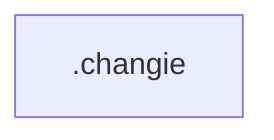

# Chapter 8: Contribution, Roadmap, and Team Adoption

Welcome to **Chapter 8: Contribution, Roadmap, and Team Adoption**. In this part of **Tabby Tutorial: Self-Hosted AI Coding Assistant Architecture and Operations**, you will build an intuitive mental model first, then move into concrete implementation details and practical production tradeoffs.


This chapter closes the track with contribution mechanics and rollout strategy for engineering organizations.

## Learning Goals

- map a phased adoption plan for teams
- contribute changes to Tabby with minimal friction
- align roadmap signals with your internal platform needs

## Team Rollout Model

| Phase | Outcome |
|:------|:--------|
| pilot | small engineering group validates quality and workflow fit |
| expansion | additional teams onboard with shared policy templates |
| platformization | Tabby becomes part of standard developer environment |

## Contribution Workflow

1. clone repository with submodules when needed
2. follow `CONTRIBUTING.md` setup guidance
3. build and run tests for touched modules
4. submit focused PRs with clear behavior change notes

## Governance Checklist

- define ownership for runtime config and upgrades
- standardize model/provider policies across teams
- maintain internal runbooks for incidents and user onboarding

## Source References

- [Contributing Guide](https://github.com/TabbyML/tabby/blob/main/CONTRIBUTING.md)
- [Roadmap](https://tabby.tabbyml.com/docs/roadmap)
- [Tabby Repository](https://github.com/TabbyML/tabby)

## Summary

You now have a full lifecycle mental model for adopting, operating, and extending Tabby as an internal coding assistant platform.

Next: pick a related implementation track such as [Continue](../continue-tutorial/) or [OpenCode](../opencode-tutorial/).

## Depth Expansion Playbook

## Source Code Walkthrough

### `.changie.yaml`

The `.changie` module in [`.changie.yaml`](https://github.com/TabbyML/tabby/blob/HEAD/.changie.yaml) handles a key part of this chapter's functionality:

```yaml
changesDir: .changes
unreleasedDir: unreleased
headerPath: header.tpl.md
changelogPath: CHANGELOG.md
versionExt: md
versionFormat: '## {{.Version}} ({{.Time.Format "2006-01-02"}})'
kindFormat: '### {{.Kind}}'
changeFormat: '* {{.Body}}'
kinds:
- label: Notice
  auto: minor
- label: Features
  auto: minor
- label: Fixed and Improvements
  auto: patch
newlines:
  afterChangelogHeader: 1
  afterKind: 1
  afterChangelogVersion: 1
  beforeKind: 1
  endOfVersion: 1
envPrefix: CHANGIE_
```

This module is important because it defines how Tabby Tutorial: Self-Hosted AI Coding Assistant Architecture and Operations implements the patterns covered in this chapter.


## How These Components Connect


