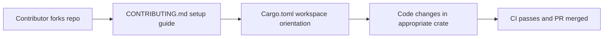

# Chapter 8: Contribution, Roadmap, and Team Adoption

Welcome to **Chapter 8: Contribution, Roadmap, and Team Adoption**. In this part of **Tabby Tutorial: Self-Hosted AI Coding Assistant Architecture and Operations**, you will build an intuitive mental model first, then move into concrete implementation details and practical production tradeoffs.

This chapter closes the track with contribution mechanics and rollout strategy for engineering organizations.

## Learning Goals

- map a phased adoption plan for teams
- contribute changes to Tabby with minimal friction
- align roadmap signals with your internal platform needs

## Team Rollout Model

| Phase | Outcome |
|:------|:--------|
| pilot | small engineering group validates quality and workflow fit |
| expansion | additional teams onboard with shared policy templates |
| platformization | Tabby becomes part of standard developer environment |

## Contribution Workflow

1. clone repository with submodules when needed
2. follow `CONTRIBUTING.md` setup guidance
3. build and run tests for touched modules
4. submit focused PRs with clear behavior change notes

## Governance Checklist

- define ownership for runtime config and upgrades
- standardize model/provider policies across teams
- maintain internal runbooks for incidents and user onboarding

## Source References

- [Contributing Guide](https://github.com/TabbyML/tabby/blob/main/CONTRIBUTING.md)
- [Roadmap](https://tabby.tabbyml.com/docs/roadmap)
- [Tabby Repository](https://github.com/TabbyML/tabby)

## Summary

You now have a full lifecycle mental model for adopting, operating, and extending Tabby as an internal coding assistant platform.

Next: pick a related implementation track such as [Continue](../continue-tutorial/) or [OpenCode](../opencode-tutorial/).

## Source Code Walkthrough

Use the following upstream sources to verify contribution workflow and team adoption details while reading this chapter:

- [`CONTRIBUTING.md`](https://github.com/TabbyML/tabby/blob/HEAD/CONTRIBUTING.md) — the contributor guide covering how to set up a development environment, run tests, submit pull requests, and follow the project's coding standards.
- [`Cargo.toml`](https://github.com/TabbyML/tabby/blob/HEAD/Cargo.toml) — the workspace manifest used by contributors to understand the crate layout, add new crates, and manage inter-crate dependencies when extending Tabby.

Suggested trace strategy:
- read `CONTRIBUTING.md` for the dev environment setup steps (Rust toolchain, LLVM requirements) and the test suite commands
- review `Cargo.toml` workspace member list to identify where a new feature or integration should be placed
- check `.github/workflows/` for the CI pipeline to understand what checks must pass before a PR can be merged

## How These Components Connect

