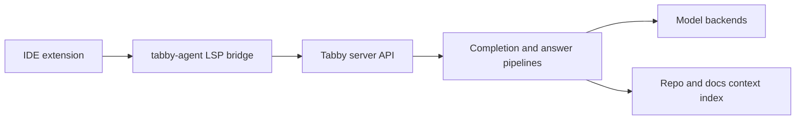

# Tabby Tutorial: Self-Hosted AI Coding Assistant Architecture and Operations

> Learn how to run and extend `TabbyML/tabby` for production code completion and team knowledge workflows.

## Why This Track Matters

Tabby is a mature self-hosted coding assistant platform that combines model serving, editor integrations, repository context indexing, and enterprise controls.

This track focuses on:

- setting up Tabby reliably across local and server deployments
- understanding the runtime components and request flow
- tuning completion and answer workflows with model and context configuration
- operating upgrades, security boundaries, and team rollout safely

## Current Snapshot (auto-updated)

- repository: [`TabbyML/tabby`](https://github.com/TabbyML/tabby)
- stars: about **32.9k**
- latest release: [`v0.32.0`](https://github.com/TabbyML/tabby/releases/tag/v0.32.0) (**January 25, 2026**)
- recent activity: updated on **February 12, 2026**
- positioning: self-hosted AI coding assistant with completion, chat, repository context, and editor agents

## Mental Model

## Chapter Guide

| Chapter | Key Question | Outcome |
|:--------|:-------------|:--------|
| [01 - Getting Started and First Server](01-getting-started-and-first-server.md) | How do I launch a working Tabby environment quickly? | Stable baseline deployment |
| [02 - Architecture and Runtime Components](02-architecture-and-runtime-components.md) | What are the core components and how do they interact? | Clear system map |
| [03 - Model Serving and Completion Pipeline](03-model-serving-and-completion-pipeline.md) | How do completion/chat models map to Tabby runtime behavior? | Better model strategy |
| [04 - Answer Engine and Context Indexing](04-answer-engine-and-context-indexing.md) | How does Tabby ground responses with repository knowledge? | Higher answer quality |
| [05 - Editor Agents and Client Integrations](05-editor-agents-and-client-integrations.md) | How do extensions and `tabby-agent` fit into daily dev loops? | Reliable client setup |
| [06 - Configuration, Security, and Enterprise Controls](06-configuration-security-and-enterprise-controls.md) | Which controls matter for secure multi-user deployments? | Safer production posture |
| [07 - Operations, Upgrades, and Observability](07-operations-upgrades-and-observability.md) | How do you keep Tabby healthy over time? | Repeatable runbook |
| [08 - Contribution, Roadmap, and Team Adoption](08-contribution-roadmap-and-team-adoption.md) | How do teams extend Tabby and scale adoption? | Long-term ownership plan |

## What You Will Learn

- how to stand up Tabby with clear runtime and network assumptions
- how to design model, context, and completion configuration for your stack
- how to integrate Tabby in editor clients and custom LSP flows
- how to operate upgrades, backups, and governance for production teams

## Source References

- [Tabby Repository](https://github.com/TabbyML/tabby)
- [Tabby README](https://github.com/TabbyML/tabby/blob/main/README.md)
- [Welcome Docs](https://tabby.tabbyml.com/docs/welcome/)
- [Docker Installation](https://tabby.tabbyml.com/docs/quick-start/installation/docker)
- [Connect IDE Extensions](https://tabby.tabbyml.com/docs/quick-start/setup-ide)
- [Config TOML](https://tabby.tabbyml.com/docs/administration/config-toml)
- [Upgrade Guide](https://tabby.tabbyml.com/docs/administration/upgrade)
- [tabby-agent README](https://github.com/TabbyML/tabby/blob/main/clients/tabby-agent/README.md)
- [Changelog](https://github.com/TabbyML/tabby/blob/main/CHANGELOG.md)

## Related Tutorials

- [Continue Tutorial](../continue-tutorial/)
- [OpenHands Tutorial](../openhands-tutorial/)
- [Aider Tutorial](../aider-tutorial/)
- [OpenCode Tutorial](../opencode-tutorial/)

---

Start with [Chapter 1: Getting Started and First Server](01-getting-started-and-first-server.md).

## Navigation & Backlinks

- [Start Here: Chapter 1: Getting Started and First Server](01-getting-started-and-first-server.md)
- [Back to Main Catalog](../../README.md#-tutorial-catalog)
- [Browse A-Z Tutorial Directory](../../discoverability/tutorial-directory.md)
- [Search by Intent](../../discoverability/query-hub.md)
- [Explore Category Hubs](../../README.md#category-hubs)

## Full Chapter Map

1. [Chapter 1: Getting Started and First Server](01-getting-started-and-first-server.md)
2. [Chapter 2: Architecture and Runtime Components](02-architecture-and-runtime-components.md)
3. [Chapter 3: Model Serving and Completion Pipeline](03-model-serving-and-completion-pipeline.md)
4. [Chapter 4: Answer Engine and Context Indexing](04-answer-engine-and-context-indexing.md)
5. [Chapter 5: Editor Agents and Client Integrations](05-editor-agents-and-client-integrations.md)
6. [Chapter 6: Configuration, Security, and Enterprise Controls](06-configuration-security-and-enterprise-controls.md)
7. [Chapter 7: Operations, Upgrades, and Observability](07-operations-upgrades-and-observability.md)
8. [Chapter 8: Contribution, Roadmap, and Team Adoption](08-contribution-roadmap-and-team-adoption.md)

*Generated by [AI Codebase Knowledge Builder](https://github.com/The-Pocket/Tutorial-Codebase-Knowledge)*
