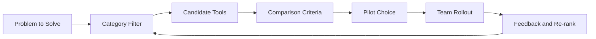

# Taskade Awesome Vibe Coding Tutorial: Curating the 2026 AI-Building Landscape

> Learn how to use and maintain `taskade/awesome-vibe-coding` as a decision system for AI app builders, coding agents, MCP tooling, and Genesis-centered workflows.

## Why This Track Matters

`taskade/awesome-vibe-coding` is not just a links list. It is a structured map of fast-moving AI development tools with practical comparison anchors.

Teams can use it to reduce stack-selection time, avoid tool churn, and build consistent adoption playbooks.

## Current Snapshot (verified 2026-02-24)

- repository: [`taskade/awesome-vibe-coding`](https://github.com/taskade/awesome-vibe-coding)
- stars: about **5**
- forks: about **1**
- recent push: **2026-02-11**
- companion repos used in this track's decision context: [`taskade/mcp`](https://github.com/taskade/mcp), [`taskade/docs`](https://github.com/taskade/docs), [`taskade/taskade`](https://github.com/taskade/taskade)
- current posture: actively curated thematic catalog with sections for app builders, coding editors/CLIs, MCP ecosystem, frameworks, workflows, and learning resources

## Mental Model

## Chapter Guide

| Chapter | Key Question | Outcome |
|:--------|:-------------|:--------|
| [01 - Getting Started and List Orientation](01-getting-started-and-list-orientation.md) | How should you read and use the list quickly? | faster onboarding |
| [02 - Information Architecture and Taxonomy](02-information-architecture-and-taxonomy.md) | How is the list structured and why does it matter? | better navigation |
| [03 - Taskade Genesis Positioning and Comparison Patterns](03-taskade-genesis-positioning-and-comparison-patterns.md) | How is Genesis framed vs other builders? | clearer platform fit |
| [04 - AI Coding Tool Categories and Selection Framework](04-ai-coding-tool-categories-and-selection-framework.md) | How do you choose across IDEs, CLIs, and agent tools? | higher-quality tool decisions |
| [05 - MCP and Agent Ecosystem Coverage](05-mcp-and-agent-ecosystem-coverage.md) | How does MCP change tool interoperability choices? | stronger integration strategy |
| [06 - Practical Workflows and Learning Paths](06-practical-workflows-and-learning-paths.md) | How do teams move from reading to execution? | adoption velocity |
| [07 - Contribution Governance and List Quality Controls](07-contribution-governance-and-list-quality-controls.md) | How do you keep the list useful as the market shifts? | quality sustainability |
| [08 - Market Monitoring and Operations Playbook](08-market-monitoring-and-operations-playbook.md) | How do you operationalize ongoing updates and evaluation? | long-term competitiveness |

## What You Will Learn

- how to extract actionable decisions from a high-volume curated list
- how to evaluate no-code, IDE, CLI, and autonomous agent tools with one rubric
- how to connect Taskade Genesis, automations, and MCP strategy into broader tool choices
- how to keep curation trustworthy through governance, cadence, and quality checks

## Source References

- [taskade/awesome-vibe-coding](https://github.com/taskade/awesome-vibe-coding)
- [Taskade Genesis](https://www.taskade.com/ai/apps)
- [Taskade AI Agents](https://www.taskade.com/ai/agents)
- [Taskade Automations](https://www.taskade.com/ai/automations)
- [Taskade MCP](https://github.com/taskade/mcp)
- [Taskade Docs](https://github.com/taskade/docs)
- [Taskade Platform Repo](https://github.com/taskade/taskade)

## Related Tutorials

- [Taskade Tutorial](../taskade-tutorial/)
- [Taskade Docs Tutorial](../taskade-docs-tutorial/)
- [Taskade MCP Tutorial](../taskade-mcp-tutorial/)
- [OpenCode Tutorial](../opencode-tutorial/)
- [Cline Tutorial](../cline-tutorial/)

---

Start with [Chapter 1: Getting Started and List Orientation](01-getting-started-and-list-orientation.md).

## Navigation & Backlinks

- [Start Here: Chapter 1: Getting Started and List Orientation](01-getting-started-and-list-orientation.md)
- [Back to Main Catalog](../../README.md#-tutorial-catalog)
- [Browse A-Z Tutorial Directory](../../discoverability/tutorial-directory.md)
- [Search by Intent](../../discoverability/query-hub.md)
- [Explore Category Hubs](../../README.md#category-hubs)

## Full Chapter Map

1. [Chapter 1: Getting Started and List Orientation](01-getting-started-and-list-orientation.md)
2. [Chapter 2: Information Architecture and Taxonomy](02-information-architecture-and-taxonomy.md)
3. [Chapter 3: Taskade Genesis Positioning and Comparison Patterns](03-taskade-genesis-positioning-and-comparison-patterns.md)
4. [Chapter 4: AI Coding Tool Categories and Selection Framework](04-ai-coding-tool-categories-and-selection-framework.md)
5. [Chapter 5: MCP and Agent Ecosystem Coverage](05-mcp-and-agent-ecosystem-coverage.md)
6. [Chapter 6: Practical Workflows and Learning Paths](06-practical-workflows-and-learning-paths.md)
7. [Chapter 7: Contribution Governance and List Quality Controls](07-contribution-governance-and-list-quality-controls.md)
8. [Chapter 8: Market Monitoring and Operations Playbook](08-market-monitoring-and-operations-playbook.md)

*Generated by [AI Codebase Knowledge Builder](https://github.com/The-Pocket/Tutorial-Codebase-Knowledge)*
