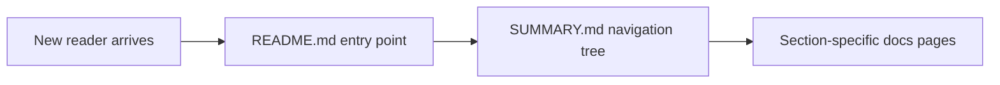

# Chapter 1: Getting Started and Docs Entry Points

Welcome to **Chapter 1: Getting Started and Docs Entry Points**. In this part of **Taskade Docs Tutorial: Operating the Living-DNA Documentation Stack**, you will build an intuitive mental model first, then move into concrete implementation details and practical production tradeoffs.

This chapter establishes the fastest route through `taskade/docs` for builders, operators, and integrators.

## Learning Goals

- choose the correct starting surface by role
- avoid duplicate reading across overlapping sections
- build a first-pass documentation map in under 30 minutes

## Primary Entry Surfaces

- `README.md` for platform narrative and quick-start paths
- `SUMMARY.md` for full table-of-contents navigation
- `.gitbook.yaml` for structure and redirect behavior

## Role-Based Start Path

| Role | Start Here | Then |
|:-----|:-----------|:-----|
| product builder | Genesis sections | Workspaces + automations |
| API integrator | developer overview + comprehensive API guide | auth + endpoint families |
| support/ops | help-center + troubleshooting + timeline | changelog and release diffs |

## Quick Orientation Checklist

1. read platform capability table in root README
2. inspect `SUMMARY.md` for current taxonomy
3. identify one target flow (Genesis, API, automation, or support)
4. capture relevant pages into an internal reading bundle

## Source References

- [Root README](https://github.com/taskade/docs/blob/main/README.md)
- [Summary](https://github.com/taskade/docs/blob/main/SUMMARY.md)
- [GitBook Config](https://github.com/taskade/docs/blob/main/.gitbook.yaml)

## Summary

You now have an entry-point strategy that matches role and objective.

Next: [Chapter 2: GitBook Structure, Navigation, and Information Architecture](02-gitbook-structure-navigation-and-information-architecture.md)

## Source Code Walkthrough

Use the following upstream sources to verify docs entry point and navigation details while reading this chapter:

- [`README.md`](https://github.com/taskade/docs/blob/HEAD/README.md) — the root entry point for the Taskade docs repo, containing the primary navigation overview and links to the major documentation sections.
- [`SUMMARY.md`](https://github.com/taskade/docs/blob/HEAD/SUMMARY.md) — the GitBook navigation manifest that defines the complete document tree, section ordering, and all internal page links.

Suggested trace strategy:
- read `README.md` to understand the intended reader journey and which sections are prioritized for new users
- browse `SUMMARY.md` to map the full navigation structure before diving into individual sections
- check `.gitbook.yaml` for any redirects or custom config that affects URL resolution

## How These Components Connect

