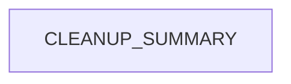

# Chapter 1: Getting Started and Docs Entry Points

Welcome to **Chapter 1: Getting Started and Docs Entry Points**. In this part of **Taskade Docs Tutorial: Operating the Living-DNA Documentation Stack**, you will build an intuitive mental model first, then move into concrete implementation details and practical production tradeoffs.


This chapter establishes the fastest route through `taskade/docs` for builders, operators, and integrators.

## Learning Goals

- choose the correct starting surface by role
- avoid duplicate reading across overlapping sections
- build a first-pass documentation map in under 30 minutes

## Primary Entry Surfaces

- `README.md` for platform narrative and quick-start paths
- `SUMMARY.md` for full table-of-contents navigation
- `.gitbook.yaml` for structure and redirect behavior

## Role-Based Start Path

| Role | Start Here | Then |
|:-----|:-----------|:-----|
| product builder | Genesis sections | Workspaces + automations |
| API integrator | developer overview + comprehensive API guide | auth + endpoint families |
| support/ops | help-center + troubleshooting + timeline | changelog and release diffs |

## Quick Orientation Checklist

1. read platform capability table in root README
2. inspect `SUMMARY.md` for current taxonomy
3. identify one target flow (Genesis, API, automation, or support)
4. capture relevant pages into an internal reading bundle

## Source References

- [Root README](https://github.com/taskade/docs/blob/main/README.md)
- [Summary](https://github.com/taskade/docs/blob/main/SUMMARY.md)
- [GitBook Config](https://github.com/taskade/docs/blob/main/.gitbook.yaml)

## Summary

You now have an entry-point strategy that matches role and objective.

Next: [Chapter 2: GitBook Structure, Navigation, and Information Architecture](02-gitbook-structure-navigation-and-information-architecture.md)

## Depth Expansion Playbook

## Source Code Walkthrough

### `archive/help-center/_imported/CLEANUP_SUMMARY.json`

The `CLEANUP_SUMMARY` module in [`archive/help-center/_imported/CLEANUP_SUMMARY.json`](https://github.com/taskade/docs/blob/HEAD/archive/help-center/_imported/CLEANUP_SUMMARY.json) handles a key part of this chapter's functionality:

```json
{
  "cleanup_date": "2025-09-14T01:11:04.798Z",
  "total_unique_articles": 1145,
  "duplicates_removed": 0,
  "published_articles": 1057,
  "unpublished_articles": 88,
  "categories": [
    "ai-agents",
    "ai-automation",
    "ai-basics",
    "ai-features",
    "automations",
    "collaboration",
    "essentials",
    "folders",
    "general",
    "genesis",
    "getting-started",
    "integrations",
    "known-urls",
    "mobile",
    "overview",
    "productivity",
    "project-views",
    "projects",
    "sharing",
    "structure",
    "taskade-ai",
    "tasks",
    "templates",
    "tips",
    "workspaces"
  ],
  "published_by_category": {
    "ai-agents": 22,
```

This module is important because it defines how Taskade Docs Tutorial: Operating the Living-DNA Documentation Stack implements the patterns covered in this chapter.


## How These Components Connect


