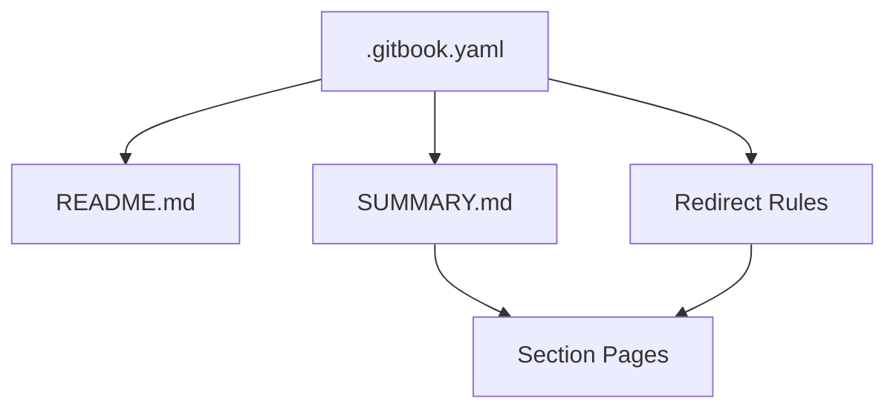

# Chapter 2: GitBook Structure, Navigation, and Information Architecture

Welcome to **Chapter 2: GitBook Structure, Navigation, and Information Architecture**. In this part of **Taskade Docs Tutorial: Operating the Living-DNA Documentation Stack**, you will build an intuitive mental model first, then move into concrete implementation details and practical production tradeoffs.

This chapter explains the control files that determine how users traverse the documentation.

## Learning Goals

- understand how root, summary, and redirect files cooperate
- identify where navigation drift is most likely
- maintain stable paths while content evolves

## Core Control Files

- `.gitbook.yaml` defines root/readme/summary bindings and redirect rules
- `SUMMARY.md` is the canonical navigation tree
- `README.md` serves as the top-level landing narrative

## Navigation Model

## Architecture Risks

| Risk | Impact | Mitigation |
|:-----|:-------|:-----------|
| stale redirect targets | broken user journeys | validate redirects during release checks |
| summary/readme mismatch | discoverability drop | maintain single-source taxonomy ownership |
| deep nesting without cross-links | high bounce and confusion | add role-based path links at section heads |

## Source References

- [GitBook Config](https://github.com/taskade/docs/blob/main/.gitbook.yaml)
- [Summary](https://github.com/taskade/docs/blob/main/SUMMARY.md)

## Summary

You now understand the navigation control plane and where to enforce consistency.

Next: [Chapter 3: Genesis, Workspace DNA, and Living-System Docs Model](03-genesis-workspace-dna-and-living-systems-doc-model.md)

## Depth Expansion Playbook

<!-- depth-expansion-v2 -->

This chapter is expanded to v1-style depth for production-grade learning and implementation quality.

### Strategic Context

- tutorial: **Taskade Docs Tutorial: Operating the Living-DNA Documentation Stack**
- tutorial slug: **taskade-docs-tutorial**
- chapter focus: **Chapter 2: GitBook Structure, Navigation, and Information Architecture**
- system context: **Taskade Docs Tutorial**
- objective: move from surface-level usage to repeatable engineering operation

### Architecture Decomposition

1. Define the runtime boundary for `Chapter 2: GitBook Structure, Navigation, and Information Architecture`.
2. Separate control-plane decisions from data-plane execution.
3. Capture input contracts, transformation points, and output contracts.
4. Trace state transitions across request lifecycle stages.
5. Identify extension hooks and policy interception points.
6. Map ownership boundaries for team and automation workflows.
7. Specify rollback and recovery paths for unsafe changes.
8. Track observability signals for correctness, latency, and cost.

### Operator Decision Matrix

| Decision Area | Low-Risk Path | High-Control Path | Tradeoff |
|:--------------|:--------------|:------------------|:---------|
| Runtime mode | managed defaults | explicit policy config | speed vs control |
| State handling | local ephemeral | durable persisted state | simplicity vs auditability |
| Tool integration | direct API use | mediated adapter layer | velocity vs governance |
| Rollout method | manual change | staged + canary rollout | effort vs safety |
| Incident response | best effort logs | runbooks + SLO alerts | cost vs reliability |

### Failure Modes and Countermeasures

| Failure Mode | Early Signal | Root Cause Pattern | Countermeasure |
|:-------------|:-------------|:-------------------|:---------------|
| stale context | inconsistent outputs | missing refresh window | enforce context TTL and refresh hooks |
| policy drift | unexpected execution | ad hoc overrides | centralize policy profiles |
| auth mismatch | 401/403 bursts | credential sprawl | rotation schedule + scope minimization |
| schema breakage | parser/validation errors | unmanaged upstream changes | contract tests per release |
| retry storms | queue congestion | no backoff controls | jittered backoff + circuit breakers |
| silent regressions | quality drop without alerts | weak baseline metrics | eval harness with thresholds |

### Implementation Runbook

1. Establish a reproducible baseline environment.
2. Capture chapter-specific success criteria before changes.
3. Implement minimal viable path with explicit interfaces.
4. Add observability before expanding feature scope.
5. Run deterministic tests for happy-path behavior.
6. Inject failure scenarios for negative-path validation.
7. Compare output quality against baseline snapshots.
8. Promote through staged environments with rollback gates.
9. Record operational lessons in release notes.

### Quality Gate Checklist

- [ ] chapter-level assumptions are explicit and testable
- [ ] API/tool boundaries are documented with input/output examples
- [ ] failure handling includes retry, timeout, and fallback policy
- [ ] security controls include auth scopes and secret rotation plans
- [ ] observability includes logs, metrics, traces, and alert thresholds
- [ ] deployment guidance includes canary and rollback paths
- [ ] docs include links to upstream sources and related tracks
- [ ] post-release verification confirms expected behavior under load

### Source Alignment

- [taskade/docs Repository](https://github.com/taskade/docs)
- [Root README](https://github.com/taskade/docs/blob/main/README.md)
- [SUMMARY Navigation](https://github.com/taskade/docs/blob/main/SUMMARY.md)
- [GitBook Config](https://github.com/taskade/docs/blob/main/.gitbook.yaml)
- [Taskade Help Center](https://help.taskade.com)
- [Taskade MCP](https://github.com/taskade/mcp)
- [Taskade Actions Runner Controller](https://github.com/taskade/actions-runner-controller)
- [Create Your First App](https://help.taskade.com/en/articles/11957643-create-your-first-app)

### Cross-Tutorial Connection Map

- [Taskade Tutorial](../taskade-tutorial/)
- [Taskade MCP Tutorial](../taskade-mcp-tutorial/)
- [Taskade Awesome Vibe Coding Tutorial](../taskade-awesome-vibe-coding-tutorial/)
- [MCP Docs Repo Tutorial](../mcp-docs-repo-tutorial/)
- [Chapter 1: Getting Started and Docs Entry Points](01-getting-started-and-docs-entry-points.md)

### Advanced Practice Exercises

1. Build a minimal end-to-end implementation for `Chapter 2: GitBook Structure, Navigation, and Information Architecture`.
2. Add instrumentation and measure baseline latency and error rate.
3. Introduce one controlled failure and confirm graceful recovery.
4. Add policy constraints and verify they are enforced consistently.
5. Run a staged rollout and document rollback decision criteria.

### Review Questions

1. Which execution boundary matters most for this chapter and why?
2. What signal detects regressions earliest in your environment?
3. What tradeoff did you make between delivery speed and governance?
4. How would you recover from the highest-impact failure mode?
5. What must be automated before scaling to team-wide adoption?

### Scenario Playbook 1: Chapter 2: GitBook Structure, Navigation, and Information Architecture

- tutorial context: **Taskade Docs Tutorial: Operating the Living-DNA Documentation Stack**
- trigger condition: incoming request volume spikes after release
- initial hypothesis: identify the smallest reproducible failure boundary
- immediate action: protect user-facing stability before optimization work
- engineering control: introduce adaptive concurrency limits and queue bounds
- verification target: latency p95 and p99 stay within defined SLO windows
- rollback trigger: pre-defined quality gate fails for two consecutive checks
- communication step: publish incident status with owner and ETA
- learning capture: add postmortem and convert findings into automated tests

### Scenario Playbook 2: Chapter 2: GitBook Structure, Navigation, and Information Architecture

- tutorial context: **Taskade Docs Tutorial: Operating the Living-DNA Documentation Stack**
- trigger condition: tool dependency latency increases under concurrency
- initial hypothesis: identify the smallest reproducible failure boundary
- immediate action: protect user-facing stability before optimization work
- engineering control: enable staged retries with jitter and circuit breaker fallback
- verification target: error budget burn rate remains below escalation threshold
- rollback trigger: pre-defined quality gate fails for two consecutive checks
- communication step: publish incident status with owner and ETA
- learning capture: add postmortem and convert findings into automated tests

### Scenario Playbook 3: Chapter 2: GitBook Structure, Navigation, and Information Architecture

- tutorial context: **Taskade Docs Tutorial: Operating the Living-DNA Documentation Stack**
- trigger condition: schema updates introduce incompatible payloads
- initial hypothesis: identify the smallest reproducible failure boundary
- immediate action: protect user-facing stability before optimization work
- engineering control: pin schema versions and add compatibility shims
- verification target: throughput remains stable under target concurrency
- rollback trigger: pre-defined quality gate fails for two consecutive checks
- communication step: publish incident status with owner and ETA
- learning capture: add postmortem and convert findings into automated tests

### Scenario Playbook 4: Chapter 2: GitBook Structure, Navigation, and Information Architecture

- tutorial context: **Taskade Docs Tutorial: Operating the Living-DNA Documentation Stack**
- trigger condition: environment parity drifts between staging and production
- initial hypothesis: identify the smallest reproducible failure boundary
- immediate action: protect user-facing stability before optimization work
- engineering control: restore environment parity via immutable config promotion
- verification target: retry volume stays bounded without feedback loops
- rollback trigger: pre-defined quality gate fails for two consecutive checks
- communication step: publish incident status with owner and ETA
- learning capture: add postmortem and convert findings into automated tests

### Scenario Playbook 5: Chapter 2: GitBook Structure, Navigation, and Information Architecture

- tutorial context: **Taskade Docs Tutorial: Operating the Living-DNA Documentation Stack**
- trigger condition: access policy changes reduce successful execution rates
- initial hypothesis: identify the smallest reproducible failure boundary
- immediate action: protect user-facing stability before optimization work
- engineering control: re-scope credentials and rotate leaked or stale keys
- verification target: data integrity checks pass across write/read cycles
- rollback trigger: pre-defined quality gate fails for two consecutive checks
- communication step: publish incident status with owner and ETA
- learning capture: add postmortem and convert findings into automated tests

### Scenario Playbook 6: Chapter 2: GitBook Structure, Navigation, and Information Architecture

- tutorial context: **Taskade Docs Tutorial: Operating the Living-DNA Documentation Stack**
- trigger condition: background jobs accumulate and exceed processing windows
- initial hypothesis: identify the smallest reproducible failure boundary
- immediate action: protect user-facing stability before optimization work
- engineering control: activate degradation mode to preserve core user paths
- verification target: audit logs capture all control-plane mutations
- rollback trigger: pre-defined quality gate fails for two consecutive checks
- communication step: publish incident status with owner and ETA
- learning capture: add postmortem and convert findings into automated tests

### Scenario Playbook 7: Chapter 2: GitBook Structure, Navigation, and Information Architecture

- tutorial context: **Taskade Docs Tutorial: Operating the Living-DNA Documentation Stack**
- trigger condition: incoming request volume spikes after release
- initial hypothesis: identify the smallest reproducible failure boundary
- immediate action: protect user-facing stability before optimization work
- engineering control: introduce adaptive concurrency limits and queue bounds
- verification target: latency p95 and p99 stay within defined SLO windows
- rollback trigger: pre-defined quality gate fails for two consecutive checks
- communication step: publish incident status with owner and ETA
- learning capture: add postmortem and convert findings into automated tests

### Scenario Playbook 8: Chapter 2: GitBook Structure, Navigation, and Information Architecture

- tutorial context: **Taskade Docs Tutorial: Operating the Living-DNA Documentation Stack**
- trigger condition: tool dependency latency increases under concurrency
- initial hypothesis: identify the smallest reproducible failure boundary
- immediate action: protect user-facing stability before optimization work
- engineering control: enable staged retries with jitter and circuit breaker fallback
- verification target: error budget burn rate remains below escalation threshold
- rollback trigger: pre-defined quality gate fails for two consecutive checks
- communication step: publish incident status with owner and ETA
- learning capture: add postmortem and convert findings into automated tests

### Scenario Playbook 9: Chapter 2: GitBook Structure, Navigation, and Information Architecture

- tutorial context: **Taskade Docs Tutorial: Operating the Living-DNA Documentation Stack**
- trigger condition: schema updates introduce incompatible payloads
- initial hypothesis: identify the smallest reproducible failure boundary
- immediate action: protect user-facing stability before optimization work
- engineering control: pin schema versions and add compatibility shims
- verification target: throughput remains stable under target concurrency
- rollback trigger: pre-defined quality gate fails for two consecutive checks
- communication step: publish incident status with owner and ETA
- learning capture: add postmortem and convert findings into automated tests

### Scenario Playbook 10: Chapter 2: GitBook Structure, Navigation, and Information Architecture

- tutorial context: **Taskade Docs Tutorial: Operating the Living-DNA Documentation Stack**
- trigger condition: environment parity drifts between staging and production
- initial hypothesis: identify the smallest reproducible failure boundary
- immediate action: protect user-facing stability before optimization work
- engineering control: restore environment parity via immutable config promotion
- verification target: retry volume stays bounded without feedback loops
- rollback trigger: pre-defined quality gate fails for two consecutive checks
- communication step: publish incident status with owner and ETA
- learning capture: add postmortem and convert findings into automated tests

### Scenario Playbook 11: Chapter 2: GitBook Structure, Navigation, and Information Architecture

- tutorial context: **Taskade Docs Tutorial: Operating the Living-DNA Documentation Stack**
- trigger condition: access policy changes reduce successful execution rates
- initial hypothesis: identify the smallest reproducible failure boundary
- immediate action: protect user-facing stability before optimization work
- engineering control: re-scope credentials and rotate leaked or stale keys
- verification target: data integrity checks pass across write/read cycles
- rollback trigger: pre-defined quality gate fails for two consecutive checks
- communication step: publish incident status with owner and ETA
- learning capture: add postmortem and convert findings into automated tests

### Scenario Playbook 12: Chapter 2: GitBook Structure, Navigation, and Information Architecture

- tutorial context: **Taskade Docs Tutorial: Operating the Living-DNA Documentation Stack**
- trigger condition: background jobs accumulate and exceed processing windows
- initial hypothesis: identify the smallest reproducible failure boundary
- immediate action: protect user-facing stability before optimization work
- engineering control: activate degradation mode to preserve core user paths
- verification target: audit logs capture all control-plane mutations
- rollback trigger: pre-defined quality gate fails for two consecutive checks
- communication step: publish incident status with owner and ETA
- learning capture: add postmortem and convert findings into automated tests

### Scenario Playbook 13: Chapter 2: GitBook Structure, Navigation, and Information Architecture

- tutorial context: **Taskade Docs Tutorial: Operating the Living-DNA Documentation Stack**
- trigger condition: incoming request volume spikes after release
- initial hypothesis: identify the smallest reproducible failure boundary
- immediate action: protect user-facing stability before optimization work
- engineering control: introduce adaptive concurrency limits and queue bounds
- verification target: latency p95 and p99 stay within defined SLO windows
- rollback trigger: pre-defined quality gate fails for two consecutive checks
- communication step: publish incident status with owner and ETA
- learning capture: add postmortem and convert findings into automated tests

### Scenario Playbook 14: Chapter 2: GitBook Structure, Navigation, and Information Architecture

- tutorial context: **Taskade Docs Tutorial: Operating the Living-DNA Documentation Stack**
- trigger condition: tool dependency latency increases under concurrency
- initial hypothesis: identify the smallest reproducible failure boundary
- immediate action: protect user-facing stability before optimization work
- engineering control: enable staged retries with jitter and circuit breaker fallback
- verification target: error budget burn rate remains below escalation threshold
- rollback trigger: pre-defined quality gate fails for two consecutive checks
- communication step: publish incident status with owner and ETA
- learning capture: add postmortem and convert findings into automated tests

### Scenario Playbook 15: Chapter 2: GitBook Structure, Navigation, and Information Architecture

- tutorial context: **Taskade Docs Tutorial: Operating the Living-DNA Documentation Stack**
- trigger condition: schema updates introduce incompatible payloads
- initial hypothesis: identify the smallest reproducible failure boundary
- immediate action: protect user-facing stability before optimization work
- engineering control: pin schema versions and add compatibility shims
- verification target: throughput remains stable under target concurrency
- rollback trigger: pre-defined quality gate fails for two consecutive checks
- communication step: publish incident status with owner and ETA
- learning capture: add postmortem and convert findings into automated tests

### Scenario Playbook 16: Chapter 2: GitBook Structure, Navigation, and Information Architecture

- tutorial context: **Taskade Docs Tutorial: Operating the Living-DNA Documentation Stack**
- trigger condition: environment parity drifts between staging and production
- initial hypothesis: identify the smallest reproducible failure boundary
- immediate action: protect user-facing stability before optimization work
- engineering control: restore environment parity via immutable config promotion
- verification target: retry volume stays bounded without feedback loops
- rollback trigger: pre-defined quality gate fails for two consecutive checks
- communication step: publish incident status with owner and ETA
- learning capture: add postmortem and convert findings into automated tests

### Scenario Playbook 17: Chapter 2: GitBook Structure, Navigation, and Information Architecture

- tutorial context: **Taskade Docs Tutorial: Operating the Living-DNA Documentation Stack**
- trigger condition: access policy changes reduce successful execution rates
- initial hypothesis: identify the smallest reproducible failure boundary
- immediate action: protect user-facing stability before optimization work
- engineering control: re-scope credentials and rotate leaked or stale keys
- verification target: data integrity checks pass across write/read cycles
- rollback trigger: pre-defined quality gate fails for two consecutive checks
- communication step: publish incident status with owner and ETA
- learning capture: add postmortem and convert findings into automated tests

### Scenario Playbook 18: Chapter 2: GitBook Structure, Navigation, and Information Architecture

- tutorial context: **Taskade Docs Tutorial: Operating the Living-DNA Documentation Stack**
- trigger condition: background jobs accumulate and exceed processing windows
- initial hypothesis: identify the smallest reproducible failure boundary
- immediate action: protect user-facing stability before optimization work
- engineering control: activate degradation mode to preserve core user paths
- verification target: audit logs capture all control-plane mutations
- rollback trigger: pre-defined quality gate fails for two consecutive checks
- communication step: publish incident status with owner and ETA
- learning capture: add postmortem and convert findings into automated tests

### Scenario Playbook 19: Chapter 2: GitBook Structure, Navigation, and Information Architecture

- tutorial context: **Taskade Docs Tutorial: Operating the Living-DNA Documentation Stack**
- trigger condition: incoming request volume spikes after release
- initial hypothesis: identify the smallest reproducible failure boundary
- immediate action: protect user-facing stability before optimization work
- engineering control: introduce adaptive concurrency limits and queue bounds
- verification target: latency p95 and p99 stay within defined SLO windows
- rollback trigger: pre-defined quality gate fails for two consecutive checks
- communication step: publish incident status with owner and ETA
- learning capture: add postmortem and convert findings into automated tests

### Scenario Playbook 20: Chapter 2: GitBook Structure, Navigation, and Information Architecture

- tutorial context: **Taskade Docs Tutorial: Operating the Living-DNA Documentation Stack**
- trigger condition: tool dependency latency increases under concurrency
- initial hypothesis: identify the smallest reproducible failure boundary
- immediate action: protect user-facing stability before optimization work
- engineering control: enable staged retries with jitter and circuit breaker fallback
- verification target: error budget burn rate remains below escalation threshold
- rollback trigger: pre-defined quality gate fails for two consecutive checks
- communication step: publish incident status with owner and ETA
- learning capture: add postmortem and convert findings into automated tests

### Scenario Playbook 21: Chapter 2: GitBook Structure, Navigation, and Information Architecture

- tutorial context: **Taskade Docs Tutorial: Operating the Living-DNA Documentation Stack**
- trigger condition: schema updates introduce incompatible payloads
- initial hypothesis: identify the smallest reproducible failure boundary
- immediate action: protect user-facing stability before optimization work
- engineering control: pin schema versions and add compatibility shims
- verification target: throughput remains stable under target concurrency
- rollback trigger: pre-defined quality gate fails for two consecutive checks
- communication step: publish incident status with owner and ETA
- learning capture: add postmortem and convert findings into automated tests

### Scenario Playbook 22: Chapter 2: GitBook Structure, Navigation, and Information Architecture

- tutorial context: **Taskade Docs Tutorial: Operating the Living-DNA Documentation Stack**
- trigger condition: environment parity drifts between staging and production
- initial hypothesis: identify the smallest reproducible failure boundary
- immediate action: protect user-facing stability before optimization work
- engineering control: restore environment parity via immutable config promotion
- verification target: retry volume stays bounded without feedback loops
- rollback trigger: pre-defined quality gate fails for two consecutive checks
- communication step: publish incident status with owner and ETA
- learning capture: add postmortem and convert findings into automated tests

### Scenario Playbook 23: Chapter 2: GitBook Structure, Navigation, and Information Architecture

- tutorial context: **Taskade Docs Tutorial: Operating the Living-DNA Documentation Stack**
- trigger condition: access policy changes reduce successful execution rates
- initial hypothesis: identify the smallest reproducible failure boundary
- immediate action: protect user-facing stability before optimization work
- engineering control: re-scope credentials and rotate leaked or stale keys
- verification target: data integrity checks pass across write/read cycles
- rollback trigger: pre-defined quality gate fails for two consecutive checks
- communication step: publish incident status with owner and ETA
- learning capture: add postmortem and convert findings into automated tests

### Scenario Playbook 24: Chapter 2: GitBook Structure, Navigation, and Information Architecture

- tutorial context: **Taskade Docs Tutorial: Operating the Living-DNA Documentation Stack**
- trigger condition: background jobs accumulate and exceed processing windows
- initial hypothesis: identify the smallest reproducible failure boundary
- immediate action: protect user-facing stability before optimization work
- engineering control: activate degradation mode to preserve core user paths
- verification target: audit logs capture all control-plane mutations
- rollback trigger: pre-defined quality gate fails for two consecutive checks
- communication step: publish incident status with owner and ETA
- learning capture: add postmortem and convert findings into automated tests

### Scenario Playbook 25: Chapter 2: GitBook Structure, Navigation, and Information Architecture

- tutorial context: **Taskade Docs Tutorial: Operating the Living-DNA Documentation Stack**
- trigger condition: incoming request volume spikes after release
- initial hypothesis: identify the smallest reproducible failure boundary
- immediate action: protect user-facing stability before optimization work
- engineering control: introduce adaptive concurrency limits and queue bounds
- verification target: latency p95 and p99 stay within defined SLO windows
- rollback trigger: pre-defined quality gate fails for two consecutive checks
- communication step: publish incident status with owner and ETA
- learning capture: add postmortem and convert findings into automated tests

### Scenario Playbook 26: Chapter 2: GitBook Structure, Navigation, and Information Architecture

- tutorial context: **Taskade Docs Tutorial: Operating the Living-DNA Documentation Stack**
- trigger condition: tool dependency latency increases under concurrency
- initial hypothesis: identify the smallest reproducible failure boundary
- immediate action: protect user-facing stability before optimization work
- engineering control: enable staged retries with jitter and circuit breaker fallback
- verification target: error budget burn rate remains below escalation threshold
- rollback trigger: pre-defined quality gate fails for two consecutive checks
- communication step: publish incident status with owner and ETA
- learning capture: add postmortem and convert findings into automated tests

### Scenario Playbook 27: Chapter 2: GitBook Structure, Navigation, and Information Architecture

- tutorial context: **Taskade Docs Tutorial: Operating the Living-DNA Documentation Stack**
- trigger condition: schema updates introduce incompatible payloads
- initial hypothesis: identify the smallest reproducible failure boundary
- immediate action: protect user-facing stability before optimization work
- engineering control: pin schema versions and add compatibility shims
- verification target: throughput remains stable under target concurrency
- rollback trigger: pre-defined quality gate fails for two consecutive checks
- communication step: publish incident status with owner and ETA
- learning capture: add postmortem and convert findings into automated tests

### Scenario Playbook 28: Chapter 2: GitBook Structure, Navigation, and Information Architecture

- tutorial context: **Taskade Docs Tutorial: Operating the Living-DNA Documentation Stack**
- trigger condition: environment parity drifts between staging and production
- initial hypothesis: identify the smallest reproducible failure boundary
- immediate action: protect user-facing stability before optimization work
- engineering control: restore environment parity via immutable config promotion
- verification target: retry volume stays bounded without feedback loops
- rollback trigger: pre-defined quality gate fails for two consecutive checks
- communication step: publish incident status with owner and ETA
- learning capture: add postmortem and convert findings into automated tests

### Scenario Playbook 29: Chapter 2: GitBook Structure, Navigation, and Information Architecture

- tutorial context: **Taskade Docs Tutorial: Operating the Living-DNA Documentation Stack**
- trigger condition: access policy changes reduce successful execution rates
- initial hypothesis: identify the smallest reproducible failure boundary
- immediate action: protect user-facing stability before optimization work
- engineering control: re-scope credentials and rotate leaked or stale keys
- verification target: data integrity checks pass across write/read cycles
- rollback trigger: pre-defined quality gate fails for two consecutive checks
- communication step: publish incident status with owner and ETA
- learning capture: add postmortem and convert findings into automated tests

### Scenario Playbook 30: Chapter 2: GitBook Structure, Navigation, and Information Architecture

- tutorial context: **Taskade Docs Tutorial: Operating the Living-DNA Documentation Stack**
- trigger condition: background jobs accumulate and exceed processing windows
- initial hypothesis: identify the smallest reproducible failure boundary
- immediate action: protect user-facing stability before optimization work
- engineering control: activate degradation mode to preserve core user paths
- verification target: audit logs capture all control-plane mutations
- rollback trigger: pre-defined quality gate fails for two consecutive checks
- communication step: publish incident status with owner and ETA
- learning capture: add postmortem and convert findings into automated tests

### Scenario Playbook 31: Chapter 2: GitBook Structure, Navigation, and Information Architecture

- tutorial context: **Taskade Docs Tutorial: Operating the Living-DNA Documentation Stack**
- trigger condition: incoming request volume spikes after release
- initial hypothesis: identify the smallest reproducible failure boundary
- immediate action: protect user-facing stability before optimization work
- engineering control: introduce adaptive concurrency limits and queue bounds
- verification target: latency p95 and p99 stay within defined SLO windows
- rollback trigger: pre-defined quality gate fails for two consecutive checks
- communication step: publish incident status with owner and ETA
- learning capture: add postmortem and convert findings into automated tests

### Scenario Playbook 32: Chapter 2: GitBook Structure, Navigation, and Information Architecture

- tutorial context: **Taskade Docs Tutorial: Operating the Living-DNA Documentation Stack**
- trigger condition: tool dependency latency increases under concurrency
- initial hypothesis: identify the smallest reproducible failure boundary
- immediate action: protect user-facing stability before optimization work
- engineering control: enable staged retries with jitter and circuit breaker fallback
- verification target: error budget burn rate remains below escalation threshold
- rollback trigger: pre-defined quality gate fails for two consecutive checks
- communication step: publish incident status with owner and ETA
- learning capture: add postmortem and convert findings into automated tests

### Scenario Playbook 33: Chapter 2: GitBook Structure, Navigation, and Information Architecture

- tutorial context: **Taskade Docs Tutorial: Operating the Living-DNA Documentation Stack**
- trigger condition: schema updates introduce incompatible payloads
- initial hypothesis: identify the smallest reproducible failure boundary
- immediate action: protect user-facing stability before optimization work
- engineering control: pin schema versions and add compatibility shims
- verification target: throughput remains stable under target concurrency
- rollback trigger: pre-defined quality gate fails for two consecutive checks
- communication step: publish incident status with owner and ETA
- learning capture: add postmortem and convert findings into automated tests

### Scenario Playbook 34: Chapter 2: GitBook Structure, Navigation, and Information Architecture

- tutorial context: **Taskade Docs Tutorial: Operating the Living-DNA Documentation Stack**
- trigger condition: environment parity drifts between staging and production
- initial hypothesis: identify the smallest reproducible failure boundary
- immediate action: protect user-facing stability before optimization work
- engineering control: restore environment parity via immutable config promotion
- verification target: retry volume stays bounded without feedback loops
- rollback trigger: pre-defined quality gate fails for two consecutive checks
- communication step: publish incident status with owner and ETA
- learning capture: add postmortem and convert findings into automated tests

### Scenario Playbook 35: Chapter 2: GitBook Structure, Navigation, and Information Architecture

- tutorial context: **Taskade Docs Tutorial: Operating the Living-DNA Documentation Stack**
- trigger condition: access policy changes reduce successful execution rates
- initial hypothesis: identify the smallest reproducible failure boundary
- immediate action: protect user-facing stability before optimization work
- engineering control: re-scope credentials and rotate leaked or stale keys
- verification target: data integrity checks pass across write/read cycles
- rollback trigger: pre-defined quality gate fails for two consecutive checks
- communication step: publish incident status with owner and ETA
- learning capture: add postmortem and convert findings into automated tests

### Scenario Playbook 36: Chapter 2: GitBook Structure, Navigation, and Information Architecture

- tutorial context: **Taskade Docs Tutorial: Operating the Living-DNA Documentation Stack**
- trigger condition: background jobs accumulate and exceed processing windows
- initial hypothesis: identify the smallest reproducible failure boundary
- immediate action: protect user-facing stability before optimization work
- engineering control: activate degradation mode to preserve core user paths
- verification target: audit logs capture all control-plane mutations
- rollback trigger: pre-defined quality gate fails for two consecutive checks
- communication step: publish incident status with owner and ETA
- learning capture: add postmortem and convert findings into automated tests

## What Problem Does This Solve?

Most teams struggle here because the hard part is not writing more code, but deciding clear boundaries for `flowchart`, `gitbook`, `yaml` so behavior stays predictable as complexity grows.

In practical terms, this chapter helps you avoid three common failures:

- coupling core logic too tightly to one implementation path
- missing the handoff boundaries between setup, execution, and validation
- shipping changes without clear rollback or observability strategy

After working through this chapter, you should be able to reason about `Chapter 2: GitBook Structure, Navigation, and Information Architecture` as an operating subsystem inside **Taskade Docs Tutorial: Operating the Living-DNA Documentation Stack**, with explicit contracts for inputs, state transitions, and outputs.

Use the implementation notes around `README`, `SUMMARY`, `Section` as your checklist when adapting these patterns to your own repository.

## How it Works Under the Hood

Under the hood, `Chapter 2: GitBook Structure, Navigation, and Information Architecture` usually follows a repeatable control path:

1. **Context bootstrap**: initialize runtime config and prerequisites for `flowchart`.
2. **Input normalization**: shape incoming data so `gitbook` receives stable contracts.
3. **Core execution**: run the main logic branch and propagate intermediate state through `yaml`.
4. **Policy and safety checks**: enforce limits, auth scopes, and failure boundaries.
5. **Output composition**: return canonical result payloads for downstream consumers.
6. **Operational telemetry**: emit logs/metrics needed for debugging and performance tuning.

When debugging, walk this sequence in order and confirm each stage has explicit success/failure conditions.

## Source Walkthrough

Use the following upstream sources to verify implementation details while reading this chapter:

- [taskade/docs Repository](https://github.com/taskade/docs)
  Why it matters: authoritative reference on `taskade/docs Repository` (github.com).
- [Root README](https://github.com/taskade/docs/blob/main/README.md)
  Why it matters: authoritative reference on `Root README` (github.com).
- [SUMMARY Navigation](https://github.com/taskade/docs/blob/main/SUMMARY.md)
  Why it matters: authoritative reference on `SUMMARY Navigation` (github.com).
- [GitBook Config](https://github.com/taskade/docs/blob/main/.gitbook.yaml)
  Why it matters: authoritative reference on `GitBook Config` (github.com).
- [Taskade Help Center](https://help.taskade.com)
  Why it matters: authoritative reference on `Taskade Help Center` (help.taskade.com).
- [Taskade MCP](https://github.com/taskade/mcp)
  Why it matters: authoritative reference on `Taskade MCP` (github.com).
- [Taskade Actions Runner Controller](https://github.com/taskade/actions-runner-controller)
  Why it matters: authoritative reference on `Taskade Actions Runner Controller` (github.com).
- [Create Your First App](https://help.taskade.com/en/articles/11957643-create-your-first-app)
  Why it matters: authoritative reference on `Create Your First App` (help.taskade.com).

Suggested trace strategy:
- search upstream code for `flowchart` and `gitbook` to map concrete implementation paths
- compare docs claims against actual runtime/config code before reusing patterns in production

## Chapter Connections

- [Tutorial Index](index.md)
- [Previous Chapter: Chapter 1: Getting Started and Docs Entry Points](01-getting-started-and-docs-entry-points.md)
- [Next Chapter: Chapter 3: Genesis, Workspace DNA, and Living-System Docs Model](03-genesis-workspace-dna-and-living-systems-doc-model.md)
- [Main Catalog](../../README.md#-tutorial-catalog)
- [A-Z Tutorial Directory](../../discoverability/tutorial-directory.md)
