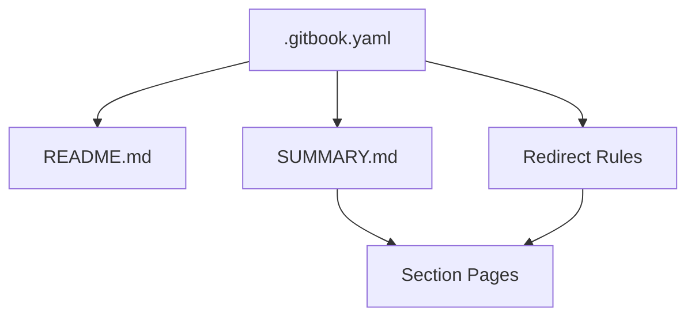
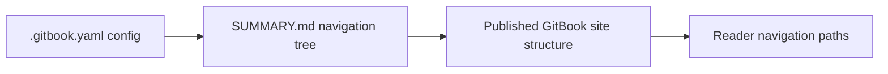

# Chapter 2: GitBook Structure, Navigation, and Information Architecture

Welcome to **Chapter 2: GitBook Structure, Navigation, and Information Architecture**. In this part of **Taskade Docs Tutorial: Operating the Living-DNA Documentation Stack**, you will build an intuitive mental model first, then move into concrete implementation details and practical production tradeoffs.

This chapter explains the control files that determine how users traverse the documentation.

## Learning Goals

- understand how root, summary, and redirect files cooperate
- identify where navigation drift is most likely
- maintain stable paths while content evolves

## Core Control Files

- `.gitbook.yaml` defines root/readme/summary bindings and redirect rules
- `SUMMARY.md` is the canonical navigation tree
- `README.md` serves as the top-level landing narrative

## Navigation Model

```mermaid
flowchart TD
    A[.gitbook.yaml] --> B[README.md]
    A --> C[SUMMARY.md]
    C --> D[Section Pages]
    A --> E[Redirect Rules]
    E --> D
```

## Architecture Risks

| Risk | Impact | Mitigation |
|:-----|:-------|:-----------|
| stale redirect targets | broken user journeys | validate redirects during release checks |
| summary/readme mismatch | discoverability drop | maintain single-source taxonomy ownership |
| deep nesting without cross-links | high bounce and confusion | add role-based path links at section heads |

## Source References

- [GitBook Config](https://github.com/taskade/docs/blob/main/.gitbook.yaml)
- [Summary](https://github.com/taskade/docs/blob/main/SUMMARY.md)

## Summary

You now understand the navigation control plane and where to enforce consistency.

Next: [Chapter 3: Genesis, Workspace DNA, and Living-System Docs Model](03-genesis-workspace-dna-and-living-systems-doc-model.md)

## Source Code Walkthrough

Use the following upstream sources to verify GitBook structure and navigation details while reading this chapter:

- [`SUMMARY.md`](https://github.com/taskade/docs/blob/HEAD/SUMMARY.md) — the canonical GitBook navigation manifest that structures the entire docs site; section headings, page order, and internal links are all controlled here.
- [`.gitbook.yaml`](https://github.com/taskade/docs/blob/HEAD/.gitbook.yaml) — the GitBook configuration file that specifies the root document, redirects, and any build-level overrides applied to the published site.

Suggested trace strategy:
- review `SUMMARY.md` structure to understand how top-level sections, subsections, and leaf pages are organized
- check `.gitbook.yaml` for redirect rules that indicate pages that have moved and must be kept accessible
- count section depths in `SUMMARY.md` to identify information architecture choices (breadth vs. depth tradeoffs)

## How These Components Connect

```mermaid
flowchart LR
    A[.gitbook.yaml config] --> B[SUMMARY.md navigation tree]
    B --> C[Published GitBook site structure]
    C --> D[Reader navigation paths]
```