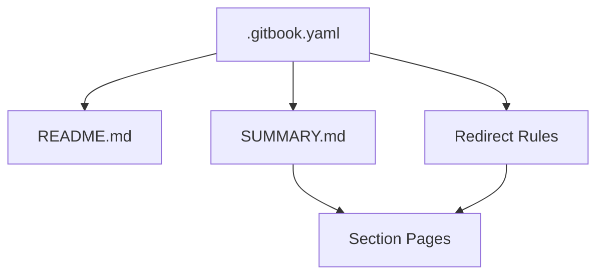
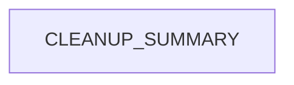

# Chapter 2: GitBook Structure, Navigation, and Information Architecture

Welcome to **Chapter 2: GitBook Structure, Navigation, and Information Architecture**. In this part of **Taskade Docs Tutorial: Operating the Living-DNA Documentation Stack**, you will build an intuitive mental model first, then move into concrete implementation details and practical production tradeoffs.


This chapter explains the control files that determine how users traverse the documentation.

## Learning Goals

- understand how root, summary, and redirect files cooperate
- identify where navigation drift is most likely
- maintain stable paths while content evolves

## Core Control Files

- `.gitbook.yaml` defines root/readme/summary bindings and redirect rules
- `SUMMARY.md` is the canonical navigation tree
- `README.md` serves as the top-level landing narrative

## Navigation Model


```mermaid
flowchart TD
    A[.gitbook.yaml] --> B[README.md]
    A --> C[SUMMARY.md]
    C --> D[Section Pages]
    A --> E[Redirect Rules]
    E --> D
```

## Architecture Risks

| Risk | Impact | Mitigation |
|:-----|:-------|:-----------|
| stale redirect targets | broken user journeys | validate redirects during release checks |
| summary/readme mismatch | discoverability drop | maintain single-source taxonomy ownership |
| deep nesting without cross-links | high bounce and confusion | add role-based path links at section heads |

## Source References

- [GitBook Config](https://github.com/taskade/docs/blob/main/.gitbook.yaml)
- [Summary](https://github.com/taskade/docs/blob/main/SUMMARY.md)

## Summary

You now understand the navigation control plane and where to enforce consistency.

Next: [Chapter 3: Genesis, Workspace DNA, and Living-System Docs Model](03-genesis-workspace-dna-and-living-systems-doc-model.md)

## Depth Expansion Playbook

## Source Code Walkthrough

### `archive/help-center/_imported/CLEANUP_SUMMARY.json`

The `CLEANUP_SUMMARY` module in [`archive/help-center/_imported/CLEANUP_SUMMARY.json`](https://github.com/taskade/docs/blob/HEAD/archive/help-center/_imported/CLEANUP_SUMMARY.json) handles a key part of this chapter's functionality:

```json
{
  "cleanup_date": "2025-09-14T01:11:04.798Z",
  "total_unique_articles": 1145,
  "duplicates_removed": 0,
  "published_articles": 1057,
  "unpublished_articles": 88,
  "categories": [
    "ai-agents",
    "ai-automation",
    "ai-basics",
    "ai-features",
    "automations",
    "collaboration",
    "essentials",
    "folders",
    "general",
    "genesis",
    "getting-started",
    "integrations",
    "known-urls",
    "mobile",
    "overview",
    "productivity",
    "project-views",
    "projects",
    "sharing",
    "structure",
    "taskade-ai",
    "tasks",
    "templates",
    "tips",
    "workspaces"
  ],
  "published_by_category": {
    "ai-agents": 22,
```

This module is important because it defines how Taskade Docs Tutorial: Operating the Living-DNA Documentation Stack implements the patterns covered in this chapter.


## How These Components Connect


```mermaid
flowchart TD
    A[CLEANUP_SUMMARY]
```
