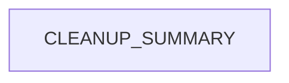

# Chapter 3: Genesis, Workspace DNA, and Living-System Docs Model

Welcome to **Chapter 3: Genesis, Workspace DNA, and Living-System Docs Model**. In this part of **Taskade Docs Tutorial: Operating the Living-DNA Documentation Stack**, you will build an intuitive mental model first, then move into concrete implementation details and practical production tradeoffs.


This chapter maps the narrative core of Taskade docs: Genesis and Workspace DNA framing.

## Learning Goals

- understand how living-system concepts are presented
- map docs sections to memory/intelligence/execution pillars
- turn narrative docs into implementation-ready checklists

## Docs Narrative Pillars

The docs present an integrated model where:

- workspace/project structures represent memory
- AI agents represent intelligence
- automations represent execution/motion

## Documentation-to-Execution Mapping

| Narrative Area | Operational Translation |
|:---------------|:------------------------|
| Genesis app builder | prompt-to-app prototyping and rollout |
| Workspace DNA | data model and context boundaries |
| living systems | combined agents + automations + projects |

## Practical Conversion Pattern

1. extract product claims from narrative pages
2. map each claim to one actionable setup/test step
3. verify against API and automation reference sections
4. keep implementation notes separate from marketing prose

## Source References

- [Genesis section in SUMMARY](https://github.com/taskade/docs/blob/main/SUMMARY.md)
- [Root README narrative](https://github.com/taskade/docs/blob/main/README.md)
- [Taskade Genesis](https://www.taskade.com/ai/apps)

## Summary

You now have a method for converting conceptual product docs into concrete rollout plans.

Next: [Chapter 4: API Documentation Surface and Endpoint Coverage](04-api-documentation-surface-and-endpoint-coverage.md)

## Depth Expansion Playbook

## Source Code Walkthrough

### `archive/help-center/_imported/CLEANUP_SUMMARY.json`

The `CLEANUP_SUMMARY` module in [`archive/help-center/_imported/CLEANUP_SUMMARY.json`](https://github.com/taskade/docs/blob/HEAD/archive/help-center/_imported/CLEANUP_SUMMARY.json) handles a key part of this chapter's functionality:

```json
{
  "cleanup_date": "2025-09-14T01:11:04.798Z",
  "total_unique_articles": 1145,
  "duplicates_removed": 0,
  "published_articles": 1057,
  "unpublished_articles": 88,
  "categories": [
    "ai-agents",
    "ai-automation",
    "ai-basics",
    "ai-features",
    "automations",
    "collaboration",
    "essentials",
    "folders",
    "general",
    "genesis",
    "getting-started",
    "integrations",
    "known-urls",
    "mobile",
    "overview",
    "productivity",
    "project-views",
    "projects",
    "sharing",
    "structure",
    "taskade-ai",
    "tasks",
    "templates",
    "tips",
    "workspaces"
  ],
  "published_by_category": {
    "ai-agents": 22,
```

This module is important because it defines how Taskade Docs Tutorial: Operating the Living-DNA Documentation Stack implements the patterns covered in this chapter.


## How These Components Connect


