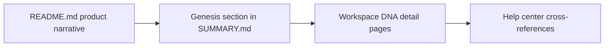

# Chapter 3: Genesis, Workspace DNA, and Living-System Docs Model

Welcome to **Chapter 3: Genesis, Workspace DNA, and Living-System Docs Model**. In this part of **Taskade Docs Tutorial: Operating the Living-DNA Documentation Stack**, you will build an intuitive mental model first, then move into concrete implementation details and practical production tradeoffs.

This chapter maps the narrative core of Taskade docs: Genesis and Workspace DNA framing.

## Learning Goals

- understand how living-system concepts are presented
- map docs sections to memory/intelligence/execution pillars
- turn narrative docs into implementation-ready checklists

## Docs Narrative Pillars

The docs present an integrated model where:

- workspace/project structures represent memory
- AI agents represent intelligence
- automations represent execution/motion

## Documentation-to-Execution Mapping

| Narrative Area | Operational Translation |
|:---------------|:------------------------|
| Genesis app builder | prompt-to-app prototyping and rollout |
| Workspace DNA | data model and context boundaries |
| living systems | combined agents + automations + projects |

## Practical Conversion Pattern

1. extract product claims from narrative pages
2. map each claim to one actionable setup/test step
3. verify against API and automation reference sections
4. keep implementation notes separate from marketing prose

## Source References

- [Genesis section in SUMMARY](https://github.com/taskade/docs/blob/main/SUMMARY.md)
- [Root README narrative](https://github.com/taskade/docs/blob/main/README.md)
- [Taskade Genesis](https://www.taskade.com/ai/apps)

## Summary

You now have a method for converting conceptual product docs into concrete rollout plans.

Next: [Chapter 4: API Documentation Surface and Endpoint Coverage](04-api-documentation-surface-and-endpoint-coverage.md)

## Source Code Walkthrough

Use the following upstream sources to verify Genesis and Workspace DNA documentation details while reading this chapter:

- [`README.md`](https://github.com/taskade/docs/blob/HEAD/README.md) — introduces the Living DNA and Genesis concepts at the top level, providing the narrative framing for the entire documentation system.
- [`SUMMARY.md`](https://github.com/taskade/docs/blob/HEAD/SUMMARY.md) — the navigation manifest; look for the Genesis and Workspace DNA section to understand how these concepts are organized relative to other product pillars.

Suggested trace strategy:
- locate the Genesis and Workspace DNA sections in `SUMMARY.md` to understand doc surface coverage
- cross-reference help center article IDs from the help.taskade.com knowledge base with docs pages to check alignment
- read the introductory Genesis page to see how the Tree of Life and EVE (Evolving Virtual Environment) metaphors are presented

## How These Components Connect

