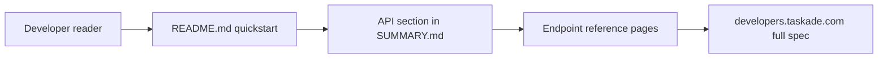

# Chapter 4: API Documentation Surface and Endpoint Coverage

Welcome to **Chapter 4: API Documentation Surface and Endpoint Coverage**. In this part of **Taskade Docs Tutorial: Operating the Living-DNA Documentation Stack**, you will build an intuitive mental model first, then move into concrete implementation details and practical production tradeoffs.

This chapter focuses on developer-facing API documentation and coverage breadth.

## Learning Goals

- identify endpoint families documented in the repo
- verify where auth/token setup lives
- align API docs with practical integration sequences

## API Coverage in Summary Tree

From `SUMMARY.md`, major endpoint families include:

- workspaces
- projects
- tasks
- agents
- folders
- media
- me

This breadth aligns closely with Taskade MCP tool families.

## Recommended Integration Read Order

1. developer overview
2. authentication and personal tokens
3. endpoint family for your first workflow
4. write operations only after read-path verification

## Coverage-to-Risk Mapping

| Domain | Common Risk | Mitigation |
|:-------|:------------|:-----------|
| tasks/projects writes | destructive updates | stage with test workspace |
| agent operations | knowledge/config drift | snapshot configs before update |
| share/public settings | accidental exposure | explicit review gates |

## Source References

- [API section in SUMMARY](https://github.com/taskade/docs/blob/main/SUMMARY.md)
- [Developer Overview](https://github.com/taskade/docs/tree/main/apis-living-system-development/developers)
- [Comprehensive API Guide](https://github.com/taskade/docs/tree/main/apis-living-system-development/comprehensive-api-guide)

## Summary

You now have a pragmatic way to consume API docs safely and in the right sequence.

Next: [Chapter 5: AI Agents and Automation Documentation Patterns](05-ai-agents-and-automation-documentation-patterns.md)

## Source Code Walkthrough

Use the following upstream sources to verify API documentation surface details while reading this chapter:

- [`SUMMARY.md`](https://github.com/taskade/docs/blob/HEAD/SUMMARY.md) — navigate to the API and developer reference sections to understand how endpoint coverage is organized across authentication, workspace, project, task, and agent surfaces.
- [`README.md`](https://github.com/taskade/docs/blob/HEAD/README.md) — the developer quickstart section points to primary API entry points and links to the `developers.taskade.com` reference site.

Suggested trace strategy:
- scan the API sections in `SUMMARY.md` to assess breadth of endpoint coverage
- compare the docs API surface against the live `developers.taskade.com` OpenAPI spec to identify gaps
- check if webhook documentation, pagination patterns, and error codes are covered in separate dedicated pages

## How These Components Connect

