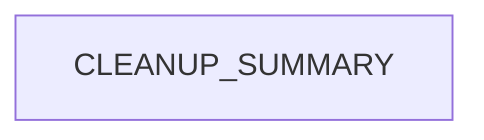

# Chapter 4: API Documentation Surface and Endpoint Coverage

Welcome to **Chapter 4: API Documentation Surface and Endpoint Coverage**. In this part of **Taskade Docs Tutorial: Operating the Living-DNA Documentation Stack**, you will build an intuitive mental model first, then move into concrete implementation details and practical production tradeoffs.


This chapter focuses on developer-facing API documentation and coverage breadth.

## Learning Goals

- identify endpoint families documented in the repo
- verify where auth/token setup lives
- align API docs with practical integration sequences

## API Coverage in Summary Tree

From `SUMMARY.md`, major endpoint families include:

- workspaces
- projects
- tasks
- agents
- folders
- media
- me

This breadth aligns closely with Taskade MCP tool families.

## Recommended Integration Read Order

1. developer overview
2. authentication and personal tokens
3. endpoint family for your first workflow
4. write operations only after read-path verification

## Coverage-to-Risk Mapping

| Domain | Common Risk | Mitigation |
|:-------|:------------|:-----------|
| tasks/projects writes | destructive updates | stage with test workspace |
| agent operations | knowledge/config drift | snapshot configs before update |
| share/public settings | accidental exposure | explicit review gates |

## Source References

- [API section in SUMMARY](https://github.com/taskade/docs/blob/main/SUMMARY.md)
- [Developer Overview](https://github.com/taskade/docs/tree/main/apis-living-system-development/developers)
- [Comprehensive API Guide](https://github.com/taskade/docs/tree/main/apis-living-system-development/comprehensive-api-guide)

## Summary

You now have a pragmatic way to consume API docs safely and in the right sequence.

Next: [Chapter 5: AI Agents and Automation Documentation Patterns](05-ai-agents-and-automation-documentation-patterns.md)

## Depth Expansion Playbook

## Source Code Walkthrough

### `archive/help-center/_imported/CLEANUP_SUMMARY.json`

The `CLEANUP_SUMMARY` module in [`archive/help-center/_imported/CLEANUP_SUMMARY.json`](https://github.com/taskade/docs/blob/HEAD/archive/help-center/_imported/CLEANUP_SUMMARY.json) handles a key part of this chapter's functionality:

```json
{
  "cleanup_date": "2025-09-14T01:11:04.798Z",
  "total_unique_articles": 1145,
  "duplicates_removed": 0,
  "published_articles": 1057,
  "unpublished_articles": 88,
  "categories": [
    "ai-agents",
    "ai-automation",
    "ai-basics",
    "ai-features",
    "automations",
    "collaboration",
    "essentials",
    "folders",
    "general",
    "genesis",
    "getting-started",
    "integrations",
    "known-urls",
    "mobile",
    "overview",
    "productivity",
    "project-views",
    "projects",
    "sharing",
    "structure",
    "taskade-ai",
    "tasks",
    "templates",
    "tips",
    "workspaces"
  ],
  "published_by_category": {
    "ai-agents": 22,
```

This module is important because it defines how Taskade Docs Tutorial: Operating the Living-DNA Documentation Stack implements the patterns covered in this chapter.


## How These Components Connect


