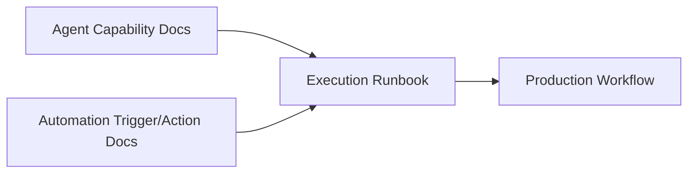
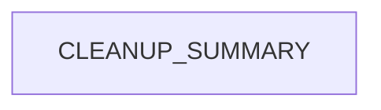

# Chapter 5: AI Agents and Automation Documentation Patterns

Welcome to **Chapter 5: AI Agents and Automation Documentation Patterns**. In this part of **Taskade Docs Tutorial: Operating the Living-DNA Documentation Stack**, you will build an intuitive mental model first, then move into concrete implementation details and practical production tradeoffs.


This chapter examines how docs describe the interaction between AI agents and automations.

## Learning Goals

- map agent docs and automation docs into one execution model
- identify where tool capabilities vs workflow recipes are documented
- create a reusable documentation-to-runbook bridge

## Agent + Automation Pairing Model



## Documentation Pattern in `taskade/docs`

- agent docs focus on setup, capability, and knowledge context
- automation docs focus on triggers, actions, integrations, and recipes
- users must combine both to produce operational workflows

## Runbook Conversion Template

- objective
- trigger event
- agent role and context
- action chain
- failure handling
- audit and rollback notes

## Source References

- [AI Features section](https://github.com/taskade/docs/tree/main/genesis-living-system-builder/ai-features)
- [Automation section](https://github.com/taskade/docs/tree/main/genesis-living-system-builder/automation)
- [Taskade Automations](https://www.taskade.com/ai/automations)

## Summary

You now have a repeatable pattern to combine agent and automation docs into executable workflows.

Next: [Chapter 6: Release Notes, Changelog, and Timeline Operations](06-release-notes-changelog-and-timeline-operations.md)

## Depth Expansion Playbook

## Source Code Walkthrough

### `archive/help-center/_imported/CLEANUP_SUMMARY.json`

The `CLEANUP_SUMMARY` module in [`archive/help-center/_imported/CLEANUP_SUMMARY.json`](https://github.com/taskade/docs/blob/HEAD/archive/help-center/_imported/CLEANUP_SUMMARY.json) handles a key part of this chapter's functionality:

```json
{
  "cleanup_date": "2025-09-14T01:11:04.798Z",
  "total_unique_articles": 1145,
  "duplicates_removed": 0,
  "published_articles": 1057,
  "unpublished_articles": 88,
  "categories": [
    "ai-agents",
    "ai-automation",
    "ai-basics",
    "ai-features",
    "automations",
    "collaboration",
    "essentials",
    "folders",
    "general",
    "genesis",
    "getting-started",
    "integrations",
    "known-urls",
    "mobile",
    "overview",
    "productivity",
    "project-views",
    "projects",
    "sharing",
    "structure",
    "taskade-ai",
    "tasks",
    "templates",
    "tips",
    "workspaces"
  ],
  "published_by_category": {
    "ai-agents": 22,
```

This module is important because it defines how Taskade Docs Tutorial: Operating the Living-DNA Documentation Stack implements the patterns covered in this chapter.


## How These Components Connect


