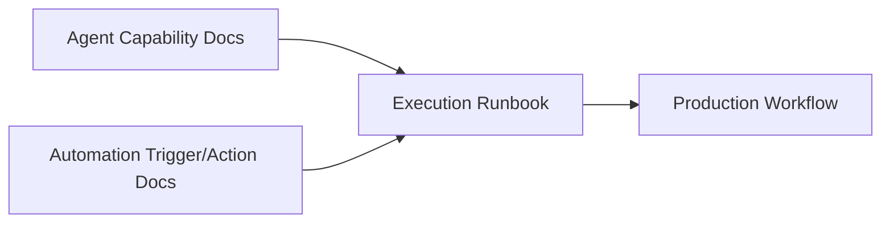
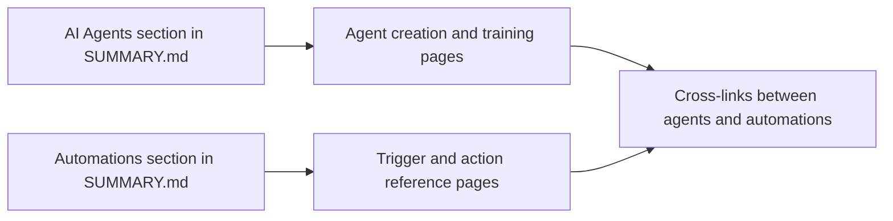

# Chapter 5: AI Agents and Automation Documentation Patterns

Welcome to **Chapter 5: AI Agents and Automation Documentation Patterns**. In this part of **Taskade Docs Tutorial: Operating the Living-DNA Documentation Stack**, you will build an intuitive mental model first, then move into concrete implementation details and practical production tradeoffs.

This chapter examines how docs describe the interaction between AI agents and automations.

## Learning Goals

- map agent docs and automation docs into one execution model
- identify where tool capabilities vs workflow recipes are documented
- create a reusable documentation-to-runbook bridge

## Agent + Automation Pairing Model

## Documentation Pattern in `taskade/docs`

- agent docs focus on setup, capability, and knowledge context
- automation docs focus on triggers, actions, integrations, and recipes
- users must combine both to produce operational workflows

## Runbook Conversion Template

- objective
- trigger event
- agent role and context
- action chain
- failure handling
- audit and rollback notes

## Source References

- [AI Features section](https://github.com/taskade/docs/tree/main/genesis-living-system-builder/ai-features)
- [Automation section](https://github.com/taskade/docs/tree/main/genesis-living-system-builder/automation)
- [Taskade Automations](https://www.taskade.com/ai/automations)

## Summary

You now have a repeatable pattern to combine agent and automation docs into executable workflows.

Next: [Chapter 6: Release Notes, Changelog, and Timeline Operations](06-release-notes-changelog-and-timeline-operations.md)

## Source Code Walkthrough

Use the following upstream sources to verify AI agent and automation documentation details while reading this chapter:

- [`SUMMARY.md`](https://github.com/taskade/docs/blob/HEAD/SUMMARY.md) — navigate to the AI Agents and Automations sections to see how these two capability pillars are separated and cross-linked in the documentation tree.
- [`README.md`](https://github.com/taskade/docs/blob/HEAD/README.md) — the main product narrative that positions AI agents (Intelligence pillar) and Automations (Execution pillar) relative to other platform capabilities.

Suggested trace strategy:
- identify the AI Agents and Automations leaf pages in `SUMMARY.md` to assess documentation depth per feature
- check whether trigger/action/condition concepts appear in both the automation docs and the agent training docs for consistency
- compare docs coverage against the `help.taskade.com` articles for agents and automations to spot content drift

## How These Components Connect

