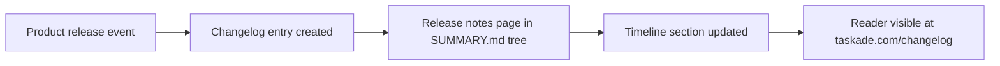

# Chapter 6: Release Notes, Changelog, and Timeline Operations

Welcome to **Chapter 6: Release Notes, Changelog, and Timeline Operations**. In this part of **Taskade Docs Tutorial: Operating the Living-DNA Documentation Stack**, you will build an intuitive mental model first, then move into concrete implementation details and practical production tradeoffs.

This chapter covers how updates are represented and how teams should consume them.

## Learning Goals

- understand timeline vs historical changelog split
- monitor recent updates without losing long-range context
- build release-intake habits for platform-dependent teams

## Update Surfaces

`SUMMARY.md` exposes both:

- current timeline buckets (for recent months)
- multi-year changelog archives

This allows near-term change monitoring and long-term reference continuity.

In practice, teams can combine these with Taskade newsletter updates to catch feature-surface changes earlier in the cycle.

## Release Intake Cadence

- weekly: scan current month timeline entries
- monthly: reconcile major changes into internal runbooks
- quarterly: review historical patterns for migration planning

## Operational Consumption Checklist

- classify each update: feature, behavior change, integration change, docs-only
- map affected teams/workflows
- define test cases before enabling high-impact features

## Newsletter Intake Layer (Imported)

Useful newsletter pages for release monitoring include:

- [Introducing Taskade Genesis](https://www.taskade.com/newsletters/w/E892fl7IEwztrpfZDdMMY9Ug)
- [Genesis 2025: The Year Software Came Alive](https://www.taskade.com/newsletters/w/W763vDgzG2W9zRfdL3aALM3g)
- [Generate Images, Preview Agents, and More](https://www.taskade.com/newsletters/w/Z0ufmcIZ46892xNbAJ5TSFtA)
- [Introducing Taskade Genesis App Community](https://www.taskade.com/newsletters/w/yKJO3flYI0O93cKz5VSsyw)

Note: one provided newsletter URL currently resolves to a web page that says the web version no longer exists:

- [Archived/Unavailable Newsletter URL](https://www.taskade.com/newsletters/w/FANqKzwWEjyhgrOTVgz763tQ)

## Source References

- [Updates and Timeline](https://github.com/taskade/docs/tree/main/updates-and-timeline)
- [Changelog](https://github.com/taskade/docs/tree/main/changelog)
- [Taskade Newsletters](https://www.taskade.com/newsletters)

## Summary

You now have a process to turn docs updates into controlled operational change.

Next: [Chapter 7: Doc Quality Governance and Link Hygiene](07-doc-quality-governance-and-link-hygiene.md)

## Source Code Walkthrough

Use the following upstream sources to verify release notes and changelog details while reading this chapter:

- [`SUMMARY.md`](https://github.com/taskade/docs/blob/HEAD/SUMMARY.md) — navigate to the changelog or release notes section to understand how release cadence and version history are documented and organized.
- [`README.md`](https://github.com/taskade/docs/blob/HEAD/README.md) — may include a link to the changelog or a version history overview that anchors how updates are surfaced to documentation readers.

Suggested trace strategy:
- find the release/changelog section in `SUMMARY.md` to check release note frequency and coverage depth
- compare docs release notes against the `taskade.com/changelog` product site for alignment
- check whether breaking API changes are flagged differently from feature additions in the release notes format

## How These Components Connect

