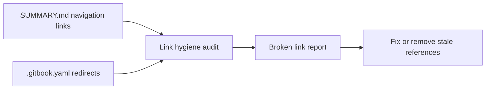

# Chapter 7: Doc Quality Governance and Link Hygiene

Welcome to **Chapter 7: Doc Quality Governance and Link Hygiene**. In this part of **Taskade Docs Tutorial: Operating the Living-DNA Documentation Stack**, you will build an intuitive mental model first, then move into concrete implementation details and practical production tradeoffs.

This chapter focuses on quality risks in a fast-moving documentation repo and how to control them.

## Learning Goals

- identify trust-breaking quality issues early
- design doc QA gates for links, structure, and factual freshness
- reduce cross-section drift between narrative and API docs

## Observed Risk Areas

From current repository content:

- some legacy or placeholder-style links appear in root docs surfaces
- cross-link density is high, increasing breakage risk during refactors
- mixed audience layers (marketing + API + support) require strict edit discipline

## Governance Controls

| Control | Purpose |
|:--------|:--------|
| link-check CI | prevent broken navigation in published docs |
| snapshot-date policy | prevent stale "current" claims |
| section ownership model | maintain taxonomy consistency |
| release-claim audit pass | align docs with actual shipped features |

## Quality Gate Checklist

- no dead internal links in summary paths
- no stale time-relative language without dates
- feature claims backed by concrete references
- redirects validated after every structural move

## Source References

- [taskade/docs repository](https://github.com/taskade/docs)
- [GitBook config redirects](https://github.com/taskade/docs/blob/main/.gitbook.yaml)
- [Taskade Help Center](https://help.taskade.com)

## Summary

You now have a governance baseline to protect documentation trust at scale.

Next: [Chapter 8: Contribution Workflow and Docs Operations Playbook](08-contribution-workflow-and-docs-operations-playbook.md)

## Source Code Walkthrough

Use the following upstream sources to verify doc quality governance details while reading this chapter:

- [`SUMMARY.md`](https://github.com/taskade/docs/blob/HEAD/SUMMARY.md) — the source of truth for all internal navigation links; broken or mismatched entries here produce broken navigation across the entire docs site.
- [`.gitbook.yaml`](https://github.com/taskade/docs/blob/HEAD/.gitbook.yaml) — contains redirect definitions that must be maintained when pages are renamed or moved to preserve URL consistency for external links.

Suggested trace strategy:
- audit `SUMMARY.md` for orphaned entries (pages listed but files missing) and missing entries (files present but not listed)
- check `.gitbook.yaml` redirects against current `SUMMARY.md` structure to identify stale redirect rules
- scan doc pages for external links to `help.taskade.com` and `developers.taskade.com` that may have drifted

## How These Components Connect

