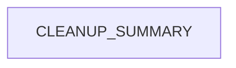

# Chapter 7: Doc Quality Governance and Link Hygiene

Welcome to **Chapter 7: Doc Quality Governance and Link Hygiene**. In this part of **Taskade Docs Tutorial: Operating the Living-DNA Documentation Stack**, you will build an intuitive mental model first, then move into concrete implementation details and practical production tradeoffs.


This chapter focuses on quality risks in a fast-moving documentation repo and how to control them.

## Learning Goals

- identify trust-breaking quality issues early
- design doc QA gates for links, structure, and factual freshness
- reduce cross-section drift between narrative and API docs

## Observed Risk Areas

From current repository content:

- some legacy or placeholder-style links appear in root docs surfaces
- cross-link density is high, increasing breakage risk during refactors
- mixed audience layers (marketing + API + support) require strict edit discipline

## Governance Controls

| Control | Purpose |
|:--------|:--------|
| link-check CI | prevent broken navigation in published docs |
| snapshot-date policy | prevent stale "current" claims |
| section ownership model | maintain taxonomy consistency |
| release-claim audit pass | align docs with actual shipped features |

## Quality Gate Checklist

- no dead internal links in summary paths
- no stale time-relative language without dates
- feature claims backed by concrete references
- redirects validated after every structural move

## Source References

- [taskade/docs repository](https://github.com/taskade/docs)
- [GitBook config redirects](https://github.com/taskade/docs/blob/main/.gitbook.yaml)
- [Taskade Help Center](https://help.taskade.com)

## Summary

You now have a governance baseline to protect documentation trust at scale.

Next: [Chapter 8: Contribution Workflow and Docs Operations Playbook](08-contribution-workflow-and-docs-operations-playbook.md)

## Depth Expansion Playbook

## Source Code Walkthrough

### `archive/help-center/_imported/CLEANUP_SUMMARY.json`

The `CLEANUP_SUMMARY` module in [`archive/help-center/_imported/CLEANUP_SUMMARY.json`](https://github.com/taskade/docs/blob/HEAD/archive/help-center/_imported/CLEANUP_SUMMARY.json) handles a key part of this chapter's functionality:

```json
{
  "cleanup_date": "2025-09-14T01:11:04.798Z",
  "total_unique_articles": 1145,
  "duplicates_removed": 0,
  "published_articles": 1057,
  "unpublished_articles": 88,
  "categories": [
    "ai-agents",
    "ai-automation",
    "ai-basics",
    "ai-features",
    "automations",
    "collaboration",
    "essentials",
    "folders",
    "general",
    "genesis",
    "getting-started",
    "integrations",
    "known-urls",
    "mobile",
    "overview",
    "productivity",
    "project-views",
    "projects",
    "sharing",
    "structure",
    "taskade-ai",
    "tasks",
    "templates",
    "tips",
    "workspaces"
  ],
  "published_by_category": {
    "ai-agents": 22,
```

This module is important because it defines how Taskade Docs Tutorial: Operating the Living-DNA Documentation Stack implements the patterns covered in this chapter.


## How These Components Connect


