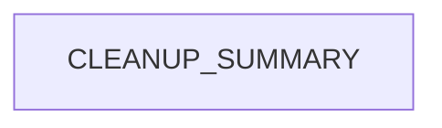

# Chapter 8: Contribution Workflow and Docs Operations Playbook

Welcome to **Chapter 8: Contribution Workflow and Docs Operations Playbook**. In this part of **Taskade Docs Tutorial: Operating the Living-DNA Documentation Stack**, you will build an intuitive mental model first, then move into concrete implementation details and practical production tradeoffs.


This chapter closes with a practical operations model for maintaining `taskade/docs` over time.

## Learning Goals

- implement a predictable contribution workflow
- align doc updates with product and API change cadence
- create durable internal ownership and review loops

## Suggested Contribution Flow

1. classify change type (feature, API, automation, support)
2. update canonical section + affected cross-links
3. validate links and navigation tree changes
4. add/refresh dated release note when needed
5. request review from section owner before merge

## Docs Operations Playbook

- maintain a monthly docs debt backlog
- run recurring link and staleness audits
- keep an explicit list of high-traffic pages and owners
- sync docs changes with integration teams using Taskade MCP/API

## Maturity Checklist

- clear ownership per docs domain
- automated checks for structure and broken links
- reliable update cadence for timeline/changelog pages
- minimal drift between help-center, API, and product narrative docs

## Source References

- [Contributing Guide](https://github.com/taskade/docs/blob/main/contributing.md)
- [Taskade Docs Repository](https://github.com/taskade/docs)
- [Taskade Changelog](https://taskade.com/changelog)

## Summary

You now have a complete framework for onboarding, evaluating, and operating the Taskade docs repository as a production documentation system.

Natural next step: pair this with [Taskade MCP Tutorial](../taskade-mcp-tutorial/) to align docs governance with integration runtime workflows.

## Depth Expansion Playbook

## Source Code Walkthrough

### `archive/help-center/_imported/CLEANUP_SUMMARY.json`

The `CLEANUP_SUMMARY` module in [`archive/help-center/_imported/CLEANUP_SUMMARY.json`](https://github.com/taskade/docs/blob/HEAD/archive/help-center/_imported/CLEANUP_SUMMARY.json) handles a key part of this chapter's functionality:

```json
{
  "cleanup_date": "2025-09-14T01:11:04.798Z",
  "total_unique_articles": 1145,
  "duplicates_removed": 0,
  "published_articles": 1057,
  "unpublished_articles": 88,
  "categories": [
    "ai-agents",
    "ai-automation",
    "ai-basics",
    "ai-features",
    "automations",
    "collaboration",
    "essentials",
    "folders",
    "general",
    "genesis",
    "getting-started",
    "integrations",
    "known-urls",
    "mobile",
    "overview",
    "productivity",
    "project-views",
    "projects",
    "sharing",
    "structure",
    "taskade-ai",
    "tasks",
    "templates",
    "tips",
    "workspaces"
  ],
  "published_by_category": {
    "ai-agents": 22,
```

This module is important because it defines how Taskade Docs Tutorial: Operating the Living-DNA Documentation Stack implements the patterns covered in this chapter.


## How These Components Connect


