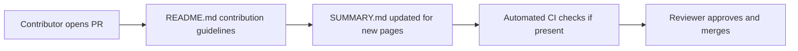

# Chapter 8: Contribution Workflow and Docs Operations Playbook

Welcome to **Chapter 8: Contribution Workflow and Docs Operations Playbook**. In this part of **Taskade Docs Tutorial: Operating the Living-DNA Documentation Stack**, you will build an intuitive mental model first, then move into concrete implementation details and practical production tradeoffs.

This chapter closes with a practical operations model for maintaining `taskade/docs` over time.

## Learning Goals

- implement a predictable contribution workflow
- align doc updates with product and API change cadence
- create durable internal ownership and review loops

## Suggested Contribution Flow

1. classify change type (feature, API, automation, support)
2. update canonical section + affected cross-links
3. validate links and navigation tree changes
4. add/refresh dated release note when needed
5. request review from section owner before merge

## Docs Operations Playbook

- maintain a monthly docs debt backlog
- run recurring link and staleness audits
- keep an explicit list of high-traffic pages and owners
- sync docs changes with integration teams using Taskade MCP/API

## Maturity Checklist

- clear ownership per docs domain
- automated checks for structure and broken links
- reliable update cadence for timeline/changelog pages
- minimal drift between help-center, API, and product narrative docs

## Source References

- [Contributing Guide](https://github.com/taskade/docs/blob/main/contributing.md)
- [Taskade Docs Repository](https://github.com/taskade/docs)
- [Taskade Changelog](https://taskade.com/changelog)

## Summary

You now have a complete framework for onboarding, evaluating, and operating the Taskade docs repository as a production documentation system.

Natural next step: pair this with [Taskade MCP Tutorial](../taskade-mcp-tutorial/) to align docs governance with integration runtime workflows.

## Source Code Walkthrough

Use the following upstream sources to verify contribution workflow and docs operations details while reading this chapter:

- [`README.md`](https://github.com/taskade/docs/blob/HEAD/README.md) — contains contributing guidelines, the branching model for docs PRs, and the review process for documentation changes.
- [`SUMMARY.md`](https://github.com/taskade/docs/blob/HEAD/SUMMARY.md) — the file that contributors must update when adding new pages; understanding its structure is prerequisite to contributing correctly.

Suggested trace strategy:
- read the contribution section of `README.md` to understand the PR workflow and review expectations
- check if a `CONTRIBUTING.md` file exists for more detailed contribution standards
- review `.github/workflows/` if present for any automated checks that run on docs PRs (link checking, spell checking)

## How These Components Connect

