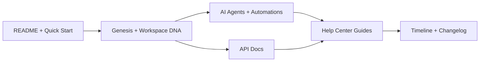

# Taskade Docs Tutorial: Operating the Living-DNA Documentation Stack

> Learn how `taskade/docs` structures product documentation across Genesis, API references, automations, help-center workflows, and release timelines.

## Why This Track Matters

`taskade/docs` is a canonical map of Taskade platform capabilities and architecture language, including Workspace DNA, Genesis, AI agents, automations, and API surfaces.

Understanding how this repo is organized makes onboarding, integration planning, and documentation governance materially faster.

## Current Snapshot (verified 2026-02-24)

- repository: [`taskade/docs`](https://github.com/taskade/docs)
- stars: about **10**
- forks: about **4**
- recent push: **2026-02-20**
- related active org repos: [`taskade/mcp`](https://github.com/taskade/mcp), [`taskade/actions-runner-controller`](https://github.com/taskade/actions-runner-controller), [`taskade/taskade`](https://github.com/taskade/taskade)
- structure posture: GitBook-oriented docs tree with `README.md`, `SUMMARY.md`, `.gitbook.yaml`, and thematic folders for:
  - Genesis / living system builder
  - API documentation
  - automation and help-center coverage
  - updates and changelog timelines

## Mental Model

## Chapter Guide

| Chapter | Key Question | Outcome |
|:--------|:-------------|:--------|
| [01 - Getting Started and Docs Entry Points](01-getting-started-and-docs-entry-points.md) | Where should teams begin reading? | faster onboarding |
| [02 - GitBook Structure, Navigation, and Information Architecture](02-gitbook-structure-navigation-and-information-architecture.md) | How do README, SUMMARY, and redirects shape navigation? | better orientation |
| [03 - Genesis, Workspace DNA, and Living-System Docs Model](03-genesis-workspace-dna-and-living-systems-doc-model.md) | How is the core product narrative organized? | clearer product understanding |
| [04 - API Documentation Surface and Endpoint Coverage](04-api-documentation-surface-and-endpoint-coverage.md) | How complete is the developer/API section? | stronger integration readiness |
| [05 - AI Agents and Automation Documentation Patterns](05-ai-agents-and-automation-documentation-patterns.md) | How are agent and automation capabilities documented? | better implementation planning |
| [06 - Release Notes, Changelog, and Timeline Operations](06-release-notes-changelog-and-timeline-operations.md) | How do updates flow across timeline and changelog sections? | improved release visibility |
| [07 - Doc Quality Governance and Link Hygiene](07-doc-quality-governance-and-link-hygiene.md) | What quality risks exist and how should they be managed? | fewer trust failures |
| [08 - Contribution Workflow and Docs Operations Playbook](08-contribution-workflow-and-docs-operations-playbook.md) | How do teams maintain this docs system over time? | sustainable docs operations |

## What You Will Learn

- how Taskade docs are partitioned across product narrative, API reference, and support workflows
- how GitBook navigation files (`README.md`, `SUMMARY.md`, `.gitbook.yaml`) work as a control plane
- how to operate release cadence, quality gates, and contribution workflows for high-change docs

## Source References

- [taskade/docs Repository](https://github.com/taskade/docs)
- [Root README](https://github.com/taskade/docs/blob/main/README.md)
- [SUMMARY Navigation](https://github.com/taskade/docs/blob/main/SUMMARY.md)
- [GitBook Config](https://github.com/taskade/docs/blob/main/.gitbook.yaml)
- [Taskade Help Center](https://help.taskade.com)
- [Taskade MCP](https://github.com/taskade/mcp)
- [Taskade Actions Runner Controller](https://github.com/taskade/actions-runner-controller)
- [Create Your First App](https://help.taskade.com/en/articles/11957643-create-your-first-app)
- [How Genesis Works: Workspace DNA](https://help.taskade.com/en/articles/12578949-how-genesis-works-workspace-dna)
- [Custom AI Agents: The Intelligence Pillar](https://help.taskade.com/en/articles/8958457-custom-ai-agents-the-intelligence-pillar)
- [Automations: The Execution Pillar](https://help.taskade.com/en/articles/8958467-automations-the-execution-pillar)
- [Taskade Newsletter: Genesis 2025 Review](https://www.taskade.com/newsletters/w/W763vDgzG2W9zRfdL3aALM3g)

## Related Tutorials

- [Taskade Tutorial](../taskade-tutorial/)
- [Taskade MCP Tutorial](../taskade-mcp-tutorial/)
- [Taskade Awesome Vibe Coding Tutorial](../taskade-awesome-vibe-coding-tutorial/)
- [MCP Docs Repo Tutorial](../mcp-docs-repo-tutorial/)

---

Start with [Chapter 1: Getting Started and Docs Entry Points](01-getting-started-and-docs-entry-points.md).

## Navigation & Backlinks

- [Start Here: Chapter 1: Getting Started and Docs Entry Points](01-getting-started-and-docs-entry-points.md)
- [Back to Main Catalog](../../README.md#-tutorial-catalog)
- [Browse A-Z Tutorial Directory](../../discoverability/tutorial-directory.md)
- [Search by Intent](../../discoverability/query-hub.md)
- [Explore Category Hubs](../../README.md#category-hubs)

## Full Chapter Map

1. [Chapter 1: Getting Started and Docs Entry Points](01-getting-started-and-docs-entry-points.md)
2. [Chapter 2: GitBook Structure, Navigation, and Information Architecture](02-gitbook-structure-navigation-and-information-architecture.md)
3. [Chapter 3: Genesis, Workspace DNA, and Living-System Docs Model](03-genesis-workspace-dna-and-living-systems-doc-model.md)
4. [Chapter 4: API Documentation Surface and Endpoint Coverage](04-api-documentation-surface-and-endpoint-coverage.md)
5. [Chapter 5: AI Agents and Automation Documentation Patterns](05-ai-agents-and-automation-documentation-patterns.md)
6. [Chapter 6: Release Notes, Changelog, and Timeline Operations](06-release-notes-changelog-and-timeline-operations.md)
7. [Chapter 7: Doc Quality Governance and Link Hygiene](07-doc-quality-governance-and-link-hygiene.md)
8. [Chapter 8: Contribution Workflow and Docs Operations Playbook](08-contribution-workflow-and-docs-operations-playbook.md)

*Generated by [AI Codebase Knowledge Builder](https://github.com/The-Pocket/Tutorial-Codebase-Knowledge)*
