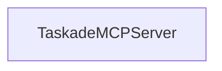

# Chapter 1: Getting Started and First Client Connection

Welcome to **Chapter 1: Getting Started and First Client Connection**. In this part of **Taskade MCP Tutorial: OpenAPI-Driven MCP Server for Taskade Workflows**, you will build an intuitive mental model first, then move into concrete implementation details and practical production tradeoffs.


This chapter gets you from zero to a working Taskade MCP connection with a practical smoke test.

## Learning Goals

- generate a Taskade API token and wire it into an MCP client
- run the official server in both stdio and HTTP/SSE modes
- validate your first tool calls and troubleshoot common failures

## Prerequisites

- Node.js 18+ and `npx`
- a Taskade account with API token access
- one MCP client: Claude Desktop, Cursor, Windsurf, or n8n-compatible bridge

## Step 1: Create a Taskade API Token

1. Open [Taskade API Settings](https://www.taskade.com/settings/api).
2. Create a Personal Access Token.
3. Store it in a local secret store (not committed files).

## Step 2: Add Taskade MCP to a Client (stdio)

Use the official package:

```json
{
  "mcpServers": {
    "taskade": {
      "command": "npx",
      "args": ["-y", "@taskade/mcp-server"],
      "env": {
        "TASKADE_API_KEY": "your-api-key"
      }
    }
  }
}
```

## Step 3: Run in HTTP/SSE Mode (for n8n and custom clients)

```bash
TASKADE_API_KEY=your-api-key npx @taskade/mcp-server --http
```

Default endpoint behavior:

- base URL: `http://localhost:3000`
- SSE entry: `http://localhost:3000/sse?access_token=...`
- override port with `PORT`

## First Smoke Test Checklist

- list workspaces using `workspacesGet`
- create or inspect a test project using `projectGet` or `projectCreate`
- create a disposable test task with `taskCreate`
- mark it complete with `taskComplete`

## Common First-Run Failures

| Symptom | Likely Cause | Fix |
|:--------|:-------------|:----|
| auth error | invalid/missing `TASKADE_API_KEY` | regenerate token and restart client |
| no tools visible | client config not reloaded | restart MCP host process/client |
| SSE connect timeout | wrong URL or blocked port | verify `localhost:3000` and token query param |

## Source References

- [Taskade MCP README](https://github.com/taskade/mcp/blob/main/README.md)
- [Server Package README](https://github.com/taskade/mcp/blob/main/packages/server/README.md)
- [Taskade API Token Settings](https://www.taskade.com/settings/api)

## Summary

You now have a working Taskade MCP connection in at least one client mode.

Next: [Chapter 2: Repository Architecture and Package Layout](02-repository-architecture-and-package-layout.md)

## Source Code Walkthrough

### `packages/server/src/server.ts`

The `TaskadeMCPServer` class in [`packages/server/src/server.ts`](https://github.com/taskade/mcp/blob/HEAD/packages/server/src/server.ts) handles a key part of this chapter's functionality:

```ts
};

export class TaskadeMCPServer extends McpServer {
  readonly config: TaskadeServerOpts;

  constructor(opts: TaskadeServerOpts) {
    super({
      name: 'taskade',
      version: '0.0.1',
      capabilities: {
        resources: {},
        tools: {},
      },
    });

    this.config = opts;

    setupTools(this, {
      url: 'https://www.taskade.com/api/v1',
      fetch,
      headers: {
        Authorization: `Bearer ${this.config.accessToken}`,
      },
      normalizeResponse: {
        folderProjectsGet: (response) => {
          return {
            content: [
              {
                type: 'text',
                text: JSON.stringify(response),
              },
              {
```

This class is important because it defines how Taskade MCP Tutorial: OpenAPI-Driven MCP Server for Taskade Workflows implements the patterns covered in this chapter.


## How These Components Connect


