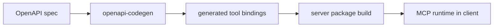
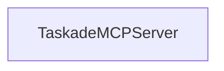

# Chapter 2: Repository Architecture and Package Layout

Welcome to **Chapter 2: Repository Architecture and Package Layout**. In this part of **Taskade MCP Tutorial: OpenAPI-Driven MCP Server for Taskade Workflows**, you will build an intuitive mental model first, then move into concrete implementation details and practical production tradeoffs.


This chapter maps the monorepo so you can make targeted changes without breaking generation or runtime flow.

## Learning Goals

- understand root workspace/build orchestration
- identify boundaries between runtime server and codegen package
- locate the critical scripts used to regenerate tool surfaces

## High-Level Structure

`taskade/mcp` is a workspace monorepo with two primary packages:

- `packages/server` -> runtime MCP server package (`@taskade/mcp-server`)
- `packages/openapi-codegen` -> generator package (`@taskade/mcp-openapi-codegen`)

## Build and Workflow Model



At root:

- workspaces configured via `package.json`
- `lerna` coordinates package-level scripts
- root `build` calls package build pipelines

## Key Root Scripts

From root `package.json`:

- `build`: `lerna run build`
- `lint`: repo-wide linting
- `publish`: build + lint + changeset publish flow

## Server Package Highlights

From `packages/server/package.json`:

- `fetch:openapi` -> pulls Taskade public OpenAPI YAML
- `generate:taskade-mcp-tools` -> generates tool bindings
- `build:cli` -> compiles CLI runtime
- `start:server` -> local HTTP runtime for iterative testing

## Codegen Package Highlights

From `packages/openapi-codegen`:

- exports codegen API for generating MCP tools from OpenAPI
- depends on parser + schema tooling for OpenAPI dereference and output shaping

## Practical Read Order

1. root `README.md`
2. `packages/server/README.md`
3. `packages/openapi-codegen/README.md`
4. server generation scripts and generated output files

## Source References

- [Monorepo Root](https://github.com/taskade/mcp)
- [Root package.json](https://github.com/taskade/mcp/blob/main/package.json)
- [Server package.json](https://github.com/taskade/mcp/blob/main/packages/server/package.json)
- [OpenAPI Codegen package.json](https://github.com/taskade/mcp/blob/main/packages/openapi-codegen/package.json)

## Summary

You now know where generation happens, where runtime happens, and which scripts connect both.

Next: [Chapter 3: MCP Server Tools, Auth, and API Surface](03-mcp-server-tools-auth-and-api-surface.md)

## Depth Expansion Playbook

## Source Code Walkthrough

### `packages/server/src/server.ts`

The `TaskadeMCPServer` class in [`packages/server/src/server.ts`](https://github.com/taskade/mcp/blob/HEAD/packages/server/src/server.ts) handles a key part of this chapter's functionality:

```ts
};

export class TaskadeMCPServer extends McpServer {
  readonly config: TaskadeServerOpts;

  constructor(opts: TaskadeServerOpts) {
    super({
      name: 'taskade',
      version: '0.0.1',
      capabilities: {
        resources: {},
        tools: {},
      },
    });

    this.config = opts;

    setupTools(this, {
      url: 'https://www.taskade.com/api/v1',
      fetch,
      headers: {
        Authorization: `Bearer ${this.config.accessToken}`,
      },
      normalizeResponse: {
        folderProjectsGet: (response) => {
          return {
            content: [
              {
                type: 'text',
                text: JSON.stringify(response),
              },
              {
```

This class is important because it defines how Taskade MCP Tutorial: OpenAPI-Driven MCP Server for Taskade Workflows implements the patterns covered in this chapter.


## How These Components Connect


