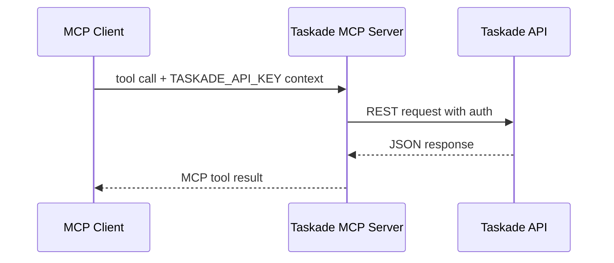
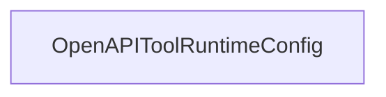

# Chapter 3: MCP Server Tools, Auth, and API Surface

Welcome to **Chapter 3: MCP Server Tools, Auth, and API Surface**. In this part of **Taskade MCP Tutorial: OpenAPI-Driven MCP Server for Taskade Workflows**, you will build an intuitive mental model first, then move into concrete implementation details and practical production tradeoffs.


This chapter explains how the Taskade MCP server exposes Taskade operations as tool families and how authentication flows through those calls.

## Learning Goals

- understand the main tool groups exposed by the server
- map MCP tool operations to Taskade business objects
- apply safe auth handling and execution constraints

## Tool Surface by Domain

From the repository README, the server exposes 50+ tools across core domains:

- workspaces (`workspacesGet`, `workspaceCreateProject`)
- projects (`projectGet`, `projectCreate`, `projectTasksGet`)
- tasks (`taskCreate`, `taskPut`, `taskComplete`)
- AI agents (`folderCreateAgent`, `agentUpdate`, `agentKnowledgeProjectCreate`)
- templates/media/personal contexts

## Authentication Flow



The key runtime dependency is `TASKADE_API_KEY`. For HTTP/SSE mode, token handling may also appear in connection URL patterns.

## Practical Scope Design

Use explicit scope boundaries in prompting and tool routing:

- workspace-level reads first
- project-level mutations next
- task-level bulk changes last

This sequence reduces accidental large-scope mutations.

## Failure Boundaries and Recovery

| Failure Mode | Recovery Pattern |
|:-------------|:-----------------|
| token invalid/expired | rotate token and restart server process |
| object not found | verify workspace/project IDs before write actions |
| unexpected output shape | use response normalization in generated tools |

## Source References

- [Taskade MCP Tool Tables](https://github.com/taskade/mcp/blob/main/README.md#tools-50)
- [Server Package](https://github.com/taskade/mcp/tree/main/packages/server)
- [Taskade Developer Docs](https://developers.taskade.com)

## Summary

You now understand how Taskade MCP tool domains and auth context map into runtime behavior.

Next: [Chapter 4: OpenAPI to MCP Codegen Pipeline](04-openapi-to-mcp-codegen-pipeline.md)

## Depth Expansion Playbook

## Source Code Walkthrough

### `packages/server/src/tools.generated.ts`

The `OpenAPIToolRuntimeConfig` class in [`packages/server/src/tools.generated.ts`](https://github.com/taskade/mcp/blob/HEAD/packages/server/src/tools.generated.ts) handles a key part of this chapter's functionality:

```ts
};

export type OpenAPIToolRuntimeConfigOpts = {
  // basic configuration
  url?: string;
  fetch?: (...args: any[]) => Promise<any>;
  headers?: Record<string, string>;

  // custom implementation of the tool call
  executeToolCall?: ExecuteToolCallOpenApiOperationCb;
  normalizeResponse?: Record<string, (response: any) => CallToolResult>;
};

export class OpenAPIToolRuntimeConfig {
  config: OpenAPIToolRuntimeConfigOpts;

  constructor(config: OpenAPIToolRuntimeConfigOpts) {
    this.config = config;
  }

  private async defaultExecuteToolCall(payload: ExecuteToolCallOpenApiOperationCbPayload) {
    const response = await this.fetch(`${this.baseUrl}${payload.url}`, {
      method: payload.method,
      body: payload.body,
      headers: {
        ...payload.headers,
        ...this.config.headers,
      },
    });

    return await response.json();
  }
```

This class is important because it defines how Taskade MCP Tutorial: OpenAPI-Driven MCP Server for Taskade Workflows implements the patterns covered in this chapter.


## How These Components Connect


