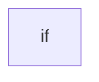

# Chapter 4: OpenAPI to MCP Codegen Pipeline

Welcome to **Chapter 4: OpenAPI to MCP Codegen Pipeline**. In this part of **Taskade MCP Tutorial: OpenAPI-Driven MCP Server for Taskade Workflows**, you will build an intuitive mental model first, then move into concrete implementation details and practical production tradeoffs.


This chapter covers the package that makes the project extensible: generating MCP tools from OpenAPI.

## Learning Goals

- run the OpenAPI-to-MCP generation loop
- understand where generated artifacts are consumed
- add response normalization for better LLM behavior

## Core Idea

`@taskade/mcp-openapi-codegen` lets you produce MCP tool bindings from any OpenAPI schema, not just Taskade APIs.

## Minimal Generator Script

```ts
import { dereference } from '@readme/openapi-parser';
import { codegen } from '@taskade/mcp-openapi-codegen';

const document = await dereference('taskade-public.yaml');

await codegen({
  path: 'src/tools.generated.ts',
  document,
});
```

## Pipeline

1. fetch or provide OpenAPI YAML
2. dereference schema
3. run codegen to emit tool bindings
4. register generated tools in the MCP server
5. rebuild and test from client

## Normalization Hook

Use per-endpoint normalization to return better structured responses:

- preserve canonical JSON payload
- append short explanatory text for client usability
- keep outputs deterministic for repeated tasks

## Engineering Guardrails

- lock spec version when possible
- review generated diff before merge
- smoke test high-risk write tools after regeneration
- keep generated output isolated from hand-authored server logic

## Source References

- [OpenAPI Codegen README](https://github.com/taskade/mcp/blob/main/packages/openapi-codegen/README.md)
- [Server Generation Script Reference](https://github.com/taskade/mcp/blob/main/packages/server/package.json)
- [Taskade Public API Docs](https://developers.taskade.com)

## Summary

You now have a repeatable pattern to regenerate MCP tools from OpenAPI updates.

Next: [Chapter 5: Client Integration Across Claude, Cursor, Windsurf, and n8n](05-client-integration-across-claude-cursor-windsurf-and-n8n.md)

## Source Code Walkthrough

### `packages/openapi-codegen/src/openapi.ts`

The `if` interface in [`packages/openapi-codegen/src/openapi.ts`](https://github.com/taskade/mcp/blob/HEAD/packages/openapi-codegen/src/openapi.ts) handles a key part of this chapter's functionality:

```ts
  response: OpenAPIV3.ResponseObject | OpenAPIV3.ReferenceObject,
): OpenAPIV3.ResponseObject => {
  if ('$ref' in response) {
    throw new Error('Reference not supported');
  }

  return response;
};

export const convertOpenApiSchemaToJsonSchema = (
  schema: OpenAPIV3.SchemaObject | OpenAPIV3.ReferenceObject,
): IJsonSchema => {
  if ('$ref' in schema) {
    // Should already be dereferenced
    throw new Error('Reference not supported');
  }

  const jsonSchema: IJsonSchema = {};

  // Handle basic properties
  if (schema.type) {
    jsonSchema.type = schema.type;
  }

  if (schema.description) {
    jsonSchema.description = schema.description;
  }

  if (schema.default !== undefined) {
    jsonSchema.default = schema.default;
  }

```

This interface is important because it defines how Taskade MCP Tutorial: OpenAPI-Driven MCP Server for Taskade Workflows implements the patterns covered in this chapter.


## How These Components Connect


