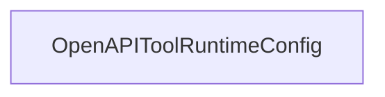

# Chapter 5: Client Integration Across Claude, Cursor, Windsurf, and n8n

Welcome to **Chapter 5: Client Integration Across Claude, Cursor, Windsurf, and n8n**. In this part of **Taskade MCP Tutorial: OpenAPI-Driven MCP Server for Taskade Workflows**, you will build an intuitive mental model first, then move into concrete implementation details and practical production tradeoffs.


This chapter focuses on integration differences between desktop IDE clients and automation hosts.

## Learning Goals

- choose transport mode per client type
- standardize config patterns across teams
- avoid the top integration drift issues

## Transport Strategy

| Client Type | Recommended Mode | Why |
|:------------|:-----------------|:----|
| Claude Desktop / Cursor / Windsurf | stdio via `npx` | simple local setup and direct launch |
| n8n and custom network clients | HTTP/SSE mode | easier remote connectivity |

## Baseline Config Pattern

Keep one internal template and stamp it per host:

- `command`: `npx`
- `args`: `-y @taskade/mcp-server`
- `env`: `TASKADE_API_KEY`

For HTTP mode:

```bash
TASKADE_API_KEY=... npx @taskade/mcp-server --http
```

## Integration Validation Matrix

Create a quick matrix for every environment:

- can connect to server
- can list workspaces
- can read one known project
- can create and complete one test task
- can perform one agent operation

## Multi-Client Drift Controls

- store configuration snippets centrally
- pin package version where reproducibility matters
- apply a single token rotation process across clients
- enforce smoke tests after upgrades

## Source References

- [Taskade MCP Quick Start](https://github.com/taskade/mcp/blob/main/README.md#quick-start)
- [Taskade MCP n8n mention](https://github.com/taskade/mcp/blob/main/README.md#n8n-automation-integration)
- [Server README](https://github.com/taskade/mcp/blob/main/packages/server/README.md)

## Summary

You now have a clear client integration strategy with transport and validation patterns.

Next: [Chapter 6: Deployment, Configuration, and Operations](06-deployment-configuration-and-operations.md)

## Depth Expansion Playbook

## Source Code Walkthrough

### `packages/openapi-codegen/src/runtime.ts`

The `OpenAPIToolRuntimeConfig` class in [`packages/openapi-codegen/src/runtime.ts`](https://github.com/taskade/mcp/blob/HEAD/packages/openapi-codegen/src/runtime.ts) handles a key part of this chapter's functionality:

```ts
};

export type OpenAPIToolRuntimeConfigOpts = {
  // basic configuration
  url?: string;
  fetch?: (...args: any[]) => Promise<any>;
  headers?: Record<string, string>;

  // custom implementation of the tool call
  executeToolCall?: ExecuteToolCallOpenApiOperationCb;
  normalizeResponse?: Record<string, (response: any) => CallToolResult>;
};

export class OpenAPIToolRuntimeConfig {
  config: OpenAPIToolRuntimeConfigOpts;

  constructor(config: OpenAPIToolRuntimeConfigOpts) {
    this.config = config;
  }

  private async defaultExecuteToolCall(payload: ExecuteToolCallOpenApiOperationCbPayload) {
    const response = await this.fetch(`${this.baseUrl}${payload.url}`, {
      method: payload.method,
      body: payload.body,
      headers: {
        ...payload.headers,
        ...this.config.headers,
      },
    });

    return await response.json();
  }
```

This class is important because it defines how Taskade MCP Tutorial: OpenAPI-Driven MCP Server for Taskade Workflows implements the patterns covered in this chapter.


## How These Components Connect


