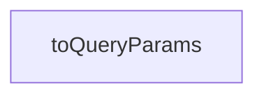

# Chapter 6: Deployment, Configuration, and Operations

Welcome to **Chapter 6: Deployment, Configuration, and Operations**. In this part of **Taskade MCP Tutorial: OpenAPI-Driven MCP Server for Taskade Workflows**, you will build an intuitive mental model first, then move into concrete implementation details and practical production tradeoffs.


This chapter moves from local setup to repeatable operations.

## Learning Goals

- define environment-specific runtime configs
- operationalize updates without breaking clients
- establish baseline observability for MCP workflows

## Runtime Configuration Baseline

Minimum environment variables:

- `TASKADE_API_KEY` (required)
- `PORT` (HTTP mode only, optional override)

Optional operational controls (team-level policy):

- allowed workspaces/projects list
- read-only mode in high-risk environments
- outbound network constraints per deployment tier

## Deployment Patterns

- local desktop/IDE usage: stdio launch per user
- shared internal host: HTTP/SSE behind internal network control
- automation host: dedicated process for n8n and workflow runners

## Release and Upgrade Discipline

1. pin previous known-good version
2. stage upgrade in non-production environment
3. run integration validation matrix
4. promote to production clients
5. monitor errors for 24-48 hours

## Operational Dashboard Signals

Track at minimum:

- successful tool call count
- error rate by tool family
- auth failure rate
- median tool latency

## Source References

- [Taskade MCP README](https://github.com/taskade/mcp/blob/main/README.md)
- [Server package scripts](https://github.com/taskade/mcp/blob/main/packages/server/package.json)
- [Taskade API Docs](https://developers.taskade.com)

## Summary

You now have a deployment and operations baseline that supports shared-team adoption.

Next: [Chapter 7: Security Guardrails and Governance](07-security-guardrails-and-governance.md)

## Source Code Walkthrough

### `packages/openapi-codegen/src/runtime.ts`

The `toQueryParams` function in [`packages/openapi-codegen/src/runtime.ts`](https://github.com/taskade/mcp/blob/HEAD/packages/openapi-codegen/src/runtime.ts) handles a key part of this chapter's functionality:

```ts
) => Promise<any>;

function toQueryParams(obj: Record<string, any>): string {
  const params = new URLSearchParams();

  for (const key in obj) {
    const value = obj[key];

    if (value == null) {
      continue;
    }

    if (Array.isArray(value)) {
      value.forEach((v) => params.append(key, String(v)));
    } else if (typeof value === 'object') {
      params.append(key, JSON.stringify(value));
    } else {
      params.append(key, String(value));
    }
  }

  const str = params.toString();

  if (str === '') {
    return '';
  }

  return `?${str}`;
}

export const prepareToolCallOperation = (
  operation: ToolCallOpenApiOperation,
```

This function is important because it defines how Taskade MCP Tutorial: OpenAPI-Driven MCP Server for Taskade Workflows implements the patterns covered in this chapter.


## How These Components Connect


