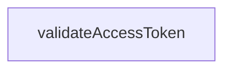

# Chapter 7: Security Guardrails and Governance

Welcome to **Chapter 7: Security Guardrails and Governance**. In this part of **Taskade MCP Tutorial: OpenAPI-Driven MCP Server for Taskade Workflows**, you will build an intuitive mental model first, then move into concrete implementation details and practical production tradeoffs.


This chapter covers practical controls required to run Taskade MCP safely in organizations.

## Learning Goals

- harden token and credential handling
- reduce accidental destructive actions
- define governance checks for tool-enabled AI workflows

## Credential Security

- keep `TASKADE_API_KEY` in secret managers only
- avoid token-in-URL usage outside local trusted development
- rotate tokens on schedule and immediately after suspected exposure
- segregate tokens by environment (dev/stage/prod)

## Least-Privilege Execution Pattern

- prefer read operations during exploration phases
- gate write operations behind explicit human confirmation
- restrict high-impact tools to approved automation contexts

## Governance Checklist

| Control | Why It Matters |
|:--------|:---------------|
| change approval for write workflows | prevents silent bulk mutations |
| integration smoke tests post-upgrade | catches tool contract drift early |
| incident response runbook | shortens recovery time on auth or data errors |
| audit logs in host platform | supports compliance and forensic review |

## Red-Team Scenarios to Simulate

- prompt injection attempts to trigger broad destructive calls
- stale token causing repeated auth failures
- schema/tool mismatch after API evolution

## Source References

- [Taskade Security](https://taskade.com/security)
- [Taskade Trust Center](https://trust.taskade.com)
- [Taskade MCP Issues](https://github.com/taskade/mcp/issues)
- [MCP Security Guidance](https://modelcontextprotocol.io/)

## Summary

You now have a governance model that keeps Taskade MCP useful without sacrificing control.

Next: [Chapter 8: Contribution, Testing, and Release Operations](08-contribution-testing-and-release-operations.md)

## Source Code Walkthrough

### `packages/server/src/cli.ts`

The `validateAccessToken` function in [`packages/server/src/cli.ts`](https://github.com/taskade/mcp/blob/HEAD/packages/server/src/cli.ts) handles a key part of this chapter's functionality:

```ts
import { TaskadeMCPServer } from './server';

function validateAccessToken(token: string | undefined): string {
  if (!token) {
    console.error(
      'ERROR: TASKADE_API_KEY environment variable is not set.\n\n' +
        'To fix this:\n' +
        '1. Generate a Personal Access Token at: https://www.taskade.com/settings/api\n' +
        '2. Set the environment variable:\n' +
        '   export TASKADE_API_KEY="your_token_here"\n',
    );
    process.exit(1);
  }

  const trimmedToken = token.trim();

  if (trimmedToken.length === 0) {
    console.error('ERROR: TASKADE_API_KEY is empty. Please provide a valid token.');
    process.exit(1);
  }

  if (trimmedToken.length < 10) {
    console.error(
      'ERROR: TASKADE_API_KEY appears to be invalid (too short).\n' +
        'Please verify your token at: https://www.taskade.com/settings/api',
    );
    process.exit(1);
  }

  return trimmedToken;
}

```

This function is important because it defines how Taskade MCP Tutorial: OpenAPI-Driven MCP Server for Taskade Workflows implements the patterns covered in this chapter.


## How These Components Connect


