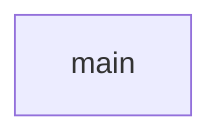

# Chapter 8: Contribution, Testing, and Release Operations

Welcome to **Chapter 8: Contribution, Testing, and Release Operations**. In this part of **Taskade MCP Tutorial: OpenAPI-Driven MCP Server for Taskade Workflows**, you will build an intuitive mental model first, then move into concrete implementation details and practical production tradeoffs.


This chapter defines a maintainable contribution and release loop for long-term ownership.

## Learning Goals

- contribute safely to server and codegen packages
- validate changes with repeatable test and smoke workflows
- manage release and upgrade cycles with low risk

## Local Contribution Workflow

```bash
git clone https://github.com/taskade/mcp.git
cd mcp
yarn install
yarn build
yarn lint
```

Then run local smoke tests against your MCP client before opening a PR.

## Change Types and Review Expectations

- server runtime change -> requires tool smoke tests
- codegen change -> requires generated diff review + representative tool validation
- docs/config change -> requires command/config copy validation

## Suggested Test Ladder

1. static checks (`lint`, build)
2. local MCP client smoke tests
3. HTTP/SSE connectivity verification (if touched)
4. regression checks on core tool families (workspace/project/task)

## Release Hygiene

The monorepo includes changeset and publish scripts. Teams should still:

- annotate breaking behavior changes clearly
- pin versions in downstream clients when stability is critical
- publish migration notes when tool names or contracts shift

## Long-Term Maintenance Playbook

- review open issues and roadmap regularly
- watch for Taskade API updates that require regeneration
- keep generated artifacts in sync with source specs
- keep client config examples current across supported hosts

## Source References

- [Contributing](https://github.com/taskade/mcp/blob/main/CONTRIBUTING.md)
- [Root package scripts](https://github.com/taskade/mcp/blob/main/package.json)
- [Server package scripts](https://github.com/taskade/mcp/blob/main/packages/server/package.json)
- [Taskade MCP Issues](https://github.com/taskade/mcp/issues)

## Summary

You now have a full production-oriented lifecycle for adopting and maintaining Taskade MCP.

Natural next step: cross-link this with your workspace/Genesis governance patterns from [Taskade Tutorial](../taskade-tutorial/).

## Source Code Walkthrough

### `packages/server/src/cli.ts`

The `main` function in [`packages/server/src/cli.ts`](https://github.com/taskade/mcp/blob/HEAD/packages/server/src/cli.ts) handles a key part of this chapter's functionality:

```ts
}

async function main() {
  const accessToken = validateAccessToken(process.env.TASKADE_API_KEY);

  const server = new TaskadeMCPServer({
    accessToken,
  });
  const transport = new StdioServerTransport();
  await server.connect(transport);

  console.error('Taskade MCP Server running on stdio');
}

main().catch((error) => {
  console.error('Fatal error in main():', error);
  process.exit(1);
});

```

This function is important because it defines how Taskade MCP Tutorial: OpenAPI-Driven MCP Server for Taskade Workflows implements the patterns covered in this chapter.


## How These Components Connect


