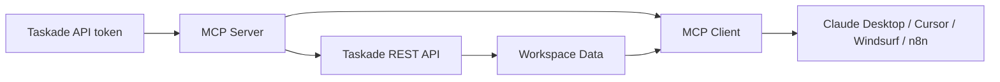

# Taskade MCP Tutorial: OpenAPI-Driven MCP Server for Taskade Workflows

> Learn how to run, extend, and operate `taskade/mcp` to connect Taskade workspaces, tasks, projects, and AI agents into MCP-compatible clients.

## Why This Track Matters

`taskade/mcp` is the fastest path to making Taskade a programmable runtime for AI clients.

Instead of manually wiring custom integrations, you can expose Taskade operations as MCP tools and let clients like Claude Desktop, Cursor, and n8n orchestrate real work.

## Current Snapshot (verified 2026-02-24)

- repository: [`taskade/mcp`](https://github.com/taskade/mcp)
- stars: about **108**
- forks: about **30**
- default branch: `main`
- recent push: **2026-02-13**
- related org repos: [`taskade/docs`](https://github.com/taskade/docs), [`taskade/taskade`](https://github.com/taskade/taskade)
- repo posture: active monorepo with two key packages:
  - `@taskade/mcp-server`
  - `@taskade/mcp-openapi-codegen`

## Mental Model

## Chapter Guide

| Chapter | Key Question | Outcome |
|:--------|:-------------|:--------|
| [01 - Getting Started and First Client Connection](01-getting-started-and-first-client-connection.md) | How do you get an end-to-end MCP connection working fast? | first live run |
| [02 - Repository Architecture and Package Layout](02-repository-architecture-and-package-layout.md) | How is the monorepo structured and why? | codebase orientation |
| [03 - MCP Server Tools, Auth, and API Surface](03-mcp-server-tools-auth-and-api-surface.md) | How do tool families and authentication work? | safe operations |
| [04 - OpenAPI to MCP Codegen Pipeline](04-openapi-to-mcp-codegen-pipeline.md) | How are tools generated from OpenAPI specs? | extensibility workflow |
| [05 - Client Integration Across Claude, Cursor, Windsurf, and n8n](05-client-integration-across-claude-cursor-windsurf-and-n8n.md) | How do transport/client modes differ in production? | fewer integration failures |
| [06 - Deployment, Configuration, and Operations](06-deployment-configuration-and-operations.md) | How do you run this reliably in team environments? | operations baseline |
| [07 - Security Guardrails and Governance](07-security-guardrails-and-governance.md) | What controls are required for enterprise-safe usage? | risk reduction |
| [08 - Contribution, Testing, and Release Operations](08-contribution-testing-and-release-operations.md) | How do you maintain and evolve your fork cleanly? | sustainable ownership |

## What You Will Learn

- how to install and connect Taskade MCP in both stdio and HTTP/SSE modes
- how generated tool surfaces map to Taskade workspace/project/task operations
- how to run codegen against OpenAPI specs and customize response normalization
- how to operate secure token handling, governance controls, and release hygiene

## Source References

- [taskade/mcp Repository](https://github.com/taskade/mcp)
- [Taskade MCP README](https://github.com/taskade/mcp/blob/main/README.md)
- [Server Package](https://github.com/taskade/mcp/tree/main/packages/server)
- [OpenAPI Codegen Package](https://github.com/taskade/mcp/tree/main/packages/openapi-codegen)
- [Model Context Protocol](https://modelcontextprotocol.io/)
- [Taskade Developer Docs](https://developers.taskade.com)
- [Taskade Docs Repo](https://github.com/taskade/docs)
- [Taskade Platform Repo](https://github.com/taskade/taskade)

## Related Tutorials

- [Taskade Tutorial](../taskade-tutorial/)
- [Taskade Docs Tutorial](../taskade-docs-tutorial/)
- [MCP Servers Tutorial](../mcp-servers-tutorial/)
- [MCP TypeScript SDK Tutorial](../mcp-typescript-sdk-tutorial/)
- [MCP Inspector Tutorial](../mcp-inspector-tutorial/)

---

Start with [Chapter 1: Getting Started and First Client Connection](01-getting-started-and-first-client-connection.md).

## Navigation & Backlinks

- [Start Here: Chapter 1: Getting Started and First Client Connection](01-getting-started-and-first-client-connection.md)
- [Back to Main Catalog](../../README.md#-tutorial-catalog)
- [Browse A-Z Tutorial Directory](../../discoverability/tutorial-directory.md)
- [Search by Intent](../../discoverability/query-hub.md)
- [Explore Category Hubs](../../README.md#category-hubs)

## Full Chapter Map

1. [Chapter 1: Getting Started and First Client Connection](01-getting-started-and-first-client-connection.md)
2. [Chapter 2: Repository Architecture and Package Layout](02-repository-architecture-and-package-layout.md)
3. [Chapter 3: MCP Server Tools, Auth, and API Surface](03-mcp-server-tools-auth-and-api-surface.md)
4. [Chapter 4: OpenAPI to MCP Codegen Pipeline](04-openapi-to-mcp-codegen-pipeline.md)
5. [Chapter 5: Client Integration Across Claude, Cursor, Windsurf, and n8n](05-client-integration-across-claude-cursor-windsurf-and-n8n.md)
6. [Chapter 6: Deployment, Configuration, and Operations](06-deployment-configuration-and-operations.md)
7. [Chapter 7: Security Guardrails and Governance](07-security-guardrails-and-governance.md)
8. [Chapter 8: Contribution, Testing, and Release Operations](08-contribution-testing-and-release-operations.md)

*Generated by [AI Codebase Knowledge Builder](https://github.com/The-Pocket/Tutorial-Codebase-Knowledge)*
