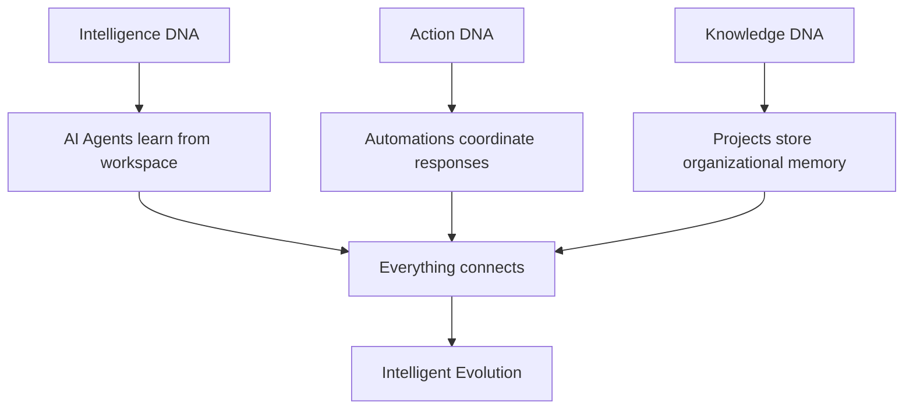
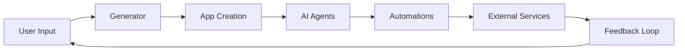

# Chapter 1: Getting Started with Taskade

Welcome to Taskade! If you're reading this, you're about to discover a revolutionary approach to productivity that combines AI intelligence with collaborative workflows. Taskade isn't just another task management app—it's a platform where your workspace becomes a living, intelligent organism.

## What Makes Taskade Revolutionary?

Taskade introduces the concept of **"Living DNA"** - an interconnected system where:
- 🤖 **AI Agents** become specialized team members
- ⚡ **Smart Automations** act as your business's nervous system
- 📊 **Projects** form your organizational memory
- 🔄 **Everything learns** from everything else

## Getting Started with Taskade

### Account Setup

```bash
# Visit Taskade
open https://taskade.com

# Sign up with your preferred method:
# - Google account
# - Email and password
# - SSO (for enterprise users)
```

### Your First Workspace

Once logged in, you'll see Taskade's unique interface:

```typescript
interface TaskadeWorkspace {
  homeSubspace: {
    generator: AIGenerator
    aiAgents: Agent[]
    automations: Automation[]
    projects: Project[]
  }
  subspaces: Subspace[]
}
```

### The Generator Input Field

At the top of every workspace, you'll find the **Generator Input Field** - this is where the magic happens:

```javascript
// Example of what you can type in the generator
const generatorExamples = [
  "Create a customer onboarding app with automated welcome emails",
  "Build an inventory tracker that reorders supplies automatically",
  "Design a project dashboard with real-time team metrics",
  "Make a meeting scheduler that finds optimal times for everyone"
]
```

## Understanding Taskade's Core Components

### 1. Home Subspace Intelligence

Every workspace starts with a **Home Subspace** containing:

```typescript
const homeSubspace = {
  generator: "AI-powered app builder",
  aiAgents: "Custom-trained assistants",
  automations: "100+ service integrations",
  projects: "Your data and workflows"
}
```

### 2. AI Agents

Taskade agents are specialized digital team members:

```javascript
const marketingAgent = {
  name: "MarketingAssistant",
  expertise: "Content creation and campaign management",
  tools: ["social_media", "analytics", "content_generation"],
  trainingData: "Your marketing projects and preferences"
}
```

### 3. Smart Automations

Automations connect your tools and data:

```javascript
const automationExample = {
  trigger: "New lead in CRM",
  conditions: [
    "Lead score > 70",
    "Budget > $5000"
  ],
  actions: [
    "Create project in Taskade",
    "Send welcome email",
    "Schedule discovery call"
  ]
}
```

## Your First AI Agent

Let's create your first AI agent:

### Step 1: Access Agent Panel

1. Open any workspace
2. Click the AI agent icon in the left panel
3. Select "Create New Agent"

### Step 2: Configure Your Agent

```javascript
const myFirstAgent = {
  name: "ProductivityAssistant",
  role: "Help manage daily tasks and boost productivity",
  personality: {
    helpfulness: 0.9,
    creativity: 0.7,
    thoroughness: 0.8
  },
  capabilities: [
    "task_organization",
    "time_management",
    "project_planning"
  ]
}
```

### Step 3: Train Your Agent

Give your agent context by:
- Sharing your typical workflows
- Describing your work style
- Providing examples of tasks you handle

## Building Your First Automation

### Simple Email Notification

```javascript
const emailAutomation = {
  name: "Task Completion Alerts",
  trigger: {
    type: "task_completed",
    project: "any"
  },
  action: {
    type: "send_email",
    to: "team@company.com",
    subject: "Task Completed: {{task.name}}",
    body: "Great work! {{task.assignee}} completed {{task.name}}"
  }
}
```

### Advanced Multi-Step Automation

```javascript
const complexAutomation = {
  name: "New Client Onboarding",
  trigger: {
    type: "form_submission",
    form: "client_intake"
  },
  steps: [
    {
      action: "create_project",
      template: "client_onboarding"
    },
    {
      action: "invite_team_members",
      roles: ["account_manager", "project_manager"]
    },
    {
      action: "schedule_meeting",
      type: "kickoff_call"
    },
    {
      action: "send_welcome_pack",
      via: "email"
    }
  ]
}
```

## The Living DNA Philosophy

Taskade's architecture is built on **Living DNA strands**:



### How Living DNA Works

1. **Intelligence DNA**: AI agents trained on your workspace patterns
2. **Action DNA**: Automations that respond to events and triggers
3. **Knowledge DNA**: Projects and data that form institutional memory
4. **Evolution DNA**: The system gets smarter with every interaction

## Creating Your First Complete App

Using the Genesis app builder:

### Step 1: Describe Your App

In the generator input field, type:
```
Create a project management dashboard that shows team progress, upcoming deadlines, and budget tracking
```

### Step 2: Genesis Builds Your App

Taskade automatically creates:
- Complete project management interface
- Real-time progress tracking
- Deadline notifications
- Budget monitoring widgets
- Team collaboration features

### Step 3: Customize and Extend

```javascript
const customizations = {
  addFeatures: [
    "Time tracking integration",
    "Resource allocation charts",
    "Risk assessment module"
  ],
  integrations: [
    "Google Calendar",
    "Slack notifications",
    "Jira sync"
  ]
}
```

## Understanding Taskade's Architecture

### Subspace Organization

```typescript
const workspaceStructure = {
  home: {
    type: "intelligence_hub",
    contains: ["generator", "ai_agents", "automations"]
  },
  projects: {
    type: "data_containers",
    purpose: "Store and organize information"
  },
  apps: {
    type: "generated_applications",
    source: "Built from generator or converted projects"
  }
}
```

### Data Flow Architecture



## Help Center Alignment: First App Workflow (Imported)

The official "Create Your First App" guide maps cleanly to this chapter's practical flow:

1. start with a specific business problem statement
2. generate with Genesis using the mode that fits your task
3. test the full user flow and iterate quickly
4. publish with the correct visibility model (private/secret/public)

Imported guidance highlights:

- Genesis creation modes are explicitly separated for app generation, project setup, agents, and automations.
- Publishing is part of first-run workflow, not an afterthought.
- Onboarding emphasizes practical business outcomes over technical setup.

## Imported Sources for This Chapter

- [Create Your First App](https://help.taskade.com/en/articles/11957643-create-your-first-app)
- [How Genesis Works: Workspace DNA](https://help.taskade.com/en/articles/12578949-how-genesis-works-workspace-dna)

## What We've Accomplished

✅ **Set up Taskade account** and workspace
✅ **Understood Living DNA** architecture
✅ **Created your first AI agent**
✅ **Built basic automation workflows**
✅ **Generated your first app** using Genesis
✅ **Explored Taskade's core concepts**

## Next Steps

Now that you understand Taskade's fundamentals, let's dive deeper into the Living DNA architecture in [Chapter 2: Living DNA Architecture](02-living-dna-architecture.md).

---

**Ready to explore more?**
- Try creating different types of AI agents
- Experiment with various automation triggers
- Build more complex apps using the generator
- Explore the 100+ available integrations

*Remember: Taskade learns from your usage patterns, so the more you use it, the smarter it becomes!*

## Depth Expansion Playbook

<!-- depth-expansion-v2 -->

This chapter is expanded to v1-style depth for production-grade learning and implementation quality.

### Strategic Context

- tutorial: **Taskade Tutorial: AI-Native Workspace, Genesis, and Agentic Operations**
- tutorial slug: **taskade-tutorial**
- chapter focus: **Chapter 1: Getting Started with Taskade**
- system context: **Taskade Tutorial**
- objective: move from surface-level usage to repeatable engineering operation

### Architecture Decomposition

1. Define the runtime boundary for `Chapter 1: Getting Started with Taskade`.
2. Separate control-plane decisions from data-plane execution.
3. Capture input contracts, transformation points, and output contracts.
4. Trace state transitions across request lifecycle stages.
5. Identify extension hooks and policy interception points.
6. Map ownership boundaries for team and automation workflows.
7. Specify rollback and recovery paths for unsafe changes.
8. Track observability signals for correctness, latency, and cost.

### Operator Decision Matrix

| Decision Area | Low-Risk Path | High-Control Path | Tradeoff |
|:--------------|:--------------|:------------------|:---------|
| Runtime mode | managed defaults | explicit policy config | speed vs control |
| State handling | local ephemeral | durable persisted state | simplicity vs auditability |
| Tool integration | direct API use | mediated adapter layer | velocity vs governance |
| Rollout method | manual change | staged + canary rollout | effort vs safety |
| Incident response | best effort logs | runbooks + SLO alerts | cost vs reliability |

### Failure Modes and Countermeasures

| Failure Mode | Early Signal | Root Cause Pattern | Countermeasure |
|:-------------|:-------------|:-------------------|:---------------|
| stale context | inconsistent outputs | missing refresh window | enforce context TTL and refresh hooks |
| policy drift | unexpected execution | ad hoc overrides | centralize policy profiles |
| auth mismatch | 401/403 bursts | credential sprawl | rotation schedule + scope minimization |
| schema breakage | parser/validation errors | unmanaged upstream changes | contract tests per release |
| retry storms | queue congestion | no backoff controls | jittered backoff + circuit breakers |
| silent regressions | quality drop without alerts | weak baseline metrics | eval harness with thresholds |

### Implementation Runbook

1. Establish a reproducible baseline environment.
2. Capture chapter-specific success criteria before changes.
3. Implement minimal viable path with explicit interfaces.
4. Add observability before expanding feature scope.
5. Run deterministic tests for happy-path behavior.
6. Inject failure scenarios for negative-path validation.
7. Compare output quality against baseline snapshots.
8. Promote through staged environments with rollback gates.
9. Record operational lessons in release notes.

### Quality Gate Checklist

- [ ] chapter-level assumptions are explicit and testable
- [ ] API/tool boundaries are documented with input/output examples
- [ ] failure handling includes retry, timeout, and fallback policy
- [ ] security controls include auth scopes and secret rotation plans
- [ ] observability includes logs, metrics, traces, and alert thresholds
- [ ] deployment guidance includes canary and rollback paths
- [ ] docs include links to upstream sources and related tracks
- [ ] post-release verification confirms expected behavior under load

### Source Alignment

- [Taskade Platform Repo](https://github.com/taskade/taskade)
- [Taskade Docs Repo](https://github.com/taskade/docs)
- [Taskade MCP Repo](https://github.com/taskade/mcp)
- [Taskade Awesome Vibe Coding](https://github.com/taskade/awesome-vibe-coding)
- [Taskade Actions Runner Controller](https://github.com/taskade/actions-runner-controller)
- [Taskade Temporal Parser](https://github.com/taskade/temporal-parser)
- [Taskade Product Site](https://taskade.com)
- [Taskade Changelog](https://taskade.com/changelog)

### Cross-Tutorial Connection Map

- [Taskade Docs Tutorial](../taskade-docs-tutorial/)
- [Taskade MCP Tutorial](../taskade-mcp-tutorial/)
- [Taskade Awesome Vibe Coding Tutorial](../taskade-awesome-vibe-coding-tutorial/)
- [MCP Servers Tutorial](../mcp-servers-tutorial/)
- [Composio Tutorial](../composio-tutorial/)
- [Chapter 1: Getting Started](01-getting-started.md)

### Advanced Practice Exercises

1. Build a minimal end-to-end implementation for `Chapter 1: Getting Started with Taskade`.
2. Add instrumentation and measure baseline latency and error rate.
3. Introduce one controlled failure and confirm graceful recovery.
4. Add policy constraints and verify they are enforced consistently.
5. Run a staged rollout and document rollback decision criteria.

### Review Questions

1. Which execution boundary matters most for this chapter and why?
2. What signal detects regressions earliest in your environment?
3. What tradeoff did you make between delivery speed and governance?
4. How would you recover from the highest-impact failure mode?
5. What must be automated before scaling to team-wide adoption?

### Scenario Playbook 1: Chapter 1: Getting Started with Taskade

- tutorial context: **Taskade Tutorial: AI-Native Workspace, Genesis, and Agentic Operations**
- trigger condition: incoming request volume spikes after release
- initial hypothesis: identify the smallest reproducible failure boundary
- immediate action: protect user-facing stability before optimization work
- engineering control: introduce adaptive concurrency limits and queue bounds
- verification target: latency p95 and p99 stay within defined SLO windows
- rollback trigger: pre-defined quality gate fails for two consecutive checks
- communication step: publish incident status with owner and ETA
- learning capture: add postmortem and convert findings into automated tests

### Scenario Playbook 2: Chapter 1: Getting Started with Taskade

- tutorial context: **Taskade Tutorial: AI-Native Workspace, Genesis, and Agentic Operations**
- trigger condition: tool dependency latency increases under concurrency
- initial hypothesis: identify the smallest reproducible failure boundary
- immediate action: protect user-facing stability before optimization work
- engineering control: enable staged retries with jitter and circuit breaker fallback
- verification target: error budget burn rate remains below escalation threshold
- rollback trigger: pre-defined quality gate fails for two consecutive checks
- communication step: publish incident status with owner and ETA
- learning capture: add postmortem and convert findings into automated tests

### Scenario Playbook 3: Chapter 1: Getting Started with Taskade

- tutorial context: **Taskade Tutorial: AI-Native Workspace, Genesis, and Agentic Operations**
- trigger condition: schema updates introduce incompatible payloads
- initial hypothesis: identify the smallest reproducible failure boundary
- immediate action: protect user-facing stability before optimization work
- engineering control: pin schema versions and add compatibility shims
- verification target: throughput remains stable under target concurrency
- rollback trigger: pre-defined quality gate fails for two consecutive checks
- communication step: publish incident status with owner and ETA
- learning capture: add postmortem and convert findings into automated tests

### Scenario Playbook 4: Chapter 1: Getting Started with Taskade

- tutorial context: **Taskade Tutorial: AI-Native Workspace, Genesis, and Agentic Operations**
- trigger condition: environment parity drifts between staging and production
- initial hypothesis: identify the smallest reproducible failure boundary
- immediate action: protect user-facing stability before optimization work
- engineering control: restore environment parity via immutable config promotion
- verification target: retry volume stays bounded without feedback loops
- rollback trigger: pre-defined quality gate fails for two consecutive checks
- communication step: publish incident status with owner and ETA
- learning capture: add postmortem and convert findings into automated tests

### Scenario Playbook 5: Chapter 1: Getting Started with Taskade

- tutorial context: **Taskade Tutorial: AI-Native Workspace, Genesis, and Agentic Operations**
- trigger condition: access policy changes reduce successful execution rates
- initial hypothesis: identify the smallest reproducible failure boundary
- immediate action: protect user-facing stability before optimization work
- engineering control: re-scope credentials and rotate leaked or stale keys
- verification target: data integrity checks pass across write/read cycles
- rollback trigger: pre-defined quality gate fails for two consecutive checks
- communication step: publish incident status with owner and ETA
- learning capture: add postmortem and convert findings into automated tests

### Scenario Playbook 6: Chapter 1: Getting Started with Taskade

- tutorial context: **Taskade Tutorial: AI-Native Workspace, Genesis, and Agentic Operations**
- trigger condition: background jobs accumulate and exceed processing windows
- initial hypothesis: identify the smallest reproducible failure boundary
- immediate action: protect user-facing stability before optimization work
- engineering control: activate degradation mode to preserve core user paths
- verification target: audit logs capture all control-plane mutations
- rollback trigger: pre-defined quality gate fails for two consecutive checks
- communication step: publish incident status with owner and ETA
- learning capture: add postmortem and convert findings into automated tests

### Scenario Playbook 7: Chapter 1: Getting Started with Taskade

- tutorial context: **Taskade Tutorial: AI-Native Workspace, Genesis, and Agentic Operations**
- trigger condition: incoming request volume spikes after release
- initial hypothesis: identify the smallest reproducible failure boundary
- immediate action: protect user-facing stability before optimization work
- engineering control: introduce adaptive concurrency limits and queue bounds
- verification target: latency p95 and p99 stay within defined SLO windows
- rollback trigger: pre-defined quality gate fails for two consecutive checks
- communication step: publish incident status with owner and ETA
- learning capture: add postmortem and convert findings into automated tests

### Scenario Playbook 8: Chapter 1: Getting Started with Taskade

- tutorial context: **Taskade Tutorial: AI-Native Workspace, Genesis, and Agentic Operations**
- trigger condition: tool dependency latency increases under concurrency
- initial hypothesis: identify the smallest reproducible failure boundary
- immediate action: protect user-facing stability before optimization work
- engineering control: enable staged retries with jitter and circuit breaker fallback
- verification target: error budget burn rate remains below escalation threshold
- rollback trigger: pre-defined quality gate fails for two consecutive checks
- communication step: publish incident status with owner and ETA
- learning capture: add postmortem and convert findings into automated tests

### Scenario Playbook 9: Chapter 1: Getting Started with Taskade

- tutorial context: **Taskade Tutorial: AI-Native Workspace, Genesis, and Agentic Operations**
- trigger condition: schema updates introduce incompatible payloads
- initial hypothesis: identify the smallest reproducible failure boundary
- immediate action: protect user-facing stability before optimization work
- engineering control: pin schema versions and add compatibility shims
- verification target: throughput remains stable under target concurrency
- rollback trigger: pre-defined quality gate fails for two consecutive checks
- communication step: publish incident status with owner and ETA
- learning capture: add postmortem and convert findings into automated tests

### Scenario Playbook 10: Chapter 1: Getting Started with Taskade

- tutorial context: **Taskade Tutorial: AI-Native Workspace, Genesis, and Agentic Operations**
- trigger condition: environment parity drifts between staging and production
- initial hypothesis: identify the smallest reproducible failure boundary
- immediate action: protect user-facing stability before optimization work
- engineering control: restore environment parity via immutable config promotion
- verification target: retry volume stays bounded without feedback loops
- rollback trigger: pre-defined quality gate fails for two consecutive checks
- communication step: publish incident status with owner and ETA
- learning capture: add postmortem and convert findings into automated tests

### Scenario Playbook 11: Chapter 1: Getting Started with Taskade

- tutorial context: **Taskade Tutorial: AI-Native Workspace, Genesis, and Agentic Operations**
- trigger condition: access policy changes reduce successful execution rates
- initial hypothesis: identify the smallest reproducible failure boundary
- immediate action: protect user-facing stability before optimization work
- engineering control: re-scope credentials and rotate leaked or stale keys
- verification target: data integrity checks pass across write/read cycles
- rollback trigger: pre-defined quality gate fails for two consecutive checks
- communication step: publish incident status with owner and ETA
- learning capture: add postmortem and convert findings into automated tests

### Scenario Playbook 12: Chapter 1: Getting Started with Taskade

- tutorial context: **Taskade Tutorial: AI-Native Workspace, Genesis, and Agentic Operations**
- trigger condition: background jobs accumulate and exceed processing windows
- initial hypothesis: identify the smallest reproducible failure boundary
- immediate action: protect user-facing stability before optimization work
- engineering control: activate degradation mode to preserve core user paths
- verification target: audit logs capture all control-plane mutations
- rollback trigger: pre-defined quality gate fails for two consecutive checks
- communication step: publish incident status with owner and ETA
- learning capture: add postmortem and convert findings into automated tests

## What Problem Does This Solve?

Teams usually fail at the Taskade onboarding stage because they treat projects, agents, and automations as separate tools instead of one connected operating system.

This chapter solves the early adoption gap by giving you a practical first-workspace blueprint:

- how to choose the first project/app shape so later automation is easy
- how to define one useful agent role before creating an agent sprawl
- how to publish a first internal workflow with clear ownership and outcomes

If this foundation is set correctly, every later chapter (DNA model, agents, automations, and production rollout) becomes additive instead of requiring rework.

## How it Works Under the Hood

On first setup, Taskade effectively runs a pipeline:

1. **Workspace bootstrap**: initialize workspace structure, defaults, and member context.
2. **Project/app initialization**: create a memory container (project/database) with initial schema.
3. **Agent binding**: attach one or more AI roles to the project context.
4. **Automation registration**: wire initial triggers and actions to that same project context.
5. **Feedback loop**: save interactions back into workspace memory so future runs improve.

When your first implementation feels unstable, inspect these five stages in order. Most issues come from mismatched context between project data, agent scope, and automation inputs.

## Source Walkthrough

Use these sources in this order for first-setup accuracy:

- [Create Your First App](https://help.taskade.com/en/articles/11957643-create-your-first-app): canonical onboarding flow for app generation and publishing.
- [Projects & Databases: The Memory Pillar](https://help.taskade.com/en/articles/12166149-projects-databases-the-memory-pillar): how first projects should store durable team context.
- [How Genesis Works: Workspace DNA](https://help.taskade.com/en/articles/12578949-how-genesis-works-workspace-dna): baseline mental model for how generated apps inherit workspace structure.
- [Taskade Docs Repo](https://github.com/taskade/docs): documentation topology and release tracking.
- [Taskade Platform Repo](https://github.com/taskade/taskade): implementation-facing entry point for platform evolution.

## Chapter Connections

- [Tutorial Index](index.md)
- [Next Chapter: Chapter 2: Living DNA Architecture](02-living-dna-architecture.md)
- [Main Catalog](../../README.md#-tutorial-catalog)
- [A-Z Tutorial Directory](../../discoverability/tutorial-directory.md)
