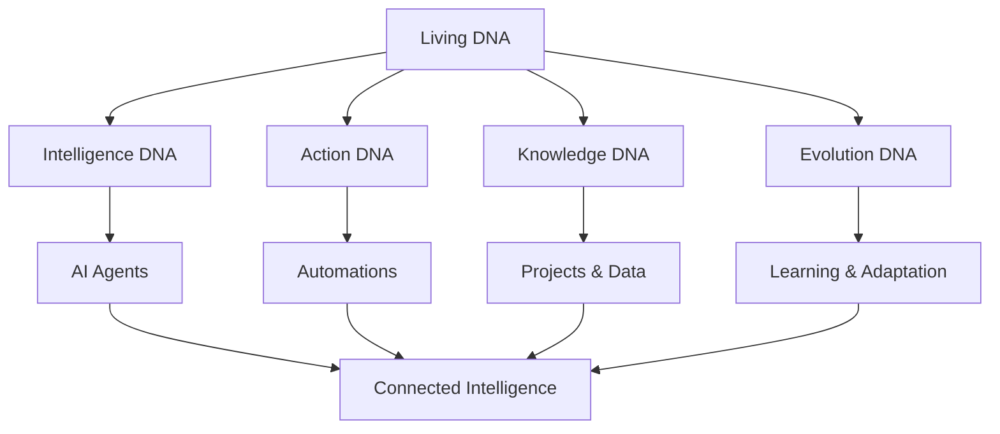

# Chapter 2: Living DNA Architecture

Welcome to **Chapter 2: Living DNA Architecture**. In this part of **Taskade Tutorial: AI-Native Workspace, Genesis, and Agentic Operations**, you will build an intuitive mental model first, then move into concrete implementation details and practical production tradeoffs.


Welcome back! In Chapter 1, we explored Taskade's surface features. Now let's dive deep into what makes Taskade truly revolutionary: its **Living DNA Architecture**. This isn't just marketing speak—it's a fundamental rethinking of how productivity platforms work.

## The Living DNA Philosophy

Taskade's architecture is inspired by biological systems where everything is interconnected and evolves:



## Intelligence DNA: AI That Learns

### How AI Agents Are Trained

```typescript
class IntelligenceDNA {
  private agents: Map<string, AIAgent> = new Map()

  async trainAgent(agentId: string, trainingData: TrainingData) {
    const agent = this.agents.get(agentId)

    // Train on workspace patterns
    await agent.train({
      userBehavior: trainingData.userPatterns,
      taskCompletion: trainingData.completedTasks,
      communicationStyle: trainingData.messageHistory,
      preferences: trainingData.userPreferences
    })

    // Connect to other agents
    await this.connectAgentToEcosystem(agent)
  }

  private async connectAgentToEcosystem(agent: AIAgent) {
    // Share knowledge with other agents
    const relatedAgents = this.findRelatedAgents(agent)
    for (const relatedAgent of relatedAgents) {
      await this.shareKnowledge(agent, relatedAgent)
    }
  }
}
```

### Agent Specialization

```typescript
const agentTypes = {
  projectManager: {
    skills: ['task_organization', 'deadline_tracking', 'resource_allocation'],
    trainingFocus: 'project_lifecycle_management'
  },
  contentCreator: {
    skills: ['writing', 'editing', 'content_strategy'],
    trainingFocus: 'content_generation_patterns'
  },
  dataAnalyst: {
    skills: ['data_processing', 'pattern_recognition', 'reporting'],
    trainingFocus: 'analytical_thinking'
  }
}
```

## Action DNA: Intelligent Automations

### The Nervous System of Your Business

```typescript
class ActionDNA {
  private automations: Automation[] = []
  private eventBus: EventBus

  constructor(eventBus: EventBus) {
    this.eventBus = eventBus
    this.initializeCoreAutomations()
  }

  private initializeCoreAutomations() {
    // Core business reflexes
    this.automations.push(
      new Automation({
        trigger: 'task_overdue',
        action: 'notify_team',
        context: 'deadline_management'
      }),
      new Automation({
        trigger: 'new_team_member',
        action: 'send_onboarding_pack',
        context: 'hr_management'
      }),
      new Automation({
        trigger: 'project_completed',
        action: 'generate_report',
        context: 'performance_tracking'
      })
    )
  }

  async processEvent(event: BusinessEvent) {
    const relevantAutomations = this.findRelevantAutomations(event)

    for (const automation of relevantAutomations) {
      await this.executeAutomation(automation, event)
    }
  }
}
```

### Advanced Automation Patterns

```typescript
const advancedPatterns = {
  conditionalAutomation: {
    trigger: 'project_status_change',
    conditions: [
      { field: 'status', operator: 'equals', value: 'at_risk' },
      { field: 'budget_used', operator: 'greater_than', value: 0.8 }
    ],
    actions: [
      'notify_project_manager',
      'escalate_to_executive',
      'trigger_budget_review'
    ]
  },

  learningAutomation: {
    trigger: 'recurring_pattern_detected',
    action: 'create_predictive_automation',
    learning: {
      analyze: 'user_behavior_patterns',
      predict: 'future_needs',
      adapt: 'automation_rules'
    }
  }
}
```

## Knowledge DNA: Organizational Memory

### How Taskade Remembers Everything

```typescript
class KnowledgeDNA {
  private memoryGraph: MemoryGraph
  private knowledgeBase: KnowledgeBase

  async storeKnowledge(knowledge: KnowledgeItem) {
    // Store in graph structure
    await this.memoryGraph.addNode(knowledge)

    // Create connections to related knowledge
    const relatedItems = await this.findRelatedKnowledge(knowledge)
    for (const related of relatedItems) {
      await this.memoryGraph.addEdge(knowledge.id, related.id, 'related')
    }

    // Update knowledge base
    await this.knowledgeBase.index(knowledge)
  }

  async retrieveKnowledge(query: KnowledgeQuery): Promise<KnowledgeItem[]> {
    // Search knowledge base
    const results = await this.knowledgeBase.search(query)

    // Enhance with graph relationships
    const enhanced = await this.enhanceWithRelationships(results, query)

    // Rank by relevance and recency
    return this.rankKnowledge(enhanced, query)
  }
}
```

### Memory Graph Structure

```typescript
interface MemoryNode {
  id: string
  type: 'task' | 'project' | 'person' | 'concept' | 'event'
  content: any
  metadata: {
    created: Date
    modified: Date
    accessCount: number
    importance: number
    connections: string[]
  }
}

interface MemoryEdge {
  from: string
  to: string
  type: 'created_by' | 'related_to' | 'depends_on' | 'part_of'
  strength: number
  lastInteraction: Date
}
```

## Evolution DNA: Learning and Adaptation

### How Taskade Gets Smarter

```typescript
class EvolutionDNA {
  private learningHistory: LearningEvent[] = []
  private adaptationEngine: AdaptationEngine

  async processInteraction(interaction: UserInteraction) {
    // Record the interaction
    await this.recordInteraction(interaction)

    // Analyze patterns
    const patterns = await this.analyzePatterns()

    // Generate adaptations
    const adaptations = await this.generateAdaptations(patterns)

    // Apply improvements
    await this.applyAdaptations(adaptations)
  }

  private async analyzePatterns(): Promise<Pattern[]> {
    const recentInteractions = this.learningHistory.slice(-100)

    return [
      this.findUsagePatterns(recentInteractions),
      this.findEfficiencyPatterns(recentInteractions),
      this.findPreferencePatterns(recentInteractions),
      this.findCollaborationPatterns(recentInteractions)
    ]
  }

  private async generateAdaptations(patterns: Pattern[]): Promise<Adaptation[]> {
    const adaptations = []

    for (const pattern of patterns) {
      const adaptation = await this.createAdaptation(pattern)
      adaptations.push(adaptation)
    }

    return adaptations
  }
}
```

### Adaptation Types

```typescript
const adaptationTypes = {
  interface: {
    type: 'ui_improvement',
    examples: [
      'reorder_frequently_used_features',
      'simplify_common_workflows',
      'add_shortcuts_for_common_actions'
    ]
  },

  automation: {
    type: 'workflow_optimization',
    examples: [
      'create_automation_for_recurring_tasks',
      'optimize_notification_timing',
      'improve_task_assignment_logic'
    ]
  },

  intelligence: {
    type: 'ai_enhancement',
    examples: [
      'improve_agent_responses_based_on_feedback',
      'learn_user_communication_preferences',
      'enhance_prediction_accuracy'
    ]
  }
}
```

## Connecting the DNA Strands

### The Interconnection Engine

```typescript
class InterconnectionEngine {
  private intelligenceDNA: IntelligenceDNA
  private actionDNA: ActionDNA
  private knowledgeDNA: KnowledgeDNA
  private evolutionDNA: EvolutionDNA

  async processEvent(event: SystemEvent) {
    // Intelligence DNA processes the event
    const insights = await this.intelligenceDNA.analyze(event)

    // Knowledge DNA stores the learning
    await this.knowledgeDNA.storeKnowledge(insights)

    // Action DNA determines appropriate responses
    const actions = await this.actionDNA.determineActions(event, insights)

    // Execute actions
    for (const action of actions) {
      await this.executeAction(action)
    }

    // Evolution DNA learns from the outcome
    await this.evolutionDNA.recordOutcome(event, actions)
  }

  private async executeAction(action: Action) {
    // Execute the action
    const result = await action.execute()

    // Share result with all DNA strands
    await this.shareResultWithDNA(result)
  }
}
```

## Real-World Living DNA Examples

### Project Management DNA

```javascript
const projectManagementDNA = {
  intelligence: {
    predict_delays: true,
    suggest_resources: true,
    optimize_schedules: true
  },
  action: {
    auto_assign_tasks: true,
    send_reminders: true,
    escalate_issues: true
  },
  knowledge: {
    track_project_history: true,
    learn_from_past_projects: true,
    identify_best_practices: true
  },
  evolution: {
    improve_estimates: true,
    enhance_collaboration: true,
    optimize_workflows: true
  }
}
```

### Customer Service DNA

```javascript
const customerServiceDNA = {
  intelligence: {
    understand_customer_sentiment: true,
    predict_issues: true,
    suggest_solutions: true
  },
  action: {
    route_tickets_automatically: true,
    notify_stakeholders: true,
    follow_up_after_resolution: true
  },
  knowledge: {
    build_knowledge_base: true,
    learn_from_resolutions: true,
    identify_trends: true
  },
  evolution: {
    improve_response_times: true,
    enhance_satisfaction: true,
    reduce_repeat_issues: true
  }
}
```

## Monitoring and Maintaining Living DNA

### Health Checks

```typescript
class DNAHealthMonitor {
  async checkDNAHealth(): Promise<HealthReport> {
    return {
      intelligence: await this.checkIntelligenceHealth(),
      action: await this.checkActionHealth(),
      knowledge: await this.checkKnowledgeHealth(),
      evolution: await this.checkEvolutionHealth(),
      interconnections: await this.checkInterconnections()
    }
  }

  private async checkIntelligenceHealth(): Promise<HealthStatus> {
    const agentPerformance = await this.measureAgentPerformance()
    const learningProgress = await this.measureLearningProgress()

    return {
      status: this.determineHealthStatus(agentPerformance, learningProgress),
      metrics: { agentPerformance, learningProgress },
      recommendations: this.generateRecommendations(agentPerformance, learningProgress)
    }
  }
}
```

### DNA Optimization

```typescript
class DNAOptimizer {
  async optimizeDNA(healthReport: HealthReport): Promise<Optimization[]> {
    const optimizations = []

    for (const [dnaType, health] of Object.entries(healthReport)) {
      if (health.status !== 'healthy') {
        const optimization = await this.createOptimization(dnaType, health)
        optimizations.push(optimization)
      }
    }

    return optimizations
  }

  private async createOptimization(dnaType: string, health: HealthStatus) {
    const optimizationStrategies = {
      intelligence: [
        'retrain_underperforming_agents',
        'update_training_data',
        'improve_agent_coordination'
      ],
      action: [
        'optimize_automation_triggers',
        'reduce_false_positives',
        'improve_action_timing'
      ],
      knowledge: [
        'consolidate_redundant_knowledge',
        'improve_retrieval_accuracy',
        'enhance_knowledge_connections'
      ],
      evolution: [
        'accelerate_learning_processes',
        'improve_adaptation_algorithms',
        'enhance_feedback_loops'
      ]
    }

    return {
      type: dnaType,
      strategy: optimizationStrategies[dnaType],
      expectedImprovement: this.calculateExpectedImprovement(health)
    }
  }
}
```

## Help Center Alignment: Tree of Life and Workspace DNA (Imported)

Official Workspace DNA documentation reinforces the same architecture used in this chapter:

- **Memory (Projects/Databases):** structured context that persists and accumulates meaning
- **Intelligence (Agents):** reasoning layer that learns from workspace memory
- **Execution (Automations):** workflow layer that responds to events and writes outcomes back

This closed loop is the practical "living software" pattern:

`memory -> intelligence -> execution -> updated memory`

## Imported Sources for This Chapter

- [How Genesis Works: Workspace DNA](https://help.taskade.com/en/articles/12578949-how-genesis-works-workspace-dna)
- [Projects & Databases: The Memory Pillar](https://help.taskade.com/en/articles/12166149-projects-databases-the-memory-pillar)
- [Automations: The Execution Pillar](https://help.taskade.com/en/articles/8958467-automations-the-execution-pillar)

## What We've Learned

✅ **Understood Living DNA architecture** and its four strands
✅ **Explored Intelligence DNA** and AI agent training
✅ **Mastered Action DNA** and intelligent automations
✅ **Comprehended Knowledge DNA** and organizational memory
✅ **Discovered Evolution DNA** and continuous learning
✅ **Learned DNA interconnection** and health monitoring

## Next Steps

Ready to put Living DNA into practice? In [Chapter 3: AI Agents & Intelligence](03-ai-agents-intelligence.md), we'll build custom AI agents that leverage the Living DNA architecture.

---

**Key Takeaway:** Taskade's Living DNA isn't just a feature—it's a fundamental rethinking of how productivity platforms should work. Every interaction makes your workspace smarter, more efficient, and better adapted to your needs.

*Living DNA turns your workspace from a static tool into a living, evolving intelligence that grows with you.*

## Depth Expansion Playbook

<!-- depth-expansion-v2 -->

This chapter is expanded to v1-style depth for production-grade learning and implementation quality.

### Strategic Context

- tutorial: **Taskade Tutorial: AI-Native Workspace, Genesis, and Agentic Operations**
- tutorial slug: **taskade-tutorial**
- chapter focus: **Chapter 2: Living DNA Architecture**
- system context: **Taskade Tutorial**
- objective: move from surface-level usage to repeatable engineering operation

### Architecture Decomposition

1. Define the runtime boundary for `Chapter 2: Living DNA Architecture`.
2. Separate control-plane decisions from data-plane execution.
3. Capture input contracts, transformation points, and output contracts.
4. Trace state transitions across request lifecycle stages.
5. Identify extension hooks and policy interception points.
6. Map ownership boundaries for team and automation workflows.
7. Specify rollback and recovery paths for unsafe changes.
8. Track observability signals for correctness, latency, and cost.

### Operator Decision Matrix

| Decision Area | Low-Risk Path | High-Control Path | Tradeoff |
|:--------------|:--------------|:------------------|:---------|
| Runtime mode | managed defaults | explicit policy config | speed vs control |
| State handling | local ephemeral | durable persisted state | simplicity vs auditability |
| Tool integration | direct API use | mediated adapter layer | velocity vs governance |
| Rollout method | manual change | staged + canary rollout | effort vs safety |
| Incident response | best effort logs | runbooks + SLO alerts | cost vs reliability |

### Failure Modes and Countermeasures

| Failure Mode | Early Signal | Root Cause Pattern | Countermeasure |
|:-------------|:-------------|:-------------------|:---------------|
| stale context | inconsistent outputs | missing refresh window | enforce context TTL and refresh hooks |
| policy drift | unexpected execution | ad hoc overrides | centralize policy profiles |
| auth mismatch | 401/403 bursts | credential sprawl | rotation schedule + scope minimization |
| schema breakage | parser/validation errors | unmanaged upstream changes | contract tests per release |
| retry storms | queue congestion | no backoff controls | jittered backoff + circuit breakers |
| silent regressions | quality drop without alerts | weak baseline metrics | eval harness with thresholds |

### Implementation Runbook

1. Establish a reproducible baseline environment.
2. Capture chapter-specific success criteria before changes.
3. Implement minimal viable path with explicit interfaces.
4. Add observability before expanding feature scope.
5. Run deterministic tests for happy-path behavior.
6. Inject failure scenarios for negative-path validation.
7. Compare output quality against baseline snapshots.
8. Promote through staged environments with rollback gates.
9. Record operational lessons in release notes.

### Quality Gate Checklist

- [ ] chapter-level assumptions are explicit and testable
- [ ] API/tool boundaries are documented with input/output examples
- [ ] failure handling includes retry, timeout, and fallback policy
- [ ] security controls include auth scopes and secret rotation plans
- [ ] observability includes logs, metrics, traces, and alert thresholds
- [ ] deployment guidance includes canary and rollback paths
- [ ] docs include links to upstream sources and related tracks
- [ ] post-release verification confirms expected behavior under load

### Source Alignment

- [Taskade Platform Repo](https://github.com/taskade/taskade)
- [Taskade Docs Repo](https://github.com/taskade/docs)
- [Taskade MCP Repo](https://github.com/taskade/mcp)
- [Taskade Awesome Vibe Coding](https://github.com/taskade/awesome-vibe-coding)
- [Taskade Actions Runner Controller](https://github.com/taskade/actions-runner-controller)
- [Taskade Temporal Parser](https://github.com/taskade/temporal-parser)
- [Taskade Product Site](https://taskade.com)
- [Taskade Changelog](https://taskade.com/changelog)

### Cross-Tutorial Connection Map

- [Taskade Docs Tutorial](../taskade-docs-tutorial/)
- [Taskade MCP Tutorial](../taskade-mcp-tutorial/)
- [Taskade Awesome Vibe Coding Tutorial](../taskade-awesome-vibe-coding-tutorial/)
- [MCP Servers Tutorial](../mcp-servers-tutorial/)
- [Composio Tutorial](../composio-tutorial/)
- [Chapter 1: Getting Started](01-getting-started.md)

### Advanced Practice Exercises

1. Build a minimal end-to-end implementation for `Chapter 2: Living DNA Architecture`.
2. Add instrumentation and measure baseline latency and error rate.
3. Introduce one controlled failure and confirm graceful recovery.
4. Add policy constraints and verify they are enforced consistently.
5. Run a staged rollout and document rollback decision criteria.

### Review Questions

1. Which execution boundary matters most for this chapter and why?
2. What signal detects regressions earliest in your environment?
3. What tradeoff did you make between delivery speed and governance?
4. How would you recover from the highest-impact failure mode?
5. What must be automated before scaling to team-wide adoption?

## What Problem Does This Solve?

Teams often build productivity systems that fragment over time: documents in one place, workflows in another, and AI context nowhere coherent.

This chapter solves that architectural drift by explaining Taskade's "Living DNA" model as a single inheritance system across:

- workspace structure and taxonomy
- project/database memory
- agent behavior and automation logic

Once this model is clear, you can design systems that scale without rewriting structure every quarter.

## How it Works Under the Hood

The DNA layer acts like a propagation engine:

1. **Root definition**: workspace-level structures define canonical categories and intent.
2. **Schema projection**: projects/databases inherit and specialize those structures.
3. **Context exposure**: agents and automations read this shared model as operating context.
4. **Mutation feedback**: edits and activity update memory nodes and influence future generation.
5. **Consistency checks**: inheritance rules keep teams aligned instead of diverging into local conventions.

When architecture feels inconsistent, inspect where inheritance broke: root model, projection, or mutation flow.

## Source Walkthrough

Primary references for this chapter:

- [How Genesis Works: Workspace DNA](https://help.taskade.com/en/articles/12578949-how-genesis-works-workspace-dna): formal framing of Tree of Life / DNA concepts.
- [Projects & Databases: The Memory Pillar](https://help.taskade.com/en/articles/12166149-projects-databases-the-memory-pillar): practical storage and structure implications.
- [Taskade Docs Repo](https://github.com/taskade/docs): documentation-level hierarchy and narrative model.
- [Taskade Platform Repo](https://github.com/taskade/taskade): implementation-facing signal for architecture changes.

## Chapter Connections

- [Tutorial Index](index.md)
- [Previous Chapter: Chapter 1: Getting Started with Taskade](01-getting-started.md)
- [Next Chapter: Chapter 3: AI Agents & Intelligence](03-ai-agents-intelligence.md)
- [Main Catalog](../../README.md#-tutorial-catalog)
- [A-Z Tutorial Directory](../../discoverability/tutorial-directory.md)
