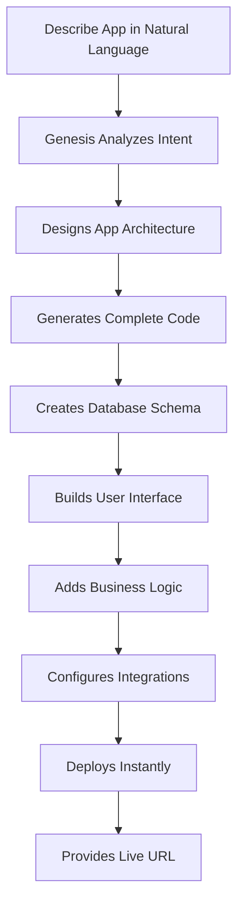

# Chapter 5: Genesis App Builder

Welcome to the most revolutionary feature in Taskade: **Genesis**, the AI-powered app builder that transforms your ideas into complete applications. Unlike traditional app builders that require coding expertise, Genesis understands natural language and builds production-ready applications from simple descriptions.

## Genesis Fundamentals

### How Genesis Works

```typescript
interface GenesisSystem {
  input: NaturalLanguageDescription
  understanding: ContextAnalysis
  architecture: AppArchitecture
  implementation: CodeGeneration
  deployment: InstantDeployment
  evolution: ContinuousImprovement
}
```

### The Genesis Process



## Building Your First Genesis App

### Step 1: Describe Your App

```javascript
const appDescription = `
Create a customer feedback management system that:
- Collects feedback through a simple web form
- Categorizes feedback automatically using AI
- Tracks response times and satisfaction scores
- Generates weekly summary reports
- Sends automated follow-up emails
- Provides real-time dashboard for managers
`
```

### Step 2: Genesis Creates the App

```typescript
class GenesisAppBuilder {
  async buildApp(description: string) {
    // 1. Parse and understand the description
    const understanding = await this.understandDescription(description)

    // 2. Design the application architecture
    const architecture = await this.designArchitecture(understanding)

    // 3. Generate the complete codebase
    const codebase = await this.generateCodebase(architecture)

    // 4. Create database schema
    const database = await this.createDatabaseSchema(architecture)

    // 5. Build user interface
    const ui = await this.buildUserInterface(architecture)

    // 6. Implement business logic
    const logic = await this.implementBusinessLogic(architecture)

    // 7. Configure integrations
    const integrations = await this.configureIntegrations(architecture)

    // 8. Deploy the application
    const deployment = await this.deployApplication(codebase)

    return {
      app: deployment,
      url: deployment.liveUrl,
      adminPanel: deployment.adminUrl
    }
  }
}
```

### Step 3: Customize and Enhance

```javascript
const customizations = {
  branding: {
    logo: "company_logo.png",
    colors: {
      primary: "#007bff",
      secondary: "#6c757d"
    },
    fonts: "Inter, sans-serif"
  },

  features: {
    add: [
      "Advanced analytics dashboard",
      "Mobile-responsive design",
      "API access for integrations"
    ],
    modify: [
      "Customize feedback categories",
      "Add priority levels",
      "Configure notification rules"
    ]
  },

  integrations: {
    email: "SendGrid",
    analytics: "Google Analytics",
    storage: "AWS S3"
  }
}
```

## Genesis App Templates

### Business Applications

#### Customer Relationship Management

```javascript
const crmApp = {
  name: "Customer CRM",
  description: "Complete CRM system with contact management, deal tracking, and automated follow-ups",
  features: [
    "Contact database with advanced search",
    "Deal pipeline with visual tracking",
    "Automated email sequences",
    "Meeting scheduling integration",
    "Performance analytics dashboard"
  ]
}
```

#### Project Management Hub

```javascript
const projectHub = {
  name: "Project Management Hub",
  description: "Unified project management with team collaboration and progress tracking",
  features: [
    "Multi-project portfolio view",
    "Resource allocation tracking",
    "Time tracking and reporting",
    "Risk management dashboard",
    "Client communication portal"
  ]
}
```

#### Inventory Management System

```javascript
const inventorySystem = {
  name: "Smart Inventory",
  description: "AI-powered inventory management with automated reordering",
  features: [
    "Real-time stock tracking",
    "Automated reorder alerts",
    "Supplier management",
    "Cost analysis and reporting",
    "Barcode scanning integration"
  ]
}
```

### Creative Applications

#### Content Creation Studio

```javascript
const contentStudio = {
  name: "Content Creation Studio",
  description: "Complete content creation and management platform",
  features: [
    "AI-powered content generation",
    "Brand style guide enforcement",
    "Content calendar and scheduling",
    "Performance tracking and analytics",
    "Team collaboration tools"
  ]
}
```

#### Marketing Campaign Manager

```javascript
const marketingManager = {
  name: "Marketing Campaign Manager",
  description: "End-to-end marketing campaign planning and execution",
  features: [
    "Campaign planning and budgeting",
    "Multi-channel content scheduling",
    "Performance tracking and ROI analysis",
    "Audience segmentation",
    "Automated reporting"
  ]
}
```

## Advanced Genesis Features

### Multi-App Ecosystems

```typescript
class MultiAppEcosystem {
  async createAppEcosystem(description: string) {
    // Parse ecosystem requirements
    const ecosystem = await this.parseEcosystemDescription(description)

    // Design inter-app communication
    const communication = await this.designCommunicationLayer(ecosystem)

    // Create individual apps
    const apps = await Promise.all(
      ecosystem.apps.map(app => this.buildApp(app.description))
    )

    // Establish app connections
    await this.connectApps(apps, communication)

    // Deploy ecosystem
    return await this.deployEcosystem(apps)
  }
}
```

### AI-Enhanced Apps

```typescript
const aiEnhancedApp = {
  name: "AI-Powered Support Center",
  features: [
    {
      name: "Intelligent Ticket Routing",
      ai: "Natural language processing for automatic categorization"
    },
    {
      name: "Smart Response Suggestions",
      ai: "Machine learning for response recommendations"
    },
    {
      name: "Predictive Issue Detection",
      ai: "Pattern recognition for proactive support"
    },
    {
      name: "Automated Resolution",
      ai: "Rule-based automation for common issues"
    }
  ]
}
```

## Genesis App Customization

### UI/UX Customization

```javascript
const uiCustomization = {
  theme: {
    light: {
      primary: "#ffffff",
      secondary: "#f8f9fa",
      accent: "#007bff"
    },
    dark: {
      primary: "#1a1a1a",
      secondary: "#2d2d2d",
      accent: "#4dabf7"
    }
  },

  layout: {
    sidebar: "collapsible",
    header: "fixed",
    navigation: "top"
  },

  components: {
    buttons: "rounded",
    cards: "elevated",
    forms: "material"
  }
}
```

### Business Logic Customization

```typescript
const businessLogic = {
  workflows: [
    {
      name: "Order Processing",
      steps: [
        "Validate order",
        "Check inventory",
        "Process payment",
        "Send confirmation",
        "Update records"
      ],
      conditions: [
        "If payment fails, cancel order",
        "If item out of stock, notify customer"
      ]
    }
  ],

  validations: {
    email: "RFC compliant",
    phone: "International format",
    date: "ISO 8601"
  },

  calculations: {
    tax: "location-based",
    discount: "rule-based",
    shipping: "weight-based"
  }
}
```

## Genesis App Analytics

### Built-in Analytics

```typescript
const appAnalytics = {
  userEngagement: {
    pageViews: "Real-time tracking",
    sessionDuration: "Average time spent",
    bounceRate: "Exit page analysis",
    conversionFunnel: "Step-by-step tracking"
  },

  performance: {
    loadTime: "Page load metrics",
    apiResponse: "API call performance",
    errorRate: "System reliability",
    uptime: "Service availability"
  },

  business: {
    userAcquisition: "New user growth",
    retentionRate: "User retention analysis",
    revenueTracking: "Monetization metrics",
    featureUsage: "Most used features"
  }
}
```

### Custom Analytics Dashboards

```javascript
const customDashboard = {
  widgets: [
    {
      type: "kpi",
      title: "Monthly Active Users",
      metric: "unique_users",
      timeframe: "30_days",
      goal: 10000
    },
    {
      type: "chart",
      title: "User Growth",
      data: "user_registrations",
      chartType: "line",
      timeframe: "12_months"
    },
    {
      type: "table",
      title: "Top Performing Features",
      data: "feature_usage",
      sortBy: "usage_count",
      limit: 10
    }
  ]
}
```

## Genesis App Security

### Built-in Security Features

```typescript
const securityFeatures = {
  authentication: {
    methods: ["email", "social", "sso"],
    mfa: "TOTP and SMS",
    session: "JWT with refresh tokens"
  },

  authorization: {
    rbac: "Role-based access control",
    permissions: "Granular permissions",
    policies: "Custom security policies"
  },

  data: {
    encryption: "AES-256 at rest",
    transmission: "TLS 1.3",
    backup: "Automated encrypted backups"
  },

  monitoring: {
    logging: "Comprehensive audit logs",
    alerts: "Security incident alerts",
    compliance: "GDPR and SOC 2 compliant"
  }
}
```

## Newsletter Signal Import: Genesis Feature Evolution (2025-2026)

Recent Taskade newsletters add practical context to Genesis rollout strategy:

- Genesis positioned as prompt-to-live-app workflow with workspace-connected memory, agents, and automations.
- Community sharing and app cloning emphasized through Taskade community distribution flows.
- Feature signals include image generation in chat, agent preview/customization, mobile app editing, media workflow improvements, and broader integration depth.
- Year-in-review messaging highlights strong automation/app usage momentum and reinforces the "living system" operating model.

Operational implication: treat Genesis as an evolving platform surface; keep app templates and internal runbooks versioned.

## Imported Sources for This Chapter

- [Introducing Taskade Genesis](https://www.taskade.com/newsletters/w/E892fl7IEwztrpfZDdMMY9Ug)
- [Genesis 2025: The Year Software Came Alive](https://www.taskade.com/newsletters/w/W763vDgzG2W9zRfdL3aALM3g)
- [Generate Images, Preview Agents, and More](https://www.taskade.com/newsletters/w/Z0ufmcIZ46892xNbAJ5TSFtA)
- [Genesis App Community Launch](https://www.taskade.com/newsletters/w/yKJO3flYI0O93cKz5VSsyw)
- [Genesis Preview, Agent Teams, and More](https://www.taskade.com/newsletters/w/llvX9892G0hGft5jX42763MKyg)

## What We've Accomplished

✅ **Understood Genesis app building** fundamentals
✅ **Created first Genesis application** from natural language
✅ **Explored app templates** and customization options
✅ **Built multi-app ecosystems** and AI-enhanced apps
✅ **Configured analytics and security** features

## Next Steps

Ready to coordinate multiple AI agents? In [Chapter 6: Multi-Agent Collaboration](06-multi-agent-collaboration.md), we'll explore how to create teams of AI agents that work together on complex tasks.

---

**Key Takeaway:** Genesis represents the future of application development—where anyone can create production-ready software using natural language. It's not just faster coding; it's democratizing software creation.

*With Genesis, your ideas become reality in minutes, not months.*

## Depth Expansion Playbook

<!-- depth-expansion-v2 -->

This chapter is expanded to v1-style depth for production-grade learning and implementation quality.

### Strategic Context

- tutorial: **Taskade Tutorial: AI-Native Workspace, Genesis, and Agentic Operations**
- tutorial slug: **taskade-tutorial**
- chapter focus: **Chapter 5: Genesis App Builder**
- system context: **Taskade Tutorial**
- objective: move from surface-level usage to repeatable engineering operation

### Architecture Decomposition

1. Define the runtime boundary for `Chapter 5: Genesis App Builder`.
2. Separate control-plane decisions from data-plane execution.
3. Capture input contracts, transformation points, and output contracts.
4. Trace state transitions across request lifecycle stages.
5. Identify extension hooks and policy interception points.
6. Map ownership boundaries for team and automation workflows.
7. Specify rollback and recovery paths for unsafe changes.
8. Track observability signals for correctness, latency, and cost.

### Operator Decision Matrix

| Decision Area | Low-Risk Path | High-Control Path | Tradeoff |
|:--------------|:--------------|:------------------|:---------|
| Runtime mode | managed defaults | explicit policy config | speed vs control |
| State handling | local ephemeral | durable persisted state | simplicity vs auditability |
| Tool integration | direct API use | mediated adapter layer | velocity vs governance |
| Rollout method | manual change | staged + canary rollout | effort vs safety |
| Incident response | best effort logs | runbooks + SLO alerts | cost vs reliability |

### Failure Modes and Countermeasures

| Failure Mode | Early Signal | Root Cause Pattern | Countermeasure |
|:-------------|:-------------|:-------------------|:---------------|
| stale context | inconsistent outputs | missing refresh window | enforce context TTL and refresh hooks |
| policy drift | unexpected execution | ad hoc overrides | centralize policy profiles |
| auth mismatch | 401/403 bursts | credential sprawl | rotation schedule + scope minimization |
| schema breakage | parser/validation errors | unmanaged upstream changes | contract tests per release |
| retry storms | queue congestion | no backoff controls | jittered backoff + circuit breakers |
| silent regressions | quality drop without alerts | weak baseline metrics | eval harness with thresholds |

### Implementation Runbook

1. Establish a reproducible baseline environment.
2. Capture chapter-specific success criteria before changes.
3. Implement minimal viable path with explicit interfaces.
4. Add observability before expanding feature scope.
5. Run deterministic tests for happy-path behavior.
6. Inject failure scenarios for negative-path validation.
7. Compare output quality against baseline snapshots.
8. Promote through staged environments with rollback gates.
9. Record operational lessons in release notes.

### Quality Gate Checklist

- [ ] chapter-level assumptions are explicit and testable
- [ ] API/tool boundaries are documented with input/output examples
- [ ] failure handling includes retry, timeout, and fallback policy
- [ ] security controls include auth scopes and secret rotation plans
- [ ] observability includes logs, metrics, traces, and alert thresholds
- [ ] deployment guidance includes canary and rollback paths
- [ ] docs include links to upstream sources and related tracks
- [ ] post-release verification confirms expected behavior under load

### Source Alignment

- [Taskade Platform Repo](https://github.com/taskade/taskade)
- [Taskade Docs Repo](https://github.com/taskade/docs)
- [Taskade MCP Repo](https://github.com/taskade/mcp)
- [Taskade Awesome Vibe Coding](https://github.com/taskade/awesome-vibe-coding)
- [Taskade Temporal Parser](https://github.com/taskade/temporal-parser)
- [Taskade Product Site](https://taskade.com)
- [Taskade Changelog](https://taskade.com/changelog)

### Cross-Tutorial Connection Map

- [Taskade Docs Tutorial](../taskade-docs-tutorial/)
- [Taskade MCP Tutorial](../taskade-mcp-tutorial/)
- [Taskade Awesome Vibe Coding Tutorial](../taskade-awesome-vibe-coding-tutorial/)
- [MCP Servers Tutorial](../mcp-servers-tutorial/)
- [Composio Tutorial](../composio-tutorial/)
- [Chapter 1: Getting Started](01-getting-started.md)

### Advanced Practice Exercises

1. Build a minimal end-to-end implementation for `Chapter 5: Genesis App Builder`.
2. Add instrumentation and measure baseline latency and error rate.
3. Introduce one controlled failure and confirm graceful recovery.
4. Add policy constraints and verify they are enforced consistently.
5. Run a staged rollout and document rollback decision criteria.

### Review Questions

1. Which execution boundary matters most for this chapter and why?
2. What signal detects regressions earliest in your environment?
3. What tradeoff did you make between delivery speed and governance?
4. How would you recover from the highest-impact failure mode?
5. What must be automated before scaling to team-wide adoption?

### Scenario Playbook 1: Chapter 5: Genesis App Builder

- tutorial context: **Taskade Tutorial: AI-Native Workspace, Genesis, and Agentic Operations**
- trigger condition: incoming request volume spikes after release
- initial hypothesis: identify the smallest reproducible failure boundary
- immediate action: protect user-facing stability before optimization work
- engineering control: introduce adaptive concurrency limits and queue bounds
- verification target: latency p95 and p99 stay within defined SLO windows
- rollback trigger: pre-defined quality gate fails for two consecutive checks
- communication step: publish incident status with owner and ETA
- learning capture: add postmortem and convert findings into automated tests

## What Problem Does This Solve?

Prompt-to-app systems often fail in the transition from demo quality to real operational quality.

This chapter solves that gap by showing how Genesis output should be treated as a structured artifact pipeline:

- prompt intent -> app schema
- app schema -> workflow logic
- workflow logic -> governed team usage

The goal is not just "generate an app," but generate an app that can be versioned, evaluated, and safely iterated.

## How it Works Under the Hood

Genesis app generation can be decomposed into six stages:

1. **Intent parsing**: interpret natural-language goals and constraints.
2. **Model synthesis**: generate core entities, views, and action model.
3. **Workspace alignment**: bind generated app parts to workspace DNA and memory.
4. **Automation linking**: connect triggers, actions, and agent capabilities.
5. **Preview + validation**: render preview state and apply sanity checks.
6. **Publish + feedback**: deploy into team workflow and collect improvement signals.

If generated apps drift from expectations, inspect intent parsing and workspace alignment first.

## Source Walkthrough

Use these Genesis-specific references:

- [Create Your First App](https://help.taskade.com/en/articles/11957643-create-your-first-app): canonical app creation and publish flow.
- [How Genesis Works: Workspace DNA](https://help.taskade.com/en/articles/12578949-how-genesis-works-workspace-dna): conceptual model behind generation behavior.
- [Build Apps, Dashboards, and Workflows](https://www.taskade.com/newsletters/w/mOA79zAZ3Hg9mbPpQKrRHQ): recent product signal on generation scope and direction.
- [Introducing Taskade Genesis App Community](https://www.taskade.com/newsletters/w/yKJO3flYI0O93cKz5VSsyw): ecosystem signal for reusable generated apps.

## Chapter Connections

- [Tutorial Index](index.md)
- [Previous Chapter: Chapter 4: Smart Automations](04-smart-automations.md)
- [Next Chapter: Chapter 6: Multi-Agent Collaboration](06-multi-agent-collaboration.md)
- [Main Catalog](../../README.md#-tutorial-catalog)
- [A-Z Tutorial Directory](../../discoverability/tutorial-directory.md)
