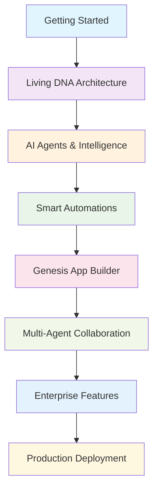

# Taskade Tutorial: AI-Powered Productivity Platform

> This tutorial is AI-generated! To learn more, check out [Awesome Code Docs](https://github.com/johnxie/awesome-code-docs)

Taskade[View Repo](https://github.com/taskade/docs) is a revolutionary productivity platform that combines AI-powered intelligence with collaborative workflows, featuring "living DNA" architecture where your workspace becomes an intelligent organism.

## Tutorial Chapters

1. **[Chapter 1: Getting Started](01-getting-started.md)** - Installation and workspace setup
2. **[Chapter 2: Living DNA Architecture](02-living-dna-architecture.md)** - Understanding Taskade's core philosophy
3. **[Chapter 3: AI Agents & Intelligence](03-ai-agents-intelligence.md)** - Building custom AI assistants
4. **[Chapter 4: Smart Automations](04-smart-automations.md)** - Workflow automation and integrations
5. **[Chapter 5: Genesis App Builder](05-genesis-app-builder.md)** - Creating complete applications from ideas
6. **[Chapter 6: Multi-Agent Collaboration](06-multi-agent-collaboration.md)** - Coordinating multiple AI agents
7. **[Chapter 7: Enterprise Features](07-enterprise-features.md)** - Security, compliance, and scaling
8. **[Chapter 8: Production Deployment](08-production-deployment.md)** - Going live with Taskade solutions

## What You'll Learn

- **Living DNA Architecture** - How Taskade's interconnected systems create intelligent experiences
- **AI Agent Development** - Building specialized assistants for different business functions
- **Workflow Automation** - Creating intelligent automations that learn and adapt
- **App Generation** - Transforming natural language descriptions into complete applications
- **Multi-Agent Systems** - Coordinating teams of AI agents for complex tasks
- **Enterprise Integration** - Scaling Taskade solutions for production use

## Learning Objectives

By the end of this tutorial, you'll be able to:
- Set up and configure Taskade workspaces with living DNA
- Build custom AI agents with specialized capabilities
- Create intelligent automations connecting 100+ services
- Use Genesis to build complete applications from text descriptions
- Implement multi-agent collaboration patterns
- Deploy production-ready Taskade solutions

## What's New in Taskade (2024-2025)

> **AI-Powered Productivity Revolution**: Genesis app generation, advanced automation, and human-AI collaboration mark Taskade's transformation.

**🚀 Genesis App Generator (2025):**
- ⚡ **Prompt-to-App**: Transform any idea into a working application in minutes
- 🏗️ **Rapid Prototyping**: Build MVPs and demos instantly from natural language
- 🎯 **No-Code Development**: Create functional applications without coding expertise

**🤖 Advanced AI Automation (2025):**
- 🔄 **Dynamic Workflows**: Complex multi-step process automation
- 🧠 **Real-Time Knowledge**: Live integration of team knowledge and context
- 🎭 **Multimodal Processing**: Handle text, images, documents, and more
- 📊 **Intelligent Insights**: AI-driven project intelligence and analytics

**👥 Human-AI Collaboration (2025):**
- 🏢 **Unified Workspaces**: Real-time human-AI teamwork environments
- 🧠 **Dynamic Memory Systems**: Team knowledge repositories that evolve
- 🎯 **Project Intelligence**: AI-enhanced project management and insights
- 🤝 **Seamless Integration**: Natural collaboration between humans and AI agents

**🔗 2024 AI Automation:**
- ⚙️ **AI Automation Beta**: Connect with Slack, Gmail, Typeform, WordPress
- 🎯 **Custom AI Commands**: Personalized agent commands in project editor
- 📚 **Expanded AI Context**: Full project access for AI teams
- 📄 **Smart Import**: Convert PowerPoint, Excel, EPUB files to projects with AI

**🏢 Enterprise & Community (2025):**
- 🔒 **SOC2 Compliance**: Enterprise-grade security and compliance
- 🌐 **Custom Domains**: White-label solutions for organizations
- 🏪 **Community Marketplace**: Share and discover AI agents
- 📈 **Enterprise Scaling**: Production-ready for large organizations

## Prerequisites

- Basic understanding of AI concepts
- Familiarity with productivity tools
- Experience with workflow automation (helpful but not required)

## Target Audience

- **Product Managers** - Learn to build intelligent business applications
- **Developers** - Understand AI-powered development workflows
- **Entrepreneurs** - Create MVPs and prototypes rapidly
- **Team Leaders** - Implement intelligent team collaboration systems

## Tutorial Flow

---

*Generated by [AI Codebase Knowledge Builder](https://github.com/The-Pocket/Tutorial-Codebase-Knowledge)*
