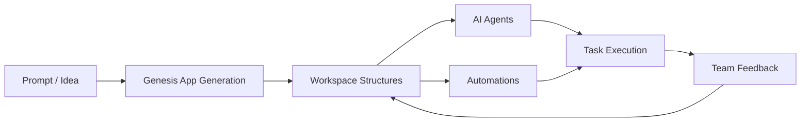

# Taskade Tutorial: AI-Native Workspace, Genesis, and Agentic Operations

> Learn how to operate Taskade as an AI-native workspace system: Genesis app generation, AI agents, automations, enterprise controls, and production rollout patterns.

## Why This Track Matters

Taskade spans multiple product surfaces: workspace planning, app generation, automation, AI agents, and MCP integrations.

This track gives you a practical operating model across those surfaces so teams can move from experimentation to repeatable production workflows.

## Current Snapshot (verified 2026-02-24)

- platform repository: [`taskade/taskade`](https://github.com/taskade/taskade) (about **4 stars**, recently pushed **2026-02-19**)
- documentation repository: [`taskade/docs`](https://github.com/taskade/docs) (about **10 stars**, recently pushed **2026-02-20**)
- official MCP repository: [`taskade/mcp`](https://github.com/taskade/mcp) (about **108 stars**, recently pushed **2026-02-13**)
- curated vibe-coding list: [`taskade/awesome-vibe-coding`](https://github.com/taskade/awesome-vibe-coding) (about **5 stars**, recently pushed **2026-02-11**)
- parser utility used in automation/runtime tooling: [`taskade/temporal-parser`](https://github.com/taskade/temporal-parser) (about **1 star**, recently pushed **2026-02-12**)
- product docs posture: active docs and help-center footprint with strong focus on Genesis, AI agents, automations, and workspace workflows

## Mental Model

## Chapter Guide

| Chapter | Key Question | Outcome |
|:--------|:-------------|:--------|
| [01 - Getting Started](01-getting-started.md) | How do you set up and run your first Taskade workflow? | working baseline |
| [02 - Living DNA Architecture](02-living-dna-architecture.md) | What does "living DNA" mean in practice? | system understanding |
| [03 - AI Agents and Intelligence](03-ai-agents-intelligence.md) | How do you design reliable specialized agents? | better agent quality |
| [04 - Smart Automations](04-smart-automations.md) | How do you connect triggers, logic, and actions safely? | operational automation |
| [05 - Genesis App Builder](05-genesis-app-builder.md) | How do you move from prompt to usable app? | faster app iteration |
| [06 - Multi-Agent Collaboration](06-multi-agent-collaboration.md) | How do multiple agents coordinate without chaos? | scalable delegation |
| [07 - Enterprise Features](07-enterprise-features.md) | What controls matter for governance and compliance? | safer enterprise adoption |
| [08 - Production Deployment](08-production-deployment.md) | How do you deploy, monitor, and improve over time? | production readiness |

## What You Will Learn

- Taskade operating model across workspace, agents, automations, and Genesis
- practical rollout sequence from prototype to governed production workflows
- integration surfaces including API and MCP-based agent tooling
- enterprise controls for security, auditability, and organizational scaling

## Imported Help-Center Knowledge Base (verified 2026-02-24)

This track is now aligned with the official Help Center pillar model and onboarding guidance:

- [Create Your First App](https://help.taskade.com/en/articles/11957643-create-your-first-app) -> first-app flow, generation modes, and publish options
- [Projects & Databases: The Memory Pillar](https://help.taskade.com/en/articles/12166149-projects-databases-the-memory-pillar) -> data layer patterns for Genesis apps
- [How Genesis Works: Workspace DNA](https://help.taskade.com/en/articles/12578949-how-genesis-works-workspace-dna) -> Tree of Life architecture and EVE framing
- [Custom AI Agents: The Intelligence Pillar](https://help.taskade.com/en/articles/8958457-custom-ai-agents-the-intelligence-pillar) -> agent creation, training, tooling, and command modes
- [Automations: The Execution Pillar](https://help.taskade.com/en/articles/8958467-automations-the-execution-pillar) -> trigger/action/variable automation model and generator modes

## Imported Newsletter Signals (verified 2026-02-24)

Recent newsletter pages were imported to keep this track aligned with product evolution signals:

- [Introducing Taskade Genesis](https://www.taskade.com/newsletters/w/E892fl7IEwztrpfZDdMMY9Ug)
- [Genesis 2025: The Year Software Came Alive](https://www.taskade.com/newsletters/w/W763vDgzG2W9zRfdL3aALM3g)
- [Generate Images, Preview Agents, and More](https://www.taskade.com/newsletters/w/Z0ufmcIZ46892xNbAJ5TSFtA)
- [Introducing Taskade Genesis (alternate update page)](https://www.taskade.com/newsletters/w/aKro6PyA9g2NMZFRsXkDTQ)
- [Genesis Preview, Agent Teams, and More](https://www.taskade.com/newsletters/w/llvX9892G0hGft5jX42763MKyg)
- [Build Apps, Dashboards, and Workflows](https://www.taskade.com/newsletters/w/mOA79zAZ3Hg9mbPpQKrRHQ)
- [Introducing Taskade Genesis App Community](https://www.taskade.com/newsletters/w/yKJO3flYI0O93cKz5VSsyw)
- [Newsletter URL no longer available (archived web version)](https://www.taskade.com/newsletters/w/FANqKzwWEjyhgrOTVgz763tQ)

## Source References

- [Taskade Platform Repo](https://github.com/taskade/taskade)
- [Taskade Docs Repo](https://github.com/taskade/docs)
- [Taskade MCP Repo](https://github.com/taskade/mcp)
- [Taskade Awesome Vibe Coding](https://github.com/taskade/awesome-vibe-coding)
- [Taskade Temporal Parser](https://github.com/taskade/temporal-parser)
- [Taskade Product Site](https://taskade.com)
- [Taskade Changelog](https://taskade.com/changelog)
- [Taskade Developers](https://developers.taskade.com)
- [Taskade Help Center](https://help.taskade.com)

## Related Tutorials

- [Taskade Docs Tutorial](../taskade-docs-tutorial/)
- [Taskade MCP Tutorial](../taskade-mcp-tutorial/)
- [Taskade Awesome Vibe Coding Tutorial](../taskade-awesome-vibe-coding-tutorial/)
- [MCP Servers Tutorial](../mcp-servers-tutorial/)
- [Composio Tutorial](../composio-tutorial/)

---

Start with [Chapter 1: Getting Started](01-getting-started.md).

## Navigation & Backlinks

- [Start Here: Chapter 1: Getting Started with Taskade](01-getting-started.md)
- [Back to Main Catalog](../../README.md#-tutorial-catalog)
- [Browse A-Z Tutorial Directory](../../discoverability/tutorial-directory.md)
- [Search by Intent](../../discoverability/query-hub.md)
- [Explore Category Hubs](../../README.md#category-hubs)

## Full Chapter Map

1. [Chapter 1: Getting Started with Taskade](01-getting-started.md)
2. [Chapter 2: Living DNA Architecture](02-living-dna-architecture.md)
3. [Chapter 3: AI Agents & Intelligence](03-ai-agents-intelligence.md)
4. [Chapter 4: Smart Automations](04-smart-automations.md)
5. [Chapter 5: Genesis App Builder](05-genesis-app-builder.md)
6. [Chapter 6: Multi-Agent Collaboration](06-multi-agent-collaboration.md)
7. [Chapter 7: Enterprise Features & Advanced Workflows](07-enterprise-features.md)
8. [Chapter 8: Production Deployment](08-production-deployment.md)

*Generated by [AI Codebase Knowledge Builder](https://github.com/The-Pocket/Tutorial-Codebase-Knowledge)*
