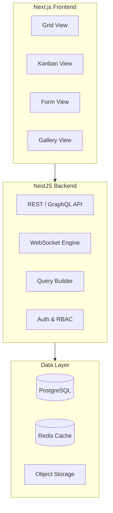

# Teable: Deep Dive Tutorial

> **Project**: [Teable](https://github.com/teableio/teable) — A high-performance, multi-dimensional database platform built on PostgreSQL with real-time collaboration.

## Why This Track Matters

Teable combines the power of PostgreSQL with a collaborative spreadsheet interface, offering teams a scalable no-code database that doesn't sacrifice data integrity or query performance for usability.

This track focuses on:
- building on PostgreSQL with Teable's schema management and query system
- implementing real-time collaborative editing with WebSocket consistency
- generating and consuming REST and GraphQL APIs from Teable tables
- deploying and scaling Teable with Docker for production workloads

## What Is Teable?

Teable is a high-performance, multi-dimensional database platform that combines the power of PostgreSQL with a spreadsheet-like UI. It supports real-time collaboration, complex data relationships, and advanced querying — offering a scalable alternative to Airtable built on proven database technology.

| Feature | Description |
|---------|-------------|
| **PostgreSQL Native** | Built directly on PostgreSQL for performance and reliability |
| **Multi-Dimensional** | Grid, kanban, gallery, form, and calendar views |
| **Real-Time Collab** | WebSocket-based collaborative editing with conflict resolution |
| **Advanced Queries** | Complex filters, aggregations, cross-table relationships |
| **REST & GraphQL** | Auto-generated APIs with schema validation |
| **Self-Hosted** | Docker deployment with horizontal scaling |

## Mental Model

## Chapter Guide

| Chapter | Topic | What You'll Learn |
|---------|-------|-------------------|
| [1. System Overview](01-system-overview.md) | Architecture | Teable's position in the database ecosystem |
| [2. Database Architecture](02-database-architecture.md) | Data Layer | PostgreSQL schema, storage engines, indexing |
| [3. Setup Environment](03-setup-environment.md) | Development | Complete development stack configuration |
| [4. API Development](04-api-development.md) | API Layer | REST/GraphQL contracts and validation patterns |
| [5. Realtime Collaboration](05-realtime-collaboration.md) | Collaboration | WebSocket events and multi-user consistency |
| [6. Query System](06-query-system.md) | Querying | View-driven query planning and optimization |
| [7. Frontend Architecture](07-frontend-architecture.md) | UI Layer | Dynamic view rendering and state boundaries |
| [8. Production Deployment](08-production-deployment.md) | Operations | Deployment hardening, scaling, and observability |

## Tech Stack

| Component | Technology |
|-----------|-----------|
| **Backend** | NestJS, TypeScript |
| **Frontend** | Next.js, React |
| **Database** | PostgreSQL |
| **Cache** | Redis |
| **Real-Time** | WebSockets |
| **Deployment** | Docker Compose |

---

Ready to begin? Start with [Chapter 1: System Overview](01-system-overview.md).

---

*Built with insights from the [Teable repository](https://github.com/teableio/teable) and community documentation.*

## Navigation & Backlinks

- [Start Here: Chapter 1: System Overview](01-system-overview.md)
- [Back to Main Catalog](../../README.md#-tutorial-catalog)
- [Browse A-Z Tutorial Directory](../../discoverability/tutorial-directory.md)
- [Search by Intent](../../discoverability/query-hub.md)
- [Explore Category Hubs](../../README.md#category-hubs)

## Full Chapter Map

1. [Chapter 1: System Overview](01-system-overview.md)
2. [Chapter 2: Database Architecture](02-database-architecture.md)
3. [Teable Development Environment Setup](03-setup-environment.md)
4. [Chapter 4: API Development](04-api-development.md)
5. [Chapter 5: Realtime Collaboration](05-realtime-collaboration.md)
6. [Chapter 6: Query System](06-query-system.md)
7. [Chapter 7: Frontend Architecture](07-frontend-architecture.md)
8. [Chapter 8: Production Deployment](08-production-deployment.md)

## Current Snapshot (auto-updated)

- repository: [teableio/teable](https://github.com/teableio/teable)
- stars: about **15K**
- project positioning: high-performance PostgreSQL-native no-code database with real-time collaboration

## What You Will Learn

- how Teable uses PostgreSQL as its native storage layer with schema management and indexing
- how WebSocket-based real-time collaboration handles multi-user consistency
- how the query system translates view-driven filters into optimized PostgreSQL queries
- how to deploy and scale Teable with Docker Compose for production environments

## Source References

- [Teable](https://github.com/teableio/teable)

*Generated by [AI Codebase Knowledge Builder](https://github.com/The-Pocket/Tutorial-Codebase-Knowledge)*
