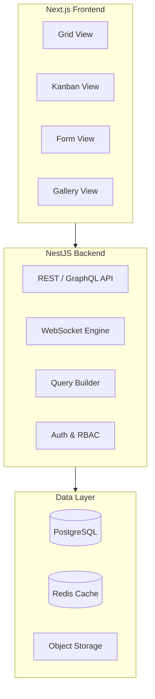

# Teable: Deep Dive Tutorial

> **Project**: [Teable](https://github.com/teableio/teable) — A high-performance, multi-dimensional database platform built on PostgreSQL with real-time collaboration.

## What Is Teable?

Teable is a high-performance, multi-dimensional database platform that combines the power of PostgreSQL with a spreadsheet-like UI. It supports real-time collaboration, complex data relationships, and advanced querying — offering a scalable alternative to Airtable built on proven database technology.

| Feature | Description |
|---------|-------------|
| **PostgreSQL Native** | Built directly on PostgreSQL for performance and reliability |
| **Multi-Dimensional** | Grid, kanban, gallery, form, and calendar views |
| **Real-Time Collab** | WebSocket-based collaborative editing with conflict resolution |
| **Advanced Queries** | Complex filters, aggregations, cross-table relationships |
| **REST & GraphQL** | Auto-generated APIs with schema validation |
| **Self-Hosted** | Docker deployment with horizontal scaling |

## Architecture Overview

## Tutorial Structure

| Chapter | Topic | What You'll Learn |
|---------|-------|-------------------|
| [1. System Overview](docs/01-system-overview.md) | Architecture | Teable's position in the database ecosystem |
| [2. Database Architecture](docs/02-database-architecture.md) | Data Layer | PostgreSQL schema, storage engines, indexing |
| [3. Setup Environment](docs/03-setup-environment.md) | Development | Complete development stack configuration |
| [4. API Development](docs/04-api-development.md) | API Layer | REST/GraphQL contracts and validation patterns |
| [5. Realtime Collaboration](docs/05-realtime-collaboration.md) | Collaboration | WebSocket events and multi-user consistency |
| [6. Query System](docs/06-query-system.md) | Querying | View-driven query planning and optimization |
| [7. Frontend Architecture](docs/07-frontend-architecture.md) | UI Layer | Dynamic view rendering and state boundaries |
| [8. Production Deployment](docs/08-production-deployment.md) | Operations | Deployment hardening, scaling, and observability |

## Tech Stack

| Component | Technology |
|-----------|-----------|
| **Backend** | NestJS, TypeScript |
| **Frontend** | Next.js, React |
| **Database** | PostgreSQL |
| **Cache** | Redis |
| **Real-Time** | WebSockets |
| **Deployment** | Docker Compose |

---

Ready to begin? Start with [Chapter 1: System Overview](docs/01-system-overview.md).

---

*Built with insights from the [Teable repository](https://github.com/teableio/teable) and community documentation.*
