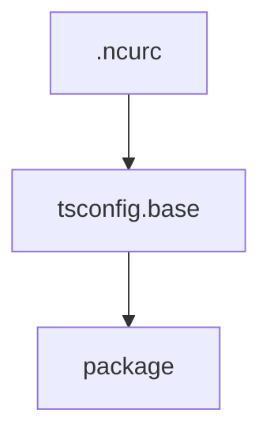

# Chapter 5: Realtime Collaboration

Welcome to **Chapter 5: Realtime Collaboration**. In this part of **Teable: Deep Dive Tutorial**, you will build an intuitive mental model first, then move into concrete implementation details and practical production tradeoffs.


Realtime collaboration enables low-latency multi-user editing while preserving canonical data consistency.

## Collaboration Event Flow

1. client submits optimistic change
2. backend validates and persists
3. canonical change event is broadcast
4. clients reconcile local state with authoritative event

## Consistency Controls

- row/version metadata for conflict detection
- ordered event streams by workspace/table
- reconnect replay for missed events
- explicit conflict UI when auto-merge cannot resolve

## Reliability Considerations

| Concern | Mitigation |
|:--------|:-----------|
| dropped websocket events | replay-on-reconnect window |
| out-of-order updates | monotonic sequence IDs |
| optimistic drift | bounded pending mutation queue |

## Summary

You can now reason about Teable's real-time consistency model under concurrent edits.

Next: [Chapter 6: Query System](06-query-system.md)

## What Problem Does This Solve?

Most teams struggle here because the hard part is not writing more code, but deciding clear boundaries for core abstractions in this chapter so behavior stays predictable as complexity grows.

In practical terms, this chapter helps you avoid three common failures:

- coupling core logic too tightly to one implementation path
- missing the handoff boundaries between setup, execution, and validation
- shipping changes without clear rollback or observability strategy

After working through this chapter, you should be able to reason about `Chapter 5: Realtime Collaboration` as an operating subsystem inside **Teable: Deep Dive Tutorial**, with explicit contracts for inputs, state transitions, and outputs.

Use the implementation notes around execution and reliability details as your checklist when adapting these patterns to your own repository.

## How it Works Under the Hood

Under the hood, `Chapter 5: Realtime Collaboration` usually follows a repeatable control path:

1. **Context bootstrap**: initialize runtime config and prerequisites for `core component`.
2. **Input normalization**: shape incoming data so `execution layer` receives stable contracts.
3. **Core execution**: run the main logic branch and propagate intermediate state through `state model`.
4. **Policy and safety checks**: enforce limits, auth scopes, and failure boundaries.
5. **Output composition**: return canonical result payloads for downstream consumers.
6. **Operational telemetry**: emit logs/metrics needed for debugging and performance tuning.

When debugging, walk this sequence in order and confirm each stage has explicit success/failure conditions.

## Source Walkthrough

Use the following upstream sources to verify implementation details while reading this chapter:

- [Teable](https://github.com/teableio/teable)
  Why it matters: authoritative reference on `Teable` (github.com).

Suggested trace strategy:
- search upstream code for `Realtime` and `Collaboration` to map concrete implementation paths
- compare docs claims against actual runtime/config code before reusing patterns in production

## Chapter Connections

- [Tutorial Index](README.md)
- [Previous Chapter: Chapter 4: API Development](04-api-development.md)
- [Next Chapter: Chapter 6: Query System](06-query-system.md)
- [Main Catalog](../../README.md#-tutorial-catalog)
- [A-Z Tutorial Directory](../../discoverability/tutorial-directory.md)

## Depth Expansion Playbook

## Source Code Walkthrough

### `.ncurc.yml`

The `.ncurc` module in [`.ncurc.yml`](https://github.com/teableio/teable/blob/HEAD/.ncurc.yml) handles a key part of this chapter's functionality:

```yml
# npm-check-updates configuration used by yarn deps:check && yarn deps:update
# convenience scripts.
# @link https://github.com/raineorshine/npm-check-updates

# Add here exclusions on packages if any
reject: [
    'vite-plugin-svgr',

    # Too early cause in esm
    'is-port-reachable',
    'nanoid',
    'node-fetch',
  ]

```

This module is important because it defines how Teable: Deep Dive Tutorial implements the patterns covered in this chapter.

### `tsconfig.base.json`

The `tsconfig.base` module in [`tsconfig.base.json`](https://github.com/teableio/teable/blob/HEAD/tsconfig.base.json) handles a key part of this chapter's functionality:

```json
{
  "$schema": "https://json.schemastore.org/tsconfig",
  "compilerOptions": {
    "strict": true,
    "useUnknownInCatchVariables": true,
    "allowJs": true,
    "skipLibCheck": true,
    "forceConsistentCasingInFileNames": true,
    "noEmit": true,
    "esModuleInterop": true,
    "moduleResolution": "node",
    "resolveJsonModule": true,
    "isolatedModules": true,
    "incremental": true,
    "newLine": "lf"
  },
  "exclude": ["**/node_modules", "**/.*/"]
}

```

This module is important because it defines how Teable: Deep Dive Tutorial implements the patterns covered in this chapter.

### `package.json`

The `package` module in [`package.json`](https://github.com/teableio/teable/blob/HEAD/package.json) handles a key part of this chapter's functionality:

```json
{
  "name": "@teable/teable",
  "version": "1.10.0",
  "license": "AGPL-3.0",
  "private": true,
  "homepage": "https://github.com/teableio/teable",
  "repository": {
    "type": "git",
    "url": "https://github.com/teableio/teable"
  },
  "author": {
    "name": "tea artist",
    "url": "https://github.com/tea-artist"
  },
  "keywords": [
    "teable",
    "database"
  ],
  "workspaces": [
    "apps/*",
    "packages/*",
    "packages/v2/*",
    "plugins",
    "!apps/electron"
  ],
  "scripts": {
    "clean:global-cache": "rimraf ./.cache",
    "deps:check": "pnpm --package=npm-check-updates@latest dlx npm-check-updates --configFileName .ncurc.yml --workspaces --root --mergeConfig",
    "deps:update": "pnpm --package=npm-check-updates@latest dlx npm-check-updates --configFileName .ncurc.yml -u --workspaces --root --mergeConfig",
    "dev:v2": "pnpm -r --parallel --stream -F @teable/formula -F './packages/v2/*' dev",
    "clean:v2": "pnpm -r --parallel --stream -F @teable/formula -F './packages/v2/*' clean",
    "build:v2": "pnpm -r --parallel --stream -F @teable/formula -F './packages/v2/*' build",
    "build:packages": "pnpm -r -F './packages/**' build",
    "g:build": "pnpm -r run build",
    "g:build-changed": "pnpm -r -F '...[origin/main]' build",
```

This module is important because it defines how Teable: Deep Dive Tutorial implements the patterns covered in this chapter.


## How These Components Connect


