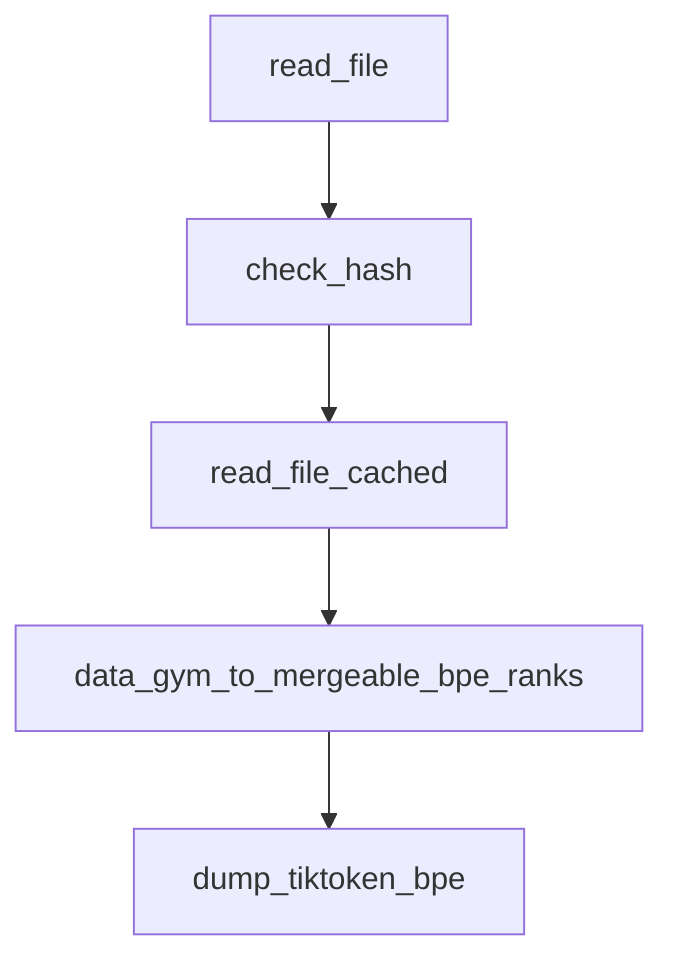

# Chapter 1: Getting Started

Welcome to **Chapter 1: Getting Started**. In this part of **tiktoken Tutorial: OpenAI Token Encoding & Optimization**, you will build an intuitive mental model first, then move into concrete implementation details and practical production tradeoffs.


This chapter introduces tiktoken and gets you productive with basic encode/decode and counting.

## Install

```bash
python3 -m venv .venv
source .venv/bin/activate
pip install --upgrade pip
pip install tiktoken
```

## First Encode/Decode

```python
import tiktoken

enc = tiktoken.get_encoding("cl100k_base")
text = "Tokenization makes cost estimation predictable."

ids = enc.encode(text)
print(ids)
print("token_count=", len(ids))
print("round_trip=", enc.decode(ids))
```

## Model-Specific Encoding

```python
import tiktoken

enc = tiktoken.encoding_for_model("gpt-4.1-mini")
print(len(enc.encode("hello world")))
```

## Why This Matters

- API cost is token-based.
- Context windows are token-limited.
- Retrieval chunking quality depends on token boundaries.

## Common Mistakes

| Mistake | Fix |
|:--------|:----|
| Using char counts as proxy | Always count actual tokens |
| Mixing encodings across pipelines | Standardize encoding per model |
| Ignoring special tokens | Include model-specific token behavior in tests |

## Summary

You now have the core encode/decode workflow and model-specific counting.

Next: [Chapter 2: Tokenization Mechanics](02-tokenization-mechanics.md)

## What Problem Does This Solve?

Most teams struggle here because the hard part is not writing more code, but deciding clear boundaries for `tiktoken`, `print`, `venv` so behavior stays predictable as complexity grows.

In practical terms, this chapter helps you avoid three common failures:

- coupling core logic too tightly to one implementation path
- missing the handoff boundaries between setup, execution, and validation
- shipping changes without clear rollback or observability strategy

After working through this chapter, you should be able to reason about `Chapter 1: Getting Started` as an operating subsystem inside **tiktoken Tutorial: OpenAI Token Encoding & Optimization**, with explicit contracts for inputs, state transitions, and outputs.

Use the implementation notes around `install`, `text`, `encode` as your checklist when adapting these patterns to your own repository.

## How it Works Under the Hood

Under the hood, `Chapter 1: Getting Started` usually follows a repeatable control path:

1. **Context bootstrap**: initialize runtime config and prerequisites for `tiktoken`.
2. **Input normalization**: shape incoming data so `print` receives stable contracts.
3. **Core execution**: run the main logic branch and propagate intermediate state through `venv`.
4. **Policy and safety checks**: enforce limits, auth scopes, and failure boundaries.
5. **Output composition**: return canonical result payloads for downstream consumers.
6. **Operational telemetry**: emit logs/metrics needed for debugging and performance tuning.

When debugging, walk this sequence in order and confirm each stage has explicit success/failure conditions.

## Source Walkthrough

Use the following upstream sources to verify implementation details while reading this chapter:

- [tiktoken repository](https://github.com/openai/tiktoken)
  Why it matters: authoritative reference on `tiktoken repository` (github.com).

Suggested trace strategy:
- search upstream code for `tiktoken` and `print` to map concrete implementation paths
- compare docs claims against actual runtime/config code before reusing patterns in production

## Chapter Connections

- [Tutorial Index](README.md)
- [Next Chapter: Chapter 2: Tokenization Mechanics](02-tokenization-mechanics.md)
- [Main Catalog](../../README.md#-tutorial-catalog)
- [A-Z Tutorial Directory](../../discoverability/tutorial-directory.md)

## Depth Expansion Playbook

## Source Code Walkthrough

### `tiktoken/load.py`

The `read_file` function in [`tiktoken/load.py`](https://github.com/openai/tiktoken/blob/HEAD/tiktoken/load.py) handles a key part of this chapter's functionality:

```py


def read_file(blobpath: str) -> bytes:
    if "://" not in blobpath:
        with open(blobpath, "rb", buffering=0) as f:
            return f.read()

    if blobpath.startswith(("http://", "https://")):
        # avoiding blobfile for public files helps avoid auth issues, like MFA prompts.
        import requests

        resp = requests.get(blobpath)
        resp.raise_for_status()
        return resp.content

    try:
        import blobfile
    except ImportError as e:
        raise ImportError(
            "blobfile is not installed. Please install it by running `pip install blobfile`."
        ) from e
    return blobfile.read_bytes(blobpath)


def check_hash(data: bytes, expected_hash: str) -> bool:
    actual_hash = hashlib.sha256(data).hexdigest()
    return actual_hash == expected_hash


def read_file_cached(blobpath: str, expected_hash: str | None = None) -> bytes:
    user_specified_cache = True
    if "TIKTOKEN_CACHE_DIR" in os.environ:
```

This function is important because it defines how tiktoken Tutorial: OpenAI Token Encoding & Optimization implements the patterns covered in this chapter.

### `tiktoken/load.py`

The `check_hash` function in [`tiktoken/load.py`](https://github.com/openai/tiktoken/blob/HEAD/tiktoken/load.py) handles a key part of this chapter's functionality:

```py


def check_hash(data: bytes, expected_hash: str) -> bool:
    actual_hash = hashlib.sha256(data).hexdigest()
    return actual_hash == expected_hash


def read_file_cached(blobpath: str, expected_hash: str | None = None) -> bytes:
    user_specified_cache = True
    if "TIKTOKEN_CACHE_DIR" in os.environ:
        cache_dir = os.environ["TIKTOKEN_CACHE_DIR"]
    elif "DATA_GYM_CACHE_DIR" in os.environ:
        cache_dir = os.environ["DATA_GYM_CACHE_DIR"]
    else:
        import tempfile

        cache_dir = os.path.join(tempfile.gettempdir(), "data-gym-cache")
        user_specified_cache = False

    if cache_dir == "":
        # disable caching
        return read_file(blobpath)

    cache_key = hashlib.sha1(blobpath.encode()).hexdigest()

    cache_path = os.path.join(cache_dir, cache_key)
    if os.path.exists(cache_path):
        with open(cache_path, "rb", buffering=0) as f:
            data = f.read()
        if expected_hash is None or check_hash(data, expected_hash):
            return data

```

This function is important because it defines how tiktoken Tutorial: OpenAI Token Encoding & Optimization implements the patterns covered in this chapter.

### `tiktoken/load.py`

The `read_file_cached` function in [`tiktoken/load.py`](https://github.com/openai/tiktoken/blob/HEAD/tiktoken/load.py) handles a key part of this chapter's functionality:

```py


def read_file_cached(blobpath: str, expected_hash: str | None = None) -> bytes:
    user_specified_cache = True
    if "TIKTOKEN_CACHE_DIR" in os.environ:
        cache_dir = os.environ["TIKTOKEN_CACHE_DIR"]
    elif "DATA_GYM_CACHE_DIR" in os.environ:
        cache_dir = os.environ["DATA_GYM_CACHE_DIR"]
    else:
        import tempfile

        cache_dir = os.path.join(tempfile.gettempdir(), "data-gym-cache")
        user_specified_cache = False

    if cache_dir == "":
        # disable caching
        return read_file(blobpath)

    cache_key = hashlib.sha1(blobpath.encode()).hexdigest()

    cache_path = os.path.join(cache_dir, cache_key)
    if os.path.exists(cache_path):
        with open(cache_path, "rb", buffering=0) as f:
            data = f.read()
        if expected_hash is None or check_hash(data, expected_hash):
            return data

        # the cached file does not match the hash, remove it and re-fetch
        try:
            os.remove(cache_path)
        except OSError:
            pass
```

This function is important because it defines how tiktoken Tutorial: OpenAI Token Encoding & Optimization implements the patterns covered in this chapter.

### `tiktoken/load.py`

The `data_gym_to_mergeable_bpe_ranks` function in [`tiktoken/load.py`](https://github.com/openai/tiktoken/blob/HEAD/tiktoken/load.py) handles a key part of this chapter's functionality:

```py


def data_gym_to_mergeable_bpe_ranks(
    vocab_bpe_file: str,
    encoder_json_file: str,
    vocab_bpe_hash: str | None = None,
    encoder_json_hash: str | None = None,
    clobber_one_byte_tokens: bool = False,
) -> dict[bytes, int]:
    # NB: do not add caching to this function
    rank_to_intbyte = [b for b in range(2**8) if chr(b).isprintable() and chr(b) != " "]

    data_gym_byte_to_byte = {chr(b): b for b in rank_to_intbyte}
    n = 0
    for b in range(2**8):
        if b not in rank_to_intbyte:
            rank_to_intbyte.append(b)
            data_gym_byte_to_byte[chr(2**8 + n)] = b
            n += 1
    assert len(rank_to_intbyte) == 2**8

    # vocab_bpe contains the merges along with associated ranks
    vocab_bpe_contents = read_file_cached(vocab_bpe_file, vocab_bpe_hash).decode()
    bpe_merges = [tuple(merge_str.split()) for merge_str in vocab_bpe_contents.split("\n")[1:-1]]

    def decode_data_gym(value: str) -> bytes:
        return bytes(data_gym_byte_to_byte[b] for b in value)

    # add the single byte tokens
    # if clobber_one_byte_tokens is True, we'll replace these with ones from the encoder json
    bpe_ranks = {bytes([b]): i for i, b in enumerate(rank_to_intbyte)}
    del rank_to_intbyte
```

This function is important because it defines how tiktoken Tutorial: OpenAI Token Encoding & Optimization implements the patterns covered in this chapter.


## How These Components Connect


