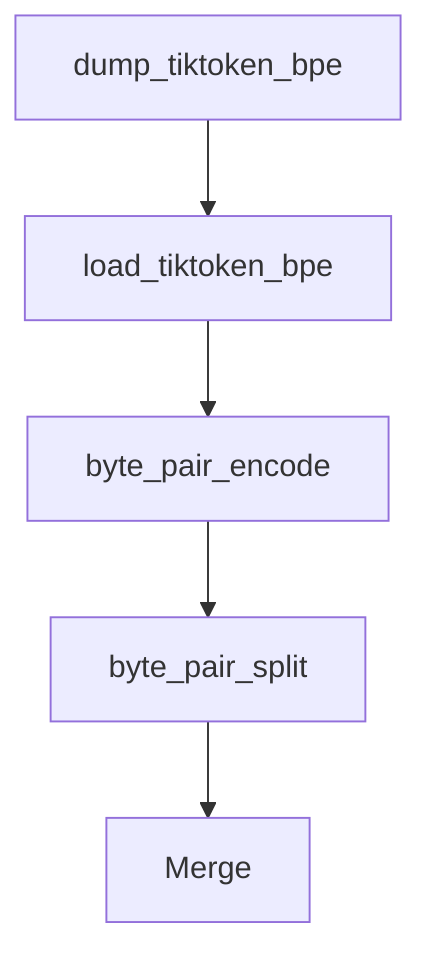

# Chapter 2: Tokenization Mechanics

Welcome to **Chapter 2: Tokenization Mechanics**. In this part of **tiktoken Tutorial: OpenAI Token Encoding & Optimization**, you will build an intuitive mental model first, then move into concrete implementation details and practical production tradeoffs.


This chapter explains how BPE tokenization works and why token boundaries look unintuitive.

## BPE Intuition

Byte Pair Encoding (BPE) builds subword units from frequent patterns.

- Frequent substrings become single tokens.
- Rare words split into multiple tokens.
- Spaces and punctuation can be encoded as separate units.

## Inspect Token Pieces

```python
import tiktoken

enc = tiktoken.get_encoding("cl100k_base")
text = "Kubernetes operators improve day-2 reliability."

ids = enc.encode(text)
for token_id in ids:
    piece = enc.decode([token_id])
    print(token_id, repr(piece))
```

## Unicode and Edge Cases

```python
samples = ["naive", "naive cafe", "naive cafe ☕", "emoji: 😀"]
for s in samples:
    print(s, len(enc.encode(s)))
```

## Practical Implications

- Prompt rewrites can change token count materially.
- Structured output formats may be more token-efficient.
- Localization can shift cost due to token distribution.

## Summary

You understand how token pieces are formed and how to inspect them.

Next: [Chapter 3: Practical Applications](03-practical-applications.md)

## What Problem Does This Solve?

Most teams struggle here because the hard part is not writing more code, but deciding clear boundaries for `token_id`, `naive`, `tiktoken` so behavior stays predictable as complexity grows.

In practical terms, this chapter helps you avoid three common failures:

- coupling core logic too tightly to one implementation path
- missing the handoff boundaries between setup, execution, and validation
- shipping changes without clear rollback or observability strategy

After working through this chapter, you should be able to reason about `Chapter 2: Tokenization Mechanics` as an operating subsystem inside **tiktoken Tutorial: OpenAI Token Encoding & Optimization**, with explicit contracts for inputs, state transitions, and outputs.

Use the implementation notes around `text`, `encode`, `piece` as your checklist when adapting these patterns to your own repository.

## How it Works Under the Hood

Under the hood, `Chapter 2: Tokenization Mechanics` usually follows a repeatable control path:

1. **Context bootstrap**: initialize runtime config and prerequisites for `token_id`.
2. **Input normalization**: shape incoming data so `naive` receives stable contracts.
3. **Core execution**: run the main logic branch and propagate intermediate state through `tiktoken`.
4. **Policy and safety checks**: enforce limits, auth scopes, and failure boundaries.
5. **Output composition**: return canonical result payloads for downstream consumers.
6. **Operational telemetry**: emit logs/metrics needed for debugging and performance tuning.

When debugging, walk this sequence in order and confirm each stage has explicit success/failure conditions.

## Source Walkthrough

Use the following upstream sources to verify implementation details while reading this chapter:

- [tiktoken repository](https://github.com/openai/tiktoken)
  Why it matters: authoritative reference on `tiktoken repository` (github.com).

Suggested trace strategy:
- search upstream code for `token_id` and `naive` to map concrete implementation paths
- compare docs claims against actual runtime/config code before reusing patterns in production

## Chapter Connections

- [Tutorial Index](README.md)
- [Previous Chapter: Chapter 1: Getting Started](01-getting-started.md)
- [Next Chapter: Chapter 3: Practical Applications](03-practical-applications.md)
- [Main Catalog](../../README.md#-tutorial-catalog)
- [A-Z Tutorial Directory](../../discoverability/tutorial-directory.md)

## Source Code Walkthrough

### `tiktoken/load.py`

The `dump_tiktoken_bpe` function in [`tiktoken/load.py`](https://github.com/openai/tiktoken/blob/HEAD/tiktoken/load.py) handles a key part of this chapter's functionality:

```py


def dump_tiktoken_bpe(bpe_ranks: dict[bytes, int], tiktoken_bpe_file: str) -> None:
    try:
        import blobfile
    except ImportError as e:
        raise ImportError(
            "blobfile is not installed. Please install it by running `pip install blobfile`."
        ) from e
    with blobfile.BlobFile(tiktoken_bpe_file, "wb") as f:
        for token, rank in sorted(bpe_ranks.items(), key=lambda x: x[1]):
            f.write(base64.b64encode(token) + b" " + str(rank).encode() + b"\n")


def load_tiktoken_bpe(tiktoken_bpe_file: str, expected_hash: str | None = None) -> dict[bytes, int]:
    # NB: do not add caching to this function
    contents = read_file_cached(tiktoken_bpe_file, expected_hash)
    ret = {}
    for line in contents.splitlines():
        if not line:
            continue
        try:
            token, rank = line.split()
            ret[base64.b64decode(token)] = int(rank)
        except Exception as e:
            raise ValueError(f"Error parsing line {line!r} in {tiktoken_bpe_file}") from e
    return ret

```

This function is important because it defines how tiktoken Tutorial: OpenAI Token Encoding & Optimization implements the patterns covered in this chapter.

### `tiktoken/load.py`

The `load_tiktoken_bpe` function in [`tiktoken/load.py`](https://github.com/openai/tiktoken/blob/HEAD/tiktoken/load.py) handles a key part of this chapter's functionality:

```py


def load_tiktoken_bpe(tiktoken_bpe_file: str, expected_hash: str | None = None) -> dict[bytes, int]:
    # NB: do not add caching to this function
    contents = read_file_cached(tiktoken_bpe_file, expected_hash)
    ret = {}
    for line in contents.splitlines():
        if not line:
            continue
        try:
            token, rank = line.split()
            ret[base64.b64decode(token)] = int(rank)
        except Exception as e:
            raise ValueError(f"Error parsing line {line!r} in {tiktoken_bpe_file}") from e
    return ret

```

This function is important because it defines how tiktoken Tutorial: OpenAI Token Encoding & Optimization implements the patterns covered in this chapter.

### `src/lib.rs`

The `byte_pair_encode` function in [`src/lib.rs`](https://github.com/openai/tiktoken/blob/HEAD/src/lib.rs) handles a key part of this chapter's functionality:

```rs
}

pub fn byte_pair_encode(piece: &[u8], ranks: &HashMap<Vec<u8>, Rank>) -> Vec<Rank> {
    let piece_len = piece.len();

    if piece_len == 1 {
        return vec![ranks[piece]];
    }
    if piece_len < 100 {
        return _byte_pair_merge(ranks, piece)
            .windows(2)
            .map(|part| ranks[&piece[part[0].0..part[1].0]])
            .collect();
    }
    _byte_pair_merge_large(ranks, piece)
}

pub fn byte_pair_split<'a>(piece: &'a [u8], ranks: &HashMap<Vec<u8>, Rank>) -> Vec<&'a [u8]> {
    assert!(piece.len() > 1);
    _byte_pair_merge(ranks, piece)
        .windows(2)
        .map(|part| &piece[part[0].0..part[1].0])
        .collect()
}

// Various performance notes:
//
// Regex
// =====
// Most of the time is spent in regex. The easiest way to speed this up is by using less fancy
// regex features. For instance, using a regex parse-able by `regex` crate is 3x faster than
// the usual regex we use.
```

This function is important because it defines how tiktoken Tutorial: OpenAI Token Encoding & Optimization implements the patterns covered in this chapter.

### `src/lib.rs`

The `byte_pair_split` function in [`src/lib.rs`](https://github.com/openai/tiktoken/blob/HEAD/src/lib.rs) handles a key part of this chapter's functionality:

```rs
}

pub fn byte_pair_split<'a>(piece: &'a [u8], ranks: &HashMap<Vec<u8>, Rank>) -> Vec<&'a [u8]> {
    assert!(piece.len() > 1);
    _byte_pair_merge(ranks, piece)
        .windows(2)
        .map(|part| &piece[part[0].0..part[1].0])
        .collect()
}

// Various performance notes:
//
// Regex
// =====
// Most of the time is spent in regex. The easiest way to speed this up is by using less fancy
// regex features. For instance, using a regex parse-able by `regex` crate is 3x faster than
// the usual regex we use.
//
// However, given that we're using a regex parse-able by `regex`, there isn't much difference
// between using the `regex` crate and using the `fancy_regex` crate.
//
// There is an important interaction between threading, `regex` and `fancy_regex`.
// When using `fancy_regex`, we hit `regex.find_at`. It turns out that this causes contention on
// some mutable scratch space inside of `regex`. This absolutely kills performance. When using plain
// old `regex`, we don't hit this, because `find_iter` has a different code path.
// Related: https://github.com/rust-lang/regex/blob/master/PERFORMANCE.md
// Anyway, the way we get around this is with having a (mostly) thread local clone of the regex for
// each thread.
//
// Threading
// =========
// I tried using `rayon`. It wasn't really faster than using Python threads and releasing the GIL.
```

This function is important because it defines how tiktoken Tutorial: OpenAI Token Encoding & Optimization implements the patterns covered in this chapter.


## How These Components Connect


