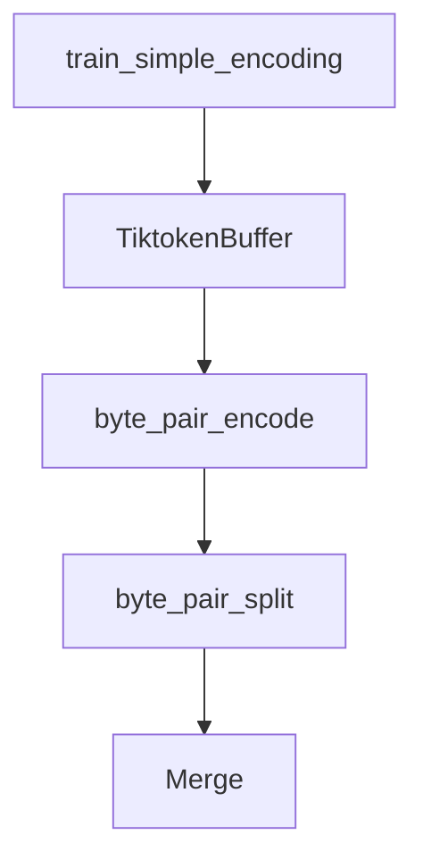

# Chapter 3: Practical Applications

Welcome to **Chapter 3: Practical Applications**. In this part of **tiktoken Tutorial: OpenAI Token Encoding & Optimization**, you will build an intuitive mental model first, then move into concrete implementation details and practical production tradeoffs.


Use token counting to manage cost, context limits, and RAG chunking.

## Cost Estimation

```python
import tiktoken

PRICE_PER_1K = 0.0003
enc = tiktoken.encoding_for_model("gpt-4.1-mini")

prompt = "Summarize this incident timeline with actions and owners."
tokens = len(enc.encode(prompt))
estimated_cost = (tokens / 1000.0) * PRICE_PER_1K

print(tokens, round(estimated_cost, 6))
```

## Safe Context Budgeting

```python
MODEL_LIMIT = 128000
RESPONSE_BUDGET = 2000

prompt_tokens = len(enc.encode(prompt))
remaining = MODEL_LIMIT - RESPONSE_BUDGET - prompt_tokens
print("max_context_tokens=", max(0, remaining))
```

## Token-Aware Chunking

```python
def token_chunks(text: str, chunk_size: int, overlap: int):
    ids = enc.encode(text)
    i = 0
    while i < len(ids):
        window = ids[i:i + chunk_size]
        yield enc.decode(window)
        if i + chunk_size >= len(ids):
            break
        i += max(1, chunk_size - overlap)
```

## Summary

You can now budget cost, enforce context limits, and chunk by tokens.

Next: [Chapter 4: Educational Module](04-educational-module.md)

## What Problem Does This Solve?

Most teams struggle here because the hard part is not writing more code, but deciding clear boundaries for `chunk_size`, `prompt`, `tokens` so behavior stays predictable as complexity grows.

In practical terms, this chapter helps you avoid three common failures:

- coupling core logic too tightly to one implementation path
- missing the handoff boundaries between setup, execution, and validation
- shipping changes without clear rollback or observability strategy

After working through this chapter, you should be able to reason about `Chapter 3: Practical Applications` as an operating subsystem inside **tiktoken Tutorial: OpenAI Token Encoding & Optimization**, with explicit contracts for inputs, state transitions, and outputs.

Use the implementation notes around `encode`, `tiktoken`, `PRICE_PER_1K` as your checklist when adapting these patterns to your own repository.

## How it Works Under the Hood

Under the hood, `Chapter 3: Practical Applications` usually follows a repeatable control path:

1. **Context bootstrap**: initialize runtime config and prerequisites for `chunk_size`.
2. **Input normalization**: shape incoming data so `prompt` receives stable contracts.
3. **Core execution**: run the main logic branch and propagate intermediate state through `tokens`.
4. **Policy and safety checks**: enforce limits, auth scopes, and failure boundaries.
5. **Output composition**: return canonical result payloads for downstream consumers.
6. **Operational telemetry**: emit logs/metrics needed for debugging and performance tuning.

When debugging, walk this sequence in order and confirm each stage has explicit success/failure conditions.

## Source Walkthrough

Use the following upstream sources to verify implementation details while reading this chapter:

- [tiktoken repository](https://github.com/openai/tiktoken)
  Why it matters: authoritative reference on `tiktoken repository` (github.com).

Suggested trace strategy:
- search upstream code for `chunk_size` and `prompt` to map concrete implementation paths
- compare docs claims against actual runtime/config code before reusing patterns in production

## Chapter Connections

- [Tutorial Index](README.md)
- [Previous Chapter: Chapter 2: Tokenization Mechanics](02-tokenization-mechanics.md)
- [Next Chapter: Chapter 4: Educational Module](04-educational-module.md)
- [Main Catalog](../../README.md#-tutorial-catalog)
- [A-Z Tutorial Directory](../../discoverability/tutorial-directory.md)

## Depth Expansion Playbook

## Source Code Walkthrough

### `tiktoken/_educational.py`

The `train_simple_encoding` function in [`tiktoken/_educational.py`](https://github.com/openai/tiktoken/blob/HEAD/tiktoken/_educational.py) handles a key part of this chapter's functionality:

```py


def train_simple_encoding():
    gpt2_pattern = (
        r"""'s|'t|'re|'ve|'m|'ll|'d| ?[\p{L}]+| ?[\p{N}]+| ?[^\s\p{L}\p{N}]+|\s+(?!\S)|\s+"""
    )
    with open(__file__) as f:
        data = f.read()

    enc = SimpleBytePairEncoding.train(data, vocab_size=600, pat_str=gpt2_pattern)

    print("This is the sequence of merges performed in order to encode 'hello world':")
    tokens = enc.encode("hello world")
    assert enc.decode(tokens) == "hello world"
    assert enc.decode_bytes(tokens) == b"hello world"
    assert enc.decode_tokens_bytes(tokens) == [b"hello", b" world"]

    return enc

```

This function is important because it defines how tiktoken Tutorial: OpenAI Token Encoding & Optimization implements the patterns covered in this chapter.

### `src/py.rs`

The `TiktokenBuffer` interface in [`src/py.rs`](https://github.com/openai/tiktoken/blob/HEAD/src/py.rs) handles a key part of this chapter's functionality:

```rs
        };

        let buffer = TiktokenBuffer { tokens };
        buffer.into_py_any(py)
    }

    fn _encode_bytes(&self, py: Python, bytes: &[u8]) -> Vec<Rank> {
        py.detach(|| {
            match std::str::from_utf8(bytes) {
                // Straightforward case
                Ok(text) => self.encode_ordinary(text),
                // Oops, don't actually have UTF-8. But we need to do the regex splitting in
                // Unicode space, so we make our best guess at where we would have splits
                Err(e) => {
                    let text = unsafe { std::str::from_utf8_unchecked(&bytes[..e.valid_up_to()]) };
                    let (tokens, last_piece_token_len) =
                        self.encode(text, &HashSet::new()).unwrap();
                    let (mut tokens, last_piece_token_len) =
                        self._increase_last_piece_token_len(tokens, last_piece_token_len);

                    let mut unstable_bytes;
                    if !tokens.is_empty() && last_piece_token_len > 0 {
                        // Lop off the tokens from the last piece and run BPE on the remaining bytes
                        // This likely matches what models see better, e.g. if you assume we're
                        // dealing with truncated UTF-8 bytes.
                        // Niche, but note this may not be correct if we'd have had a regex
                        // split between the valid UTF-8 and the invalid bytes.
                        unstable_bytes = self
                            .decode_bytes(&tokens[tokens.len() - last_piece_token_len..])
                            .unwrap();
                        unstable_bytes.extend_from_slice(&bytes[e.valid_up_to()..]);

```

This interface is important because it defines how tiktoken Tutorial: OpenAI Token Encoding & Optimization implements the patterns covered in this chapter.

### `src/lib.rs`

The `byte_pair_encode` function in [`src/lib.rs`](https://github.com/openai/tiktoken/blob/HEAD/src/lib.rs) handles a key part of this chapter's functionality:

```rs
}

pub fn byte_pair_encode(piece: &[u8], ranks: &HashMap<Vec<u8>, Rank>) -> Vec<Rank> {
    let piece_len = piece.len();

    if piece_len == 1 {
        return vec![ranks[piece]];
    }
    if piece_len < 100 {
        return _byte_pair_merge(ranks, piece)
            .windows(2)
            .map(|part| ranks[&piece[part[0].0..part[1].0]])
            .collect();
    }
    _byte_pair_merge_large(ranks, piece)
}

pub fn byte_pair_split<'a>(piece: &'a [u8], ranks: &HashMap<Vec<u8>, Rank>) -> Vec<&'a [u8]> {
    assert!(piece.len() > 1);
    _byte_pair_merge(ranks, piece)
        .windows(2)
        .map(|part| &piece[part[0].0..part[1].0])
        .collect()
}

// Various performance notes:
//
// Regex
// =====
// Most of the time is spent in regex. The easiest way to speed this up is by using less fancy
// regex features. For instance, using a regex parse-able by `regex` crate is 3x faster than
// the usual regex we use.
```

This function is important because it defines how tiktoken Tutorial: OpenAI Token Encoding & Optimization implements the patterns covered in this chapter.

### `src/lib.rs`

The `byte_pair_split` function in [`src/lib.rs`](https://github.com/openai/tiktoken/blob/HEAD/src/lib.rs) handles a key part of this chapter's functionality:

```rs
}

pub fn byte_pair_split<'a>(piece: &'a [u8], ranks: &HashMap<Vec<u8>, Rank>) -> Vec<&'a [u8]> {
    assert!(piece.len() > 1);
    _byte_pair_merge(ranks, piece)
        .windows(2)
        .map(|part| &piece[part[0].0..part[1].0])
        .collect()
}

// Various performance notes:
//
// Regex
// =====
// Most of the time is spent in regex. The easiest way to speed this up is by using less fancy
// regex features. For instance, using a regex parse-able by `regex` crate is 3x faster than
// the usual regex we use.
//
// However, given that we're using a regex parse-able by `regex`, there isn't much difference
// between using the `regex` crate and using the `fancy_regex` crate.
//
// There is an important interaction between threading, `regex` and `fancy_regex`.
// When using `fancy_regex`, we hit `regex.find_at`. It turns out that this causes contention on
// some mutable scratch space inside of `regex`. This absolutely kills performance. When using plain
// old `regex`, we don't hit this, because `find_iter` has a different code path.
// Related: https://github.com/rust-lang/regex/blob/master/PERFORMANCE.md
// Anyway, the way we get around this is with having a (mostly) thread local clone of the regex for
// each thread.
//
// Threading
// =========
// I tried using `rayon`. It wasn't really faster than using Python threads and releasing the GIL.
```

This function is important because it defines how tiktoken Tutorial: OpenAI Token Encoding & Optimization implements the patterns covered in this chapter.


## How These Components Connect


