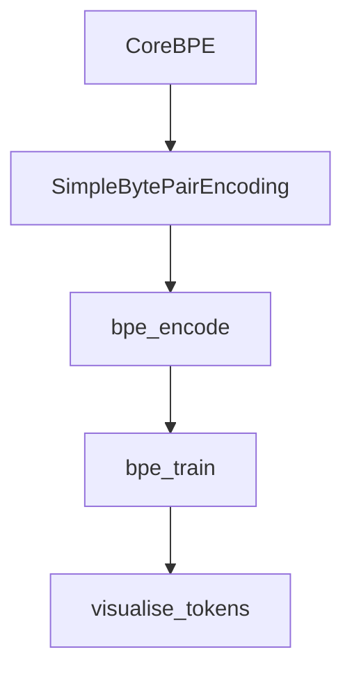

# Chapter 4: Educational Module

Welcome to **Chapter 4: Educational Module**. In this part of **tiktoken Tutorial: OpenAI Token Encoding & Optimization**, you will build an intuitive mental model first, then move into concrete implementation details and practical production tradeoffs.


The educational module helps you visualize and understand tokenization internals.

## Explore the Educational API

```python
from tiktoken._educational import SimpleBytePairEncoding

corpus = """
incident response runbook reliability oncall escalation
incident review postmortem runbook reliability
"""

enc = SimpleBytePairEncoding.train(corpus, vocab_size=300)
ids = enc.encode("runbook reliability")
print(ids)
print(enc.decode(ids))
```

## What to Learn Here

- How merges change token boundaries.
- Why domain corpora influence tokenization efficiency.
- Why tokenizer design impacts downstream model behavior.

## Visualization Tip

Print token pieces for representative prompts before finalizing prompt templates.

```python
pieces = [enc.decode([i]) for i in ids]
print(pieces)
```

## Summary

You can now use the educational API to reason about BPE behavior.

Next: [Chapter 5: Optimization Strategies](05-optimization-strategies.md)

## What Problem Does This Solve?

Most teams struggle here because the hard part is not writing more code, but deciding clear boundaries for `runbook`, `reliability`, `print` so behavior stays predictable as complexity grows.

In practical terms, this chapter helps you avoid three common failures:

- coupling core logic too tightly to one implementation path
- missing the handoff boundaries between setup, execution, and validation
- shipping changes without clear rollback or observability strategy

After working through this chapter, you should be able to reason about `Chapter 4: Educational Module` as an operating subsystem inside **tiktoken Tutorial: OpenAI Token Encoding & Optimization**, with explicit contracts for inputs, state transitions, and outputs.

Use the implementation notes around `SimpleBytePairEncoding`, `corpus`, `incident` as your checklist when adapting these patterns to your own repository.

## How it Works Under the Hood

Under the hood, `Chapter 4: Educational Module` usually follows a repeatable control path:

1. **Context bootstrap**: initialize runtime config and prerequisites for `runbook`.
2. **Input normalization**: shape incoming data so `reliability` receives stable contracts.
3. **Core execution**: run the main logic branch and propagate intermediate state through `print`.
4. **Policy and safety checks**: enforce limits, auth scopes, and failure boundaries.
5. **Output composition**: return canonical result payloads for downstream consumers.
6. **Operational telemetry**: emit logs/metrics needed for debugging and performance tuning.

When debugging, walk this sequence in order and confirm each stage has explicit success/failure conditions.

## Source Walkthrough

Use the following upstream sources to verify implementation details while reading this chapter:

- [tiktoken repository](https://github.com/openai/tiktoken)
  Why it matters: authoritative reference on `tiktoken repository` (github.com).

Suggested trace strategy:
- search upstream code for `runbook` and `reliability` to map concrete implementation paths
- compare docs claims against actual runtime/config code before reusing patterns in production

## Chapter Connections

- [Tutorial Index](README.md)
- [Previous Chapter: Chapter 3: Practical Applications](03-practical-applications.md)
- [Next Chapter: Chapter 5: Optimization Strategies](05-optimization-strategies.md)
- [Main Catalog](../../README.md#-tutorial-catalog)
- [A-Z Tutorial Directory](../../discoverability/tutorial-directory.md)

## Source Code Walkthrough

### `src/lib.rs`

The `CoreBPE` interface in [`src/lib.rs`](https://github.com/openai/tiktoken/blob/HEAD/src/lib.rs) handles a key part of this chapter's functionality:

```rs
#[cfg_attr(feature = "python", pyclass(frozen))]
#[derive(Clone)]
pub struct CoreBPE {
    encoder: HashMap<Vec<u8>, Rank>,
    special_tokens_encoder: HashMap<String, Rank>,
    decoder: HashMap<Rank, Vec<u8>>,
    special_tokens_decoder: HashMap<Rank, Vec<u8>>,
    regex_tls: Vec<Regex>,
    special_regex_tls: Vec<Regex>,
    sorted_token_bytes: Vec<Vec<u8>>,
}

impl CoreBPE {
    fn _get_tl_regex(&self) -> &Regex {
        // See performance notes above for what this is about
        // It's also a little janky, please make a better version of it!
        // However, it's nice that this doesn't leak memory to short-lived threads
        &self.regex_tls[hash_current_thread() % MAX_NUM_THREADS]
    }

    fn _get_tl_special_regex(&self) -> &Regex {
        &self.special_regex_tls[hash_current_thread() % MAX_NUM_THREADS]
    }

    /// Decodes tokens into a list of bytes.
    ///
    /// The bytes are not gauranteed to be a valid utf-8 string.
    fn decode_bytes(&self, tokens: &[Rank]) -> Result<Vec<u8>, DecodeKeyError> {
        let mut ret = Vec::with_capacity(tokens.len() * 2);
        for &token in tokens {
            let token_bytes = match self.decoder.get(&token) {
                Some(bytes) => bytes,
```

This interface is important because it defines how tiktoken Tutorial: OpenAI Token Encoding & Optimization implements the patterns covered in this chapter.

### `tiktoken/_educational.py`

The `SimpleBytePairEncoding` class in [`tiktoken/_educational.py`](https://github.com/openai/tiktoken/blob/HEAD/tiktoken/_educational.py) handles a key part of this chapter's functionality:

```py


class SimpleBytePairEncoding:
    def __init__(self, *, pat_str: str, mergeable_ranks: dict[bytes, int]) -> None:
        """Creates an Encoding object."""
        # A regex pattern string that is used to split the input text
        self.pat_str = pat_str
        # A dictionary mapping token bytes to their ranks. The ranks correspond to merge priority
        self.mergeable_ranks = mergeable_ranks

        self._decoder = {token: token_bytes for token_bytes, token in mergeable_ranks.items()}
        self._pat = regex.compile(pat_str)

    def encode(self, text: str, visualise: str | None = "colour") -> list[int]:
        """Encodes a string into tokens.

        >>> enc.encode("hello world")
        [388, 372]
        """
        # Use the regex to split the text into (approximately) words
        words = self._pat.findall(text)
        tokens = []
        for word in words:
            # Turn each word into tokens, using the byte pair encoding algorithm
            word_bytes = word.encode("utf-8")
            word_tokens = bpe_encode(self.mergeable_ranks, word_bytes, visualise=visualise)
            tokens.extend(word_tokens)
        return tokens

    def decode_bytes(self, tokens: list[int]) -> bytes:
        """Decodes a list of tokens into bytes.

```

This class is important because it defines how tiktoken Tutorial: OpenAI Token Encoding & Optimization implements the patterns covered in this chapter.

### `tiktoken/_educational.py`

The `bpe_encode` function in [`tiktoken/_educational.py`](https://github.com/openai/tiktoken/blob/HEAD/tiktoken/_educational.py) handles a key part of this chapter's functionality:

```py
            # Turn each word into tokens, using the byte pair encoding algorithm
            word_bytes = word.encode("utf-8")
            word_tokens = bpe_encode(self.mergeable_ranks, word_bytes, visualise=visualise)
            tokens.extend(word_tokens)
        return tokens

    def decode_bytes(self, tokens: list[int]) -> bytes:
        """Decodes a list of tokens into bytes.

        >>> enc.decode_bytes([388, 372])
        b'hello world'
        """
        return b"".join(self._decoder[token] for token in tokens)

    def decode(self, tokens: list[int]) -> str:
        """Decodes a list of tokens into a string.

        Decoded bytes are not guaranteed to be valid UTF-8. In that case, we replace
        the invalid bytes with the replacement character "�".

        >>> enc.decode([388, 372])
        'hello world'
        """
        return self.decode_bytes(tokens).decode("utf-8", errors="replace")

    def decode_tokens_bytes(self, tokens: list[int]) -> list[bytes]:
        """Decodes a list of tokens into a list of bytes.

        Useful for visualising how a string is tokenised.

        >>> enc.decode_tokens_bytes([388, 372])
        [b'hello', b' world']
```

This function is important because it defines how tiktoken Tutorial: OpenAI Token Encoding & Optimization implements the patterns covered in this chapter.

### `tiktoken/_educational.py`

The `bpe_train` function in [`tiktoken/_educational.py`](https://github.com/openai/tiktoken/blob/HEAD/tiktoken/_educational.py) handles a key part of this chapter's functionality:

```py
    def train(training_data: str, vocab_size: int, pat_str: str):
        """Train a BPE tokeniser on some data!"""
        mergeable_ranks = bpe_train(data=training_data, vocab_size=vocab_size, pat_str=pat_str)
        return SimpleBytePairEncoding(pat_str=pat_str, mergeable_ranks=mergeable_ranks)

    @staticmethod
    def from_tiktoken(encoding):
        if isinstance(encoding, str):
            encoding = tiktoken.get_encoding(encoding)
        return SimpleBytePairEncoding(
            pat_str=encoding._pat_str, mergeable_ranks=encoding._mergeable_ranks
        )


def bpe_encode(
    mergeable_ranks: dict[bytes, int], input: bytes, visualise: str | None = "colour"
) -> list[int]:
    parts = [bytes([b]) for b in input]
    while True:
        # See the intermediate merges play out!
        if visualise:
            if visualise in ["colour", "color"]:
                visualise_tokens(parts)
            elif visualise == "simple":
                print(parts)

        # Iterate over all pairs and find the pair we want to merge the most
        min_idx = None
        min_rank = None
        for i, pair in enumerate(zip(parts[:-1], parts[1:])):
            rank = mergeable_ranks.get(pair[0] + pair[1])
            if rank is not None and (min_rank is None or rank < min_rank):
```

This function is important because it defines how tiktoken Tutorial: OpenAI Token Encoding & Optimization implements the patterns covered in this chapter.


## How These Components Connect


