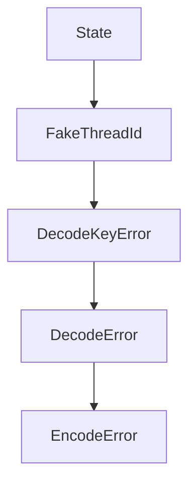

# Chapter 4: Educational Module

Welcome to **Chapter 4: Educational Module**. In this part of **tiktoken Tutorial: OpenAI Token Encoding & Optimization**, you will build an intuitive mental model first, then move into concrete implementation details and practical production tradeoffs.


The educational module helps you visualize and understand tokenization internals.

## Explore the Educational API

```python
from tiktoken._educational import SimpleBytePairEncoding

corpus = """
incident response runbook reliability oncall escalation
incident review postmortem runbook reliability
"""

enc = SimpleBytePairEncoding.train(corpus, vocab_size=300)
ids = enc.encode("runbook reliability")
print(ids)
print(enc.decode(ids))
```

## What to Learn Here

- How merges change token boundaries.
- Why domain corpora influence tokenization efficiency.
- Why tokenizer design impacts downstream model behavior.

## Visualization Tip

Print token pieces for representative prompts before finalizing prompt templates.

```python
pieces = [enc.decode([i]) for i in ids]
print(pieces)
```

## Summary

You can now use the educational API to reason about BPE behavior.

Next: [Chapter 5: Optimization Strategies](05-optimization-strategies.md)

## What Problem Does This Solve?

Most teams struggle here because the hard part is not writing more code, but deciding clear boundaries for `runbook`, `reliability`, `print` so behavior stays predictable as complexity grows.

In practical terms, this chapter helps you avoid three common failures:

- coupling core logic too tightly to one implementation path
- missing the handoff boundaries between setup, execution, and validation
- shipping changes without clear rollback or observability strategy

After working through this chapter, you should be able to reason about `Chapter 4: Educational Module` as an operating subsystem inside **tiktoken Tutorial: OpenAI Token Encoding & Optimization**, with explicit contracts for inputs, state transitions, and outputs.

Use the implementation notes around `SimpleBytePairEncoding`, `corpus`, `incident` as your checklist when adapting these patterns to your own repository.

## How it Works Under the Hood

Under the hood, `Chapter 4: Educational Module` usually follows a repeatable control path:

1. **Context bootstrap**: initialize runtime config and prerequisites for `runbook`.
2. **Input normalization**: shape incoming data so `reliability` receives stable contracts.
3. **Core execution**: run the main logic branch and propagate intermediate state through `print`.
4. **Policy and safety checks**: enforce limits, auth scopes, and failure boundaries.
5. **Output composition**: return canonical result payloads for downstream consumers.
6. **Operational telemetry**: emit logs/metrics needed for debugging and performance tuning.

When debugging, walk this sequence in order and confirm each stage has explicit success/failure conditions.

## Source Walkthrough

Use the following upstream sources to verify implementation details while reading this chapter:

- [tiktoken repository](https://github.com/openai/tiktoken)
  Why it matters: authoritative reference on `tiktoken repository` (github.com).

Suggested trace strategy:
- search upstream code for `runbook` and `reliability` to map concrete implementation paths
- compare docs claims against actual runtime/config code before reusing patterns in production

## Chapter Connections

- [Tutorial Index](README.md)
- [Previous Chapter: Chapter 3: Practical Applications](03-practical-applications.md)
- [Next Chapter: Chapter 5: Optimization Strategies](05-optimization-strategies.md)
- [Main Catalog](../../README.md#-tutorial-catalog)
- [A-Z Tutorial Directory](../../discoverability/tutorial-directory.md)

## Depth Expansion Playbook

## Source Code Walkthrough

### `src/lib.rs`

The `State` interface in [`src/lib.rs`](https://github.com/openai/tiktoken/blob/HEAD/src/lib.rs) handles a key part of this chapter's functionality:

```rs
}

struct State {
    prev: usize,
    end: usize,
    next_end: usize,
    next_rank: Rank,
    cur_rank: Rank,
}

fn _byte_pair_merge_large(ranks: &HashMap<Vec<u8>, Rank>, piece: &[u8]) -> Vec<Rank> {
    let mut state = Vec::with_capacity(piece.len());
    state.push(State {
        prev: usize::MAX,
        end: 1,
        next_end: 2,
        next_rank: Rank::MAX,
        cur_rank: Rank::MAX,
    });

    let mut heap = BinaryHeap::with_capacity(piece.len());
    for i in 0..piece.len() - 1 {
        if let Some(&rank) = ranks.get(&piece[i..i + 2]) {
            heap.push(Merge { start: i, rank });
            state[i].next_rank = rank;
        }
        // note this is happening offset by 1
        state.push(State {
            prev: i,
            end: i + 2,
            next_end: i + 3,
            next_rank: Rank::MAX,
```

This interface is important because it defines how tiktoken Tutorial: OpenAI Token Encoding & Optimization implements the patterns covered in this chapter.

### `src/lib.rs`

The `FakeThreadId` interface in [`src/lib.rs`](https://github.com/openai/tiktoken/blob/HEAD/src/lib.rs) handles a key part of this chapter's functionality:

```rs
// to be hashing of two-tuples of ints, which looks like it may also be a couple percent faster.

struct FakeThreadId(NonZeroU64);

fn hash_current_thread() -> usize {
    // It's easier to use unsafe than to use nightly. Rust has this nice u64 thread id counter
    // that works great for our use case of avoiding collisions in our array. Unfortunately,
    // it's private. However, there are only so many ways you can layout a u64, so just transmute
    // https://github.com/rust-lang/rust/issues/67939
    const _: [u8; 8] = [0; std::mem::size_of::<std::thread::ThreadId>()];
    const _: [u8; 8] = [0; std::mem::size_of::<FakeThreadId>()];
    let x = unsafe {
        std::mem::transmute::<std::thread::ThreadId, FakeThreadId>(thread::current().id()).0
    };
    u64::from(x) as usize
}

#[derive(Debug, Clone)]
pub struct DecodeKeyError {
    pub token: Rank,
}

impl std::fmt::Display for DecodeKeyError {
    fn fmt(&self, f: &mut std::fmt::Formatter) -> std::fmt::Result {
        write!(f, "Invalid token for decoding: {}", self.token)
    }
}

impl std::error::Error for DecodeKeyError {}

#[derive(Debug, Clone)]
pub struct DecodeError {
```

This interface is important because it defines how tiktoken Tutorial: OpenAI Token Encoding & Optimization implements the patterns covered in this chapter.

### `src/lib.rs`

The `DecodeKeyError` interface in [`src/lib.rs`](https://github.com/openai/tiktoken/blob/HEAD/src/lib.rs) handles a key part of this chapter's functionality:

```rs

#[derive(Debug, Clone)]
pub struct DecodeKeyError {
    pub token: Rank,
}

impl std::fmt::Display for DecodeKeyError {
    fn fmt(&self, f: &mut std::fmt::Formatter) -> std::fmt::Result {
        write!(f, "Invalid token for decoding: {}", self.token)
    }
}

impl std::error::Error for DecodeKeyError {}

#[derive(Debug, Clone)]
pub struct DecodeError {
    pub message: String,
}

impl std::fmt::Display for DecodeError {
    fn fmt(&self, f: &mut std::fmt::Formatter) -> std::fmt::Result {
        write!(f, "Could not decode tokens: {}", self.message)
    }
}

impl std::error::Error for DecodeError {}

#[derive(Debug, Clone)]
pub struct EncodeError {
    pub message: String,
}

```

This interface is important because it defines how tiktoken Tutorial: OpenAI Token Encoding & Optimization implements the patterns covered in this chapter.

### `src/lib.rs`

The `DecodeError` interface in [`src/lib.rs`](https://github.com/openai/tiktoken/blob/HEAD/src/lib.rs) handles a key part of this chapter's functionality:

```rs

#[derive(Debug, Clone)]
pub struct DecodeError {
    pub message: String,
}

impl std::fmt::Display for DecodeError {
    fn fmt(&self, f: &mut std::fmt::Formatter) -> std::fmt::Result {
        write!(f, "Could not decode tokens: {}", self.message)
    }
}

impl std::error::Error for DecodeError {}

#[derive(Debug, Clone)]
pub struct EncodeError {
    pub message: String,
}

impl std::fmt::Display for EncodeError {
    fn fmt(&self, f: &mut std::fmt::Formatter) -> std::fmt::Result {
        write!(f, "Could not encode string: {}", self.message)
    }
}

impl std::error::Error for EncodeError {}

const MAX_NUM_THREADS: usize = 128;

#[cfg_attr(feature = "python", pyclass(frozen))]
#[derive(Clone)]
pub struct CoreBPE {
```

This interface is important because it defines how tiktoken Tutorial: OpenAI Token Encoding & Optimization implements the patterns covered in this chapter.


## How These Components Connect


